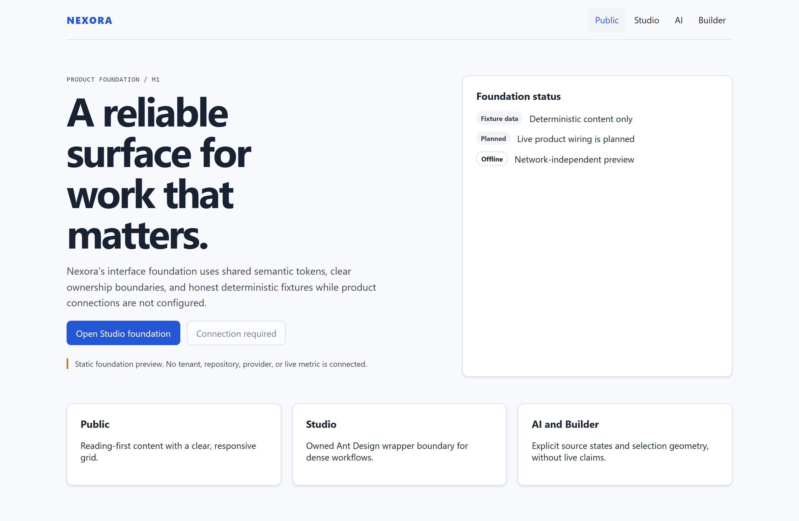
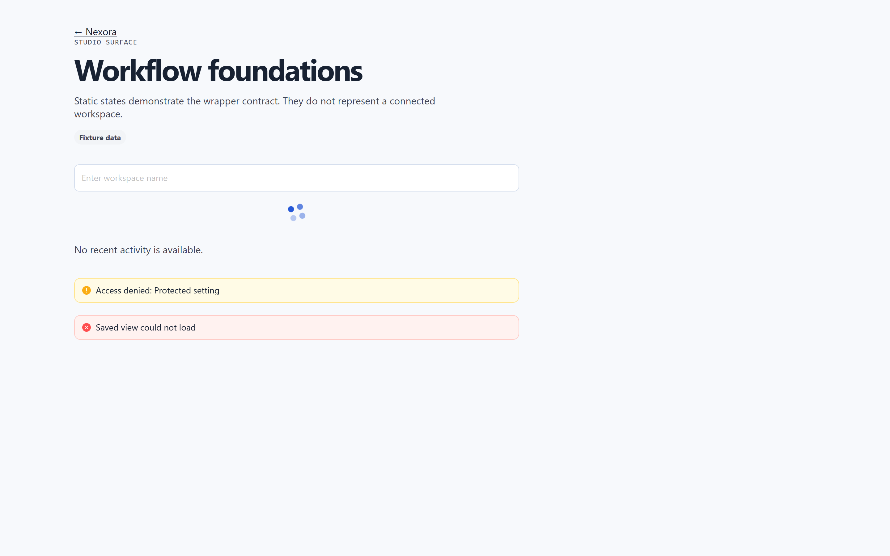
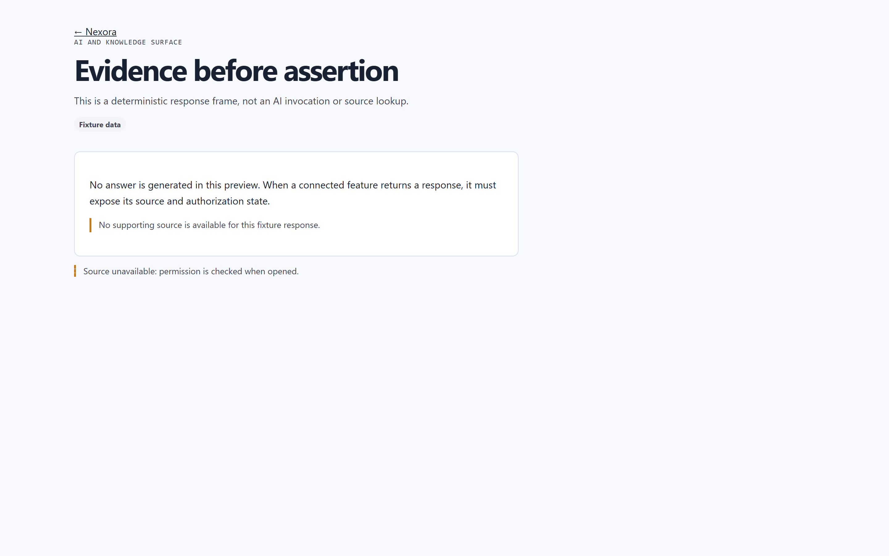
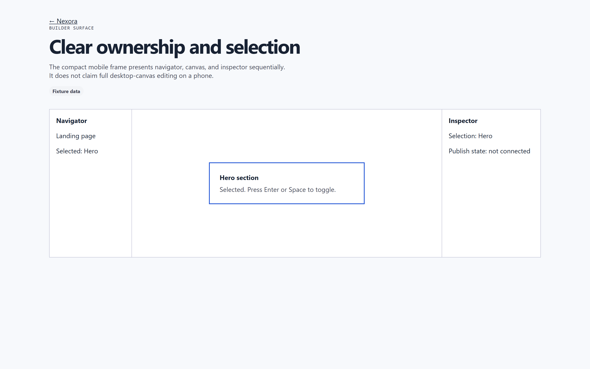
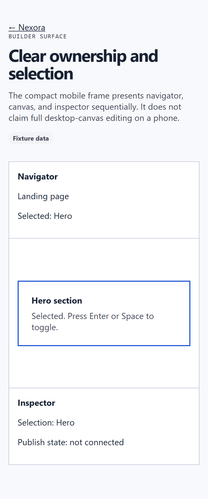

# Nexora

Nexora is a tenant-aware CMS and knowledge workspace delivered as a polyglot
monorepo: a Next.js web surface with a same-origin BFF, a Spring Boot modular
monolith platform API, a narrowly-scoped Go event-ingestion edge, PostgreSQL
with row-level security as the durable truth, and NATS JetStream as the event
backbone. The active line integrates milestones M0–M3 (repository foundation,
platform API, web foundation, tenant CMS core, durable event outbox, bounded
Go ingress, private Realtime descriptors). Milestone M4 (knowledge management
and secure RAG) is planned, not implemented.

Every claim in this repository is bounded by evidence: local builds, tests and
deterministic fixtures. Nothing here claims a deployed environment, a live
provider account, or production readiness.

## Product preview

Scripted tour of the deterministic web foundation surfaces — public home,
Studio, AI and Builder — captured from a local `next start` build. All surfaces
render honest fixture data and label themselves as foundation previews; no
tenant, repository, provider or live metric is connected.


### Surface previews

| Surface | Preview | What it demonstrates |
|---|---|---|
| Public home |  | Shared semantic tokens, responsive grid, honest foundation status (fixture data / planned wiring / offline preview). |
| Studio |  | Owned Ant Design wrapper boundary for dense workflows, including explicit loading, denied and error states. |
| AI and knowledge |  | Evidence-before-assertion contract: no generated answer, no source citation without authorization. |
| Builder (desktop) |  | Clear ownership and selection geometry: navigator, canvas and inspector with keyboard toggle semantics. |
| Builder (390px) |  | Compact mobile frame presenting navigator, canvas and inspector sequentially; it does not claim full desktop-canvas editing on a phone. |

The capture workflow is documented under
[Local development → Web evidence capture](#web-evidence-capture).

## Implemented today (M0–M3)

- Apache-2.0 repository license, `NOTICE` and third-party provenance boundary
  (`THIRD-PARTY-NOTICES.md`).
- Monorepo skeleton under `apps/`, `services/`, `packages/`, `database/`,
  `infrastructure/`, `observability/` and `docs/`, with reproducible toolchain
  declarations for Node, pnpm, Java and Go.
- Spring Boot platform API under `apps/platform-api`: identity/tenancy, RBAC,
  CMS core with immutable publishing, transactional outbox, event admission,
  idempotent persistence consumer, Realtime descriptors, health/readiness and
  metrics. See [apps/platform-api/README.md](apps/platform-api/README.md).
- Next.js web shell under `apps/web` with branded tokens, strict TypeScript,
  same-origin BFF routes and private Realtime subscription handling.
- Workspace packages: `packages/contracts` (generated client and event
  contract), `packages/design-tokens` and owned UI wrappers
  (`ui-core`, `ui-studio`, `ui-ai`, `ui-builder`).
- Go event-ingestion service under `services/event-ingestion`: bounded HTTP
  admission, JetStream ack-only publish, per-principal rate limiting and an
  aggregate concurrency cap. See
  [services/event-ingestion/README.md](services/event-ingestion/README.md) and
  the [Go/NATS ADR](docs/adr/adr-m3-go-nats-event-ingestion.md).
- Flyway migrations `V001`–`V021` under `database/migrations` with
  RLS-forced application schemas, outbox and event-ledger functions; see
  [database/migrations/README.md](database/migrations/README.md) and
  [ROLLBACK.md](database/migrations/ROLLBACK.md).
- Loopback-only local PostgreSQL 17.5 and NATS 2.11 JetStream Compose with
  health checks, file-backed stream provisioning and named volumes
  (`compose.yaml`), plus CI gates for foundation, Go and Java checks.
- `.env.local`, `engineer/`, `.worktrees/` and AgentKit runtime state remain
  ignored; `.env.example` carries placeholders only.

## Planned, not implemented

Knowledge management, document ingestion, pgvector retrieval and secure RAG
(M4); analytics/personalization/notifications (M5–M8); production deployment,
provider configuration, hosted Supabase/Vercel provisioning and release remain
later owned tasks. Empty directories such as `infrastructure/` and
`observability/` are layout markers, not working features. The sequencing is
governed by the execution ledger in
[plans/260809-1030-nexora-master-production-build](plans/260809-1030-nexora-master-production-build/plan.md).

## Repository layout

| Path | Purpose |
|---|---|
| `apps/web` | Next.js 16 / React 19 product shell, same-origin BFF, foundation surfaces |
| `apps/platform-api` | Spring Boot 4.1 modular monolith: identity, RBAC, CMS, publishing, outbox, events |
| `services/event-ingestion` | Go 1.26 bounded HTTP ingress publishing to NATS JetStream |
| `packages/contracts` | Event/API contract source and generated client |
| `packages/design-tokens`, `packages/ui-*` | Branded tokens and owned Ant Design / block wrappers |
| `database/migrations` | Single ordered Flyway migration train (V001–V021) |
| `infrastructure/`, `observability/` | Layout markers for later owned tasks |
| `docs/` | Architecture, security, UX and development documentation |
| `tools/` | Deterministic repository validation and media helpers |
| `.github/workflows/validate.yml` | CI: foundation, Go ingestion and platform-api gates |

## Architecture and trust boundary

The primary product path is **browser → same-origin Next.js BFF → Spring →
PostgreSQL**. Supabase Auth, server-issued private Storage operations and
authorized private Realtime are intentionally narrow exceptions; direct
browser-to-Spring requests and browser-held privileged credentials are not part
of the target path. Realtime is advisory: durable truth is always refetched
from the API after events. The Go ingress isolates untrusted HTTP admission
from the monolith and fails closed unless both its Spring admission URL and
NATS URL are configured; Spring remains the JWT, membership and page authority.

Full views:

- [System overview](docs/architecture/system-overview.md) and
  [system & modules](docs/architecture/system-and-modules.md)
- [Data and trust](docs/architecture/data-and-trust.md),
  [failure semantics](docs/architecture/failure-semantics.md)
- [Threat model](docs/security/threat-model.md)
- [UX architecture](docs/ux/architecture/README.md): journeys, information
  architecture, route/state inventory, wireflows
- [Go/NATS ingestion ADR](docs/adr/adr-m3-go-nats-event-ingestion.md)

## Local development

### Toolchain

| Tool | Version |
|---|---|
| Node.js | 24.12.0 (`.nvmrc`, `.tool-versions`) |
| pnpm | 11.0.9 (`packageManager`, `.tool-versions`) |
| Java | 25.0.1 (`.java-version`, `.tool-versions`) |
| Go | 1.26.5 (`.go-version`, `.tool-versions`) |
| PostgreSQL (local dependency) | 17.5-alpine |
| NATS (local dependency) | 2.11.0-alpine with JetStream |

Compatibility constraints are recorded in
[docs/development.md](docs/development.md).

### Quick start

```powershell
pnpm install --frozen-lockfile          # Node workspace (web + packages)
make help                               # canonical repository commands
make validate                           # deterministic foundation checks
make compose-health                     # loopback PostgreSQL + NATS, waits for health
make go-check                           # go vet + go test for event-ingestion
```

`make help` lists every target (`validate`, `compose-config`, `compose-up`,
`compose-health`, `compose-down`, `go-check`, `go-vet`); on systems without
Make, inspect the `Makefile` directly. `pwsh ./tools/validate-repo.ps1` runs
the same foundation checks CI runs: required files and skeleton directories,
ignored-path proof, the approved Node dependency window, registry boundary,
tracked-file credential scan and Compose rendering.

Platform API (defaults to the deterministic `local` profile, loopback bind,
no database connection; the opt-in `database` profile is documented in
[apps/platform-api/README.md](apps/platform-api/README.md)):

```powershell
Set-Location apps/platform-api
mvn spring-boot:run
```

Event ingestion (bounded local configuration table, hardened container and
evidence boundary in
[services/event-ingestion/README.md](services/event-ingestion/README.md)):

```powershell
Set-Location services/event-ingestion
go vet ./...
go test ./...
docker compose up --build --wait -d     # service-only loopback proof
```

### Web evidence capture

The README media in `assets/readme/` is produced by
[apps/web/scripts/readme-capture.mjs](apps/web/scripts/readme-capture.mjs)
against a built local preview:

```powershell
Set-Location apps/web
pnpm exec next build
pnpm exec next start -p 3100 -H 127.0.0.1
# in a second shell, from the repository root:
node apps/web/scripts/readme-capture.mjs
sh tools/readme-gif.sh                  # webm -> bounded-size GIF
```

The script captures populated desktop screenshots of `/`, `/studio`, `/ai` and
`/builder`, a 390px Builder capture, and a scripted 1280×800 navigation
recording; `tools/readme-gif.sh` converts the recording to the GIF above.
Captures are evidence of the deterministic foundation only — every surface
labels itself as fixture data.

### Environment and secrets

`.env.example` is the only committed template: provider key placeholders
(empty values) and loopback dependency ports. Copy it to `.env.local` for
local experiments; `.env.local` is ignored and must never be committed. No
credential, token or connection string with embedded credentials belongs in
this repository, and services fail closed without explicitly configured
runtime dependencies.

## Verification and CI

The `Validate repository foundation` workflow (`.github/workflows/validate.yml`)
runs three jobs on every push and pull request: `foundation`
(`tools/validate-repo.ps1` plus Compose render), `go-ingestion` (`go vet`,
`go test`) and `platform-api` (Maven unit suite). The broader local evidence
set includes the Java Testcontainers suite (PostgreSQL 17.5 + NATS JetStream:
outbox publish, Go admission joint flow, outage/stall/backpressure bounds,
replay convergence) and the M3 joint benchmark probe; see
[plans/260809-1030-nexora-master-production-build/validation-log.md](plans/260809-1030-nexora-master-production-build/validation-log.md)
for the recorded receipts and their exact heads.

## Documentation map

| Document | Scope |
|---|---|
| [docs/development.md](docs/development.md) | Toolchain pins, framework boundary, ownership seams |
| [docs/project-assessment.md](docs/project-assessment.md), [docs/implementation-plan.md](docs/implementation-plan.md) | M0 assessment and sequencing |
| [docs/architecture/](docs/architecture/README.md) | System, module, data/trust and failure-semantics views |
| [docs/security/threat-model.md](docs/security/threat-model.md) | Tenant/auth/storage/Realtime/upload/RAG/provider threats |
| [docs/ux/architecture/](docs/ux/architecture/README.md) | Journeys, IA, route/state inventory, wireflows |
| [docs/adr/](docs/adr) | Architecture decision records |
| [plans/260809-1030-nexora-master-production-build/](plans/260809-1030-nexora-master-production-build/plan.md) | Governed execution ledger, requirements catalog, decision log |

## Honest limitations

- The web surfaces are foundation previews with deterministic fixtures; M2/M3
  backend capabilities are proven by tests, not by a connected browser session.
- The event-ingestion rate limiter is in-memory, fixed-window and
  single-instance; Compose therefore wires exactly one replica. Multi-replica
  topologies need a shared limiter and their own review.
- `GET /readyz` on the Go service reports local serve state only; publish
  failures surface as bounded 503s instead of silent loss.
- File-backed JetStream provisioning is wired in `compose.yaml`, while the
  Testcontainers suite uses disposable in-memory streams for speed.
- No live provider, deployment, scale or continuity claim is made anywhere in
  this repository; those require separately authorized evidence gates.

## License

Apache-2.0 — see [LICENSE](LICENSE), [NOTICE](NOTICE) and
[THIRD-PARTY-NOTICES.md](THIRD-PARTY-NOTICES.md) for the provenance boundary.
