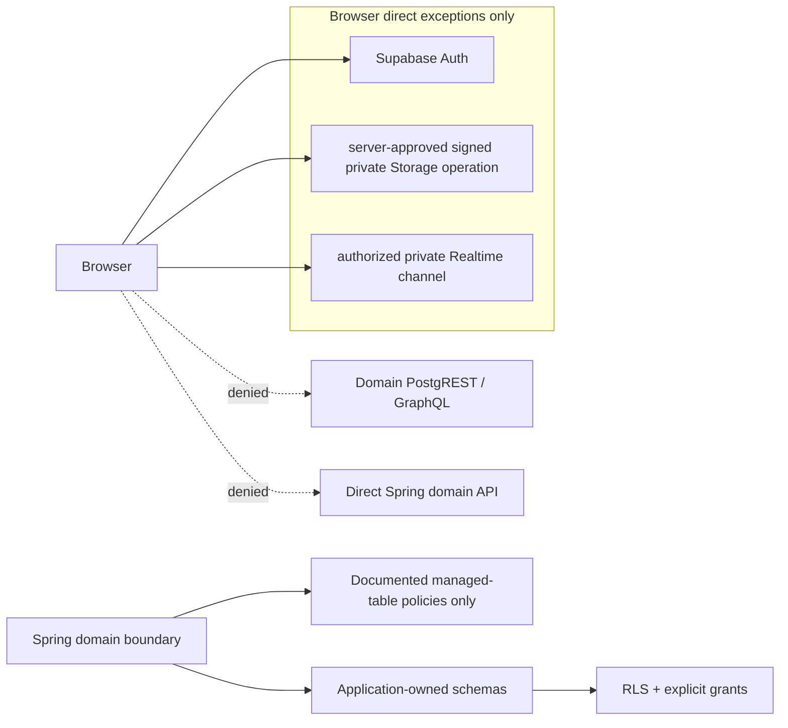
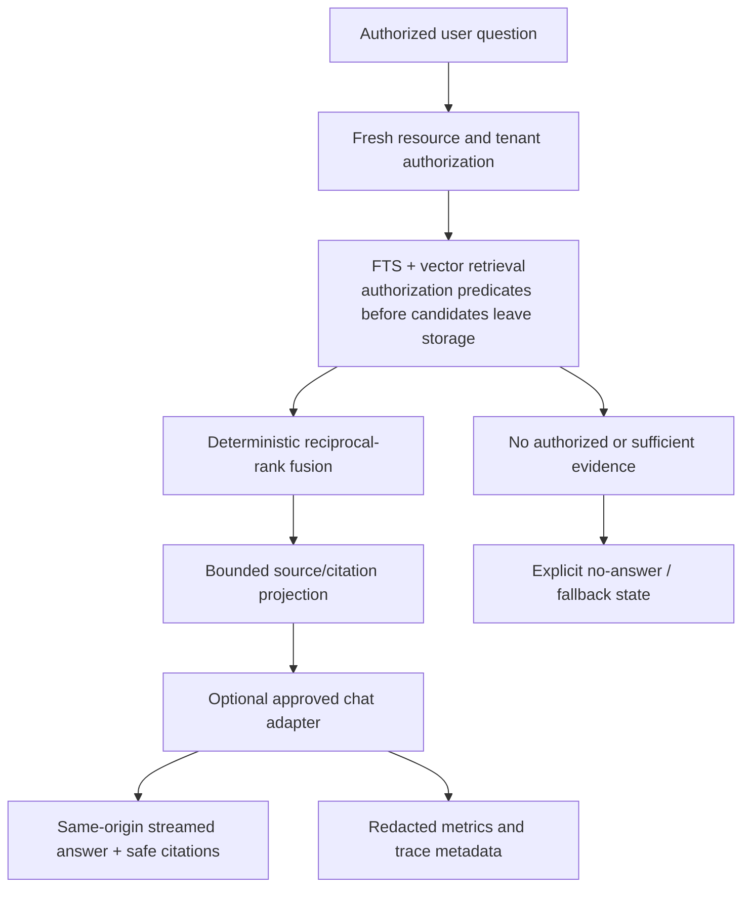

# Planned Data and Trust View

## Data classification and lifecycle intent

This is a design baseline for subsequent lifecycle, migration and security
packets. It does not assert a current retention configuration or processed data
inventory.

| Class | Examples | Planned controls | Prohibited treatment |
|---|---|---|---|
| Public | Published page fields explicitly selected for public release | Versioned publication workflow, cache policy, public-only projection | Leaking drafts, tenant-only configuration or private source content |
| Tenant-private domain data | Drafts, memberships, CMS configuration, audit context | Fresh membership, server authorization, tenant keys/composite constraints and RLS | Client-selected tenant context or broad Data API grants |
| Restricted source data | Uploaded document bytes, extracted text, chunks and citations | Private Storage, tenant-derived keys, authorization before candidate retrieval, lifecycle/deletion controls | Public bucket, raw body in telemetry or unbounded provider egress |
| Sensitive operational data | Secrets, service credentials, signing material, security receipts | Approved secret authority, least privilege, redaction and rotation | Browser exposure, source-control inclusion, screenshots or logs |
| Derived/advisory data | Embeddings, vector indexes, search ranking, Realtime messages, cached projections | Version/model/dimension provenance, authorization predicates, reconciliation/refetch | Treating derived result/delivery as source-of-truth authorization |

## Planned authorization and data-flow boundary

```mermaid
sequenceDiagram
  participant B as Browser
  participant W as Next.js BFF
  participant A as Spring API
  participant I as Identity/Membership
  participant P as PostgreSQL with RLS
  participant S as Private Storage
  B->>W: Same-origin domain request
  W->>A: Validated bearer identity + trace context
  A->>I: Validate issuer/audience/expiry; load fresh membership
  I-->>A: Server-derived actor and tenant scope
  A->>P: Transaction-local context + tenant predicate
  P-->>A: Only policy-permitted records
  alt bounded private object operation
    A->>S: Validate object/resource authority
    S-->>A: Bounded signed operation
    A-->>W: Safe operation metadata
  else domain response
    A-->>W: Authorized response / typed problem
  end
  W-->>B: Same-origin response
```

The transaction-local context and the explicit service predicate are deliberately
two controls. The runtime database role is planned to be non-owner and without
`BYPASSRLS`; pooled-connection reset tests must prove no prior tenant context
can persist. A user identifier, org value, channel name or storage path supplied
by a browser is input to validate, never proof of authority.

## Supabase boundary



Application tables are planned in application-owned schemas such as `nexora`,
`rag` and `audit`, absent from the Data API exposure list. `auth`, `storage`
and `realtime` remain provider-owned: only provider-documented policies/triggers
are permitted, and no custom table, index, function or migration-history
operation is allowed there. Provider configuration remains an evidence-bearing
external state and is not created or changed by this document.

## Planned RAG / AI trust boundary



Planned controls include separate chat, embedding and reranker interfaces;
deterministic CI providers; a local embedding default before any accepted remote
embedding egress; and source/citation data minimized to the need of the
request. The current program does not authorize a live model call. A future live
smoke must identify provider/model/date/dimension and cannot use deterministic
test behavior as substitute evidence.

## Trust assertions that need implementation evidence

| Assertion to prove later | Required type of evidence | Failure result |
|---|---|---|
| No cross-tenant data read/write | Two-tenant positive and hostile-negative fixtures under actual runtime role and pooled connections | STOP on any cross-tenant success |
| No unintended API exposure | Exposed-schema receipt and API-role reachability tests | STOP on reachable domain relation |
| Private object access stays bounded | Tenant/resource authorization, signed-operation expiry and denial tests | STOP on public or path-only access |
| Realtime converges safely | Join/read/write denial matrix plus expiry, removal, reconnect, duplicate/reorder and durable-refetch tests | HOLD if only local compatibility is claimed as hosted proof |
| Retrieval never leaks unauthorized content | Authorization-before-retrieval fixtures, hostile labels/HTML, no-answer and citation tests | STOP on unauthorized candidate/citation exposure |
| Telemetry respects privacy | Redaction assertions for secrets, raw prompts, raw sources/chunks and private document bodies | STOP on raw sensitive content in observability output |

## Egress and deletion rules

- The default data plane keeps domain records and embeddings in the planned
  PostgreSQL boundary. An embedding model's dimensionality and version are part
  of index provenance, not an implied migration constant.
- URL/DOCX ingestion is disabled in the initial planned document scope; an URL
  source cannot induce network access or tool behavior. PDF, Markdown and plain
  text remain subject to bounded parsers and later content-security tests.
- Deletion/export/retention behavior must reconcile object bytes, extracted
  text, chunks, vector rows, derived caches/indexes, publication projections,
  audit requirements and provider data. A database backup does not prove Storage
  recovery, and neither proves external-provider deletion.
- Audit trails store bounded safe metadata and operation outcomes. They must not
  become a shadow archive of prompts, source documents, credentials or private
  answer content.
