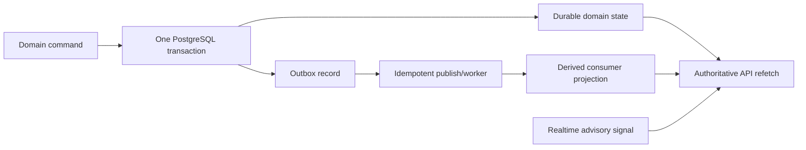

# Planned Failure Semantics and Recovery Boundaries

## Purpose

Nexora is planned to favor explicit safe degradation over hidden retries or
invented success. These are acceptance targets for later implementation and
operational packets, not observed runtime characteristics. Numeric SLOs, retry
budgets, capacity and provider limits remain unpinned until the owning packet
collects source-backed and environment-specific evidence.

## Failure matrix

| Boundary | Planned safe behavior | Retry/recovery rule | What must never happen |
|---|---|---|---|
| Browser / Next.js BFF | Show typed, accessible loading/error/unauthenticated/denied states with a correlation ID where safe | User may retry idempotent reads; mutations use explicit idempotency/command semantics where later specified | Expose internal exception, secret, another tenant's detail or claim the action completed without confirmation |
| Next.js -> Spring | Fail closed on missing/invalid identity, CSRF/Origin violation or unavailable domain API | Bounded transport retry only where operation semantics make it safe; preserve cancellation/backpressure for SSE | Directly fall back to database/provider/browser authorization |
| Identity / membership | Deny when issuer/audience/expiry/membership cannot be confirmed | Reauthenticate or retry after a controlled identity refresh | Trust stale client claims or a request-supplied tenant |
| PostgreSQL / RLS | Roll back incomplete transaction; return typed availability/consistency error | Retry only at a transaction boundary with safe idempotency and bounded policy | Partial domain write, cross-tenant fallback, owner-role bypass or unrecorded manual repair |
| Storage | Do not issue signed operation until tenant/resource/scan-state checks pass | Renew only through server reauthorization; reconcile expired/failed operation | Public fallback, path-only authorization or browser-held privileged secret |
| Realtime | Treat drop/duplicate/reorder/expired authorization as advisory delivery failure | Reconnect under current authorization then durable API refetch/reconcile | Treat a channel message as durable business state or keep a removed member subscribed |
| Durable jobs / outbox | Persist domain change and outbox atomically or not at all | At-least-once consumers use idempotency/deduplication and dead-letter/triage evidence as accepted later | Acknowledge event as permanently delivered without replay/reconciliation path |
| NATS / Go ingestion | Backpressure, validate envelope, bound time/rate/resource use and preserve idempotent handling | Resume from durable sequence/consumer policy as documented by accepted M3 architecture | Promise exactly-once delivery or let unbounded input exhaust the platform |
| Retrieval / vector index | Return an explicit no-answer/degraded retrieval result when authorization, index provenance or evidence is insufficient | Rebuild/re-evaluate indexes only via controlled job/migration path | Answer from unauthorized, stale/unattributed or cross-tenant candidates |
| Chat provider | Return safe unavailable/degraded state; retain no provider key/client fallback | Explicitly authorized, bounded adapter retry only if request semantics and cost policy allow | Leak source/prompt/secret, silently substitute a different model, or claim live provider behavior from mocks |
| Telemetry | Emit redacted health/trace/metric signal and preserve correlation | Queue/flush behavior must be bounded; drop non-critical telemetry before sensitive payload | Log secrets, raw source/chunk/prompt bodies or make telemetry a correctness dependency |

## Planned consistency model

The planned ordering makes the domain commit authoritative. A failed or delayed
publish means the outbox remains recoverable work; an optimistic UI, event,
cache or Realtime notification may be stale and must reconcile to an authorized
API read. The exact deduplication keys, delivery budgets and dead-letter policy
are M3 implementation/ADR responsibilities.

## Operational recovery constraints

1. Health and readiness endpoints are planned evidence surfaces, but a green
   local process does not prove managed production health.
2. Database point-in-time recovery does not restore deleted Storage bytes.
   Future continuity work must separately reconcile database/object watermarks,
   checksums and missing objects in an isolated restore rehearsal.
3. Restore can involve provider downtime. No zero-downtime restore statement is
   allowed without specific measured evidence.
4. Rollback must be compatible with the preceding application/database contract.
   Destructive or irreversible migrations require backup/restore preconditions
   and R3 authority before they are attempted.
5. No periodic traffic or ping technique is accepted as availability evidence or
   a substitute for paid-plan, monitoring, deployment and restore validation.

## Cross-cutting STOP conditions

- Unauthorized tenant, document, source, citation, object or event exposure.
- A mutation that cannot determine whether it committed, without a defined
  idempotency/reconciliation outcome.
- Loss of an outbox/event boundary or a consumer that cannot safely replay.
- A provider/model/extension version drift outside accepted compatibility
  evidence, or a live/provider claim backed only by local fixtures.
- An untested restore path, a database-only backup presented as Storage recovery,
  or an unsupported continuity/zero-downtime claim.
- Any recovery that requires a secret in a browser, a direct manual production
  change outside the approved migration/configuration record, or an external
  authority not yet granted.

## Validation obligations by later milestone

| Milestone | Minimum evidence to move beyond planned semantics |
|---|---|
| M1 | Typed problem details; health/readiness; transaction, RLS, role and pool-reset tests; static architecture boundaries |
| M2 | Tenant/auth/CMS/publishing negative tests, version/rollback compatibility and audit safe-metadata assertions |
| M3 | Outbox atomicity, idempotent replay, reorder/duplicate, Realtime convergence, Go ingress resource-limit and failure tests |
| M4 | Ingestion parser limits, deletion propagation, authorized retrieval/no-answer, citation safety, model-adapter failures and observability redaction |
| Later production goals | Environment-specific health/SLO, monitoring, rollout/rollback, backup inventory and isolated restore evidence under separately authorized infrastructure |
