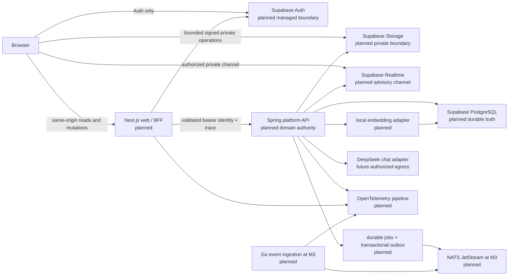
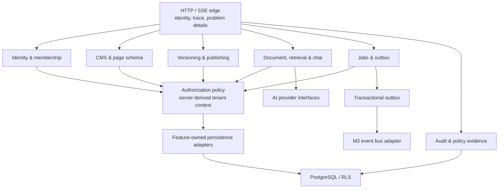

# Planned System and Module View

## Context

The intended v0.1 shape is a modular monolith around the Spring platform API,
with a separate Next.js web surface and narrowly separated Go ingestion at M3.
This is a target design, not a statement that any listed component, account,
container, database or external integration exists today.

### Planned request paths

| Path | Planned responsibility | Explicitly not authoritative |
|---|---|---|
| Browser -> Next.js -> Spring | Default domain read/write path; same-origin request controls, CSRF/Origin protections and correlation propagation | Browser session payload or request-supplied organization as authorization |
| Browser -> Supabase Auth | Authentication/session bootstrap only under approved callback controls | Domain membership, role or resource authorization |
| Browser -> private Storage | Server-approved short-lived signed operation for a private object | Object-path guessing, public buckets or client-held service credentials |
| Browser -> private Realtime | Minimal invalidation/progress information after provider-documented authorization | Durable business state, delivery order or complete event history |
| Spring -> PostgreSQL | Transactional domain data, fresh membership resolution and RLS-protected access | Data API exposure or a table-owner/BYPASSRLS runtime connection |
| Spring -> model adapter | Bounded chat inference only after future authority and adapter controls | Embeddings, authorization decisions, raw-document retention or client-side API key use |

## Planned module boundary inside the platform API

The implementation target is package-by-feature, with ArchUnit boundary tests
and only feature-owned ports/adapters crossing modules. It does **not** permit
an informal shared repository layer that bypasses authorization. Public REST is
planned under `/api/v1`; OpenAPI is the contract authority and failures use
RFC-9457-style problem details. Streaming chat is a same-origin SSE proxy, not
a second browser-to-provider trust path.

## Ownership and sequence

| Capability | Planned module authority | Earliest controlled implementation |
|---|---|---|
| Toolchain/repository skeleton | M1-T01 | after M0 integration |
| Database roles, app schemas, grants and RLS baseline | M1-DB01 migration train | after its accepted schema decision |
| HTTP, health/readiness, telemetry, OpenAPI | M1-T02 platform API | after database foundation integration |
| Tenant identity and RBAC | M2 exclusive domain/migration packets | after foundation interfaces freeze |
| CMS/page-schema/publishing | M2 packets | versioned JSON Schema remains the storage/wire authority |
| Outbox, NATS, Realtime and Go ingress | M3 packets | only with accepted event/ADR dependencies |
| Document ingestion, vectors, hybrid retrieval and chat | M4 packets | only with security/RAG evidence and approved provider boundaries |

## Considered alternatives and dispositions

| Alternative | Disposition | Reason and re-entry condition |
|---|---|---|
| Microservices first | Deferred | Adds distributed failure and operational burden before modular-monolith boundaries are proven. Reconsider only with measured module/deployment evidence. |
| Browser -> Spring / direct PostgREST | Rejected for v0.1 | Dilutes BFF authorization, CSRF, CORS and tracing controls. Needs a dedicated ADR, browser threat tests and dual review. |
| GraphQL, gRPC or WebSocket chat as default | Deferred | REST/OpenAPI plus same-origin SSE is the smaller, explicit contract. A demonstrated need must include security and operational evidence. |
| Redis queue as default | Rejected for v0.1 | Durable PostgreSQL jobs are the first planned queue. A replacement needs failure, cost and recovery evidence. |
| Separate vector/search service | Deferred | PostgreSQL FTS + pgvector with authorization predicates is the default. Corpus/latency/facet evidence must justify a separate system. |
| Generic action-agent/connector platform | Rejected now | Prompt-injection and confused-deputy surface exceeds this program's accepted boundary. |

## Module-level stop conditions

- A feature depends on a mutable or unreviewed shared contract, migration or
  generated client.
- A browser path gains direct domain-table, Spring or provider-key authority.
- A module requires a second migration history, hidden provider configuration
  or a schema object in a managed Supabase schema.
- An event, search, Realtime or model response is treated as durable domain
  truth without reconciliation to PostgreSQL.
- A packet changes this boundary without a scoped ADR and same-candidate dual
  review.
