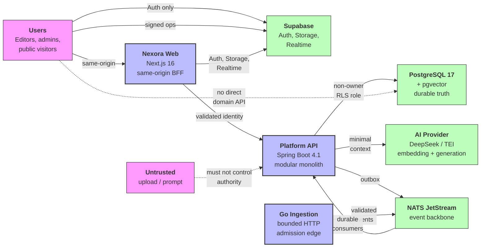

# System Context (C4 Level 1)

## Key decisions

- **Browser → BFF → Spring → PostgreSQL** is the primary product path.
- Direct browser-to-Spring requests are not part of the target path.
- Supabase is intentionally narrow: Auth, signed Storage, private Realtime only.
- PostgreSQL is the durable truth; NATS is delivery; Realtime is advisory.
