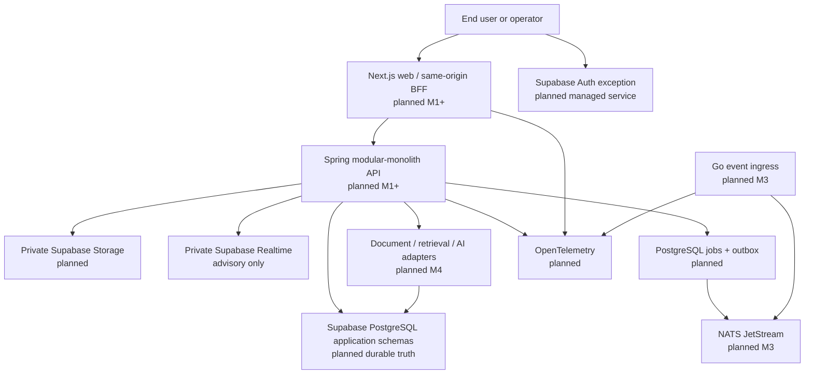
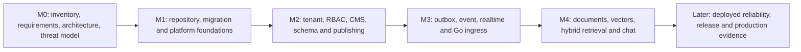

# Nexora System Overview

## Status, scope and provenance

**Status: M0 Phase-0 planned architecture assessment.** This file satisfies the
source-required `docs/architecture/system-overview.md` artifact
(`REQ-S124-4032`) and scopes no product implementation. It records the current
repository state observed by the M0 assessment and the target shape governed by
the pinned control plane; it must not be read as evidence that a runtime,
provider account, deployment, database, queue, model or recovery procedure
exists.

The current repository baseline has the control-plane plan, AgentKit control
ledger and this M0 documentation only. It has no application source tree,
package lockfile, Maven/Go module pin, migration, container image, provisioned
provider state or deployed service. The absence is deliberate at this milestone
and is a constraint on claims, not a product defect silently papered over by a
diagram.

## Target topology at a glance

The primary product path is **Browser -> same-origin Next.js -> Spring ->
PostgreSQL**. Supabase Auth, server-issued private Storage operations and
authorized private Realtime are intentionally narrow browser exceptions. Domain
PostgREST/GraphQL, direct browser-to-Spring requests and browser-held privileged
credentials are not part of the target path.

## Current-state assessment

| Area | Observed state at M0 | Consequence for later work |
|---|---|---|
| Application source | Not present in this assessment worktree | M1-T01 establishes skeleton/toolchain; later checks cannot claim a build exists now. |
| Dependency materialization | No product lockfile, BOM, image digest or model revision | Candidate technology lines remain planning inputs until exclusive owner pins and validates them. |
| Database/platform | No local/hosted migration or provider configuration is created here | M1-DB01 is the sole migration train; external configuration needs separately authorized evidence. |
| Identity/tenancy | Policy boundary exists; no runtime implementation is observed | M2 must prove both server authorization and non-owner RLS with hostile two-tenant fixtures. |
| Events/realtime | Planned only | M3 needs versioned envelope, outbox atomicity, replay/idempotency and convergence evidence. |
| Documents/RAG/AI | Planned only; no live provider call is authorized | M4 must demonstrate parser, authorization-before-retrieval, no-answer, deletion and redaction boundaries. |
| Delivery/continuity | No release or deployed environment evidence | Later goals require measured health, rollback, backup and isolated restore receipts before production claims. |

## Architectural risks and controls

| Risk | Planned control | Owning milestone / required proof |
|---|---|---|
| Tenant context can be forged or leaked by a pooled connection | Validate identity, derive fresh membership server-side, apply transaction-local context plus RLS and explicit predicate | M1/M2 role, pool-reset and two-tenant deny tests |
| Managed Supabase schemas or Data API create hidden exposure | Application-owned schemas, explicit grants and exposure tests; documented managed-table policies only | M1-DB01 plus platform configuration receipt |
| Event delivery diverges from domain truth | Transactional outbox, at-least-once idempotent consumers and API reconciliation | M3 atomicity/replay/duplicate/reorder tests |
| Realtime is mistaken for authoritative state | Private authorized channels with minimal payloads; durable refetch after events | M3 removal/expiry/reconnect/refetch tests |
| Documents or model output exfiltrate tenant-private data | Private objects, parser limits, authorization before retrieval, bounded citations and redacted telemetry | M4 hostile retrieval/citation/deletion/redaction tests |
| Provider, version or model drift invalidates behavior | Exact runtime/model/extension evidence recorded by the responsible packet | STOP or HOLD outside accepted compatibility range |
| Continuity claims exceed evidence | Separate DB and Storage recovery accounting; isolated restore and reconciled watermarks | Later production goal, never inferred from local/CI |

## Dependency strategy and implementation sequence

The sequence prevents direct implementation against unfrozen dependencies:

1. M1 owns initial repository toolchain and the single migration train; no
   feature packet writes lockfiles or migrations outside its exclusive boundary.
2. M2 consumes frozen foundation interfaces to establish tenant and content
   policy before publishing or private content is exposed.
3. M3 introduces derived/event delivery only after the domain transaction and
   event contract are accepted; consumers remain replayable and non-authoritative.
4. M4 adds document and AI capabilities only after authorization, data lifecycle
   and provider boundaries have executable proof. A model adapter cannot decide
   authorization or turn test fixtures into a live-provider claim.
5. Release, paid provisioning, first push, provider calls and deployment are
   excluded until the user separately authorizes them and the later evidence
   gates are satisfied.

## Cross-links and acceptance interpretation

- [System and module view](./system-and-modules.md) defines module ownership,
  request paths and rejected alternatives.
- [Data and trust view](./data-and-trust.md) defines classification, Supabase
  constraints and RAG authorization/egress boundaries.
- [Failure semantics](./failure-semantics.md) defines safe degradation and
  operational STOP conditions.
- The canonical technology direction, provider constraints and lifecycle rules
  remain in the pinned plan, not in this overview. Any contradiction is a STOP
  for an amended, dual-reviewed architecture decision rather than a local edit.

## Validation required before implementation claims

The overview can be accepted as an M0 planning artifact after exact-head
Advisor/Kongming review. Every operational claim it depicts requires a stronger,
later proof: builds/tests for source behavior; two-tenant/RLS tests for access;
provider configuration receipts for managed controls; browser checks for BFF/CSP;
and environment-specific health, rollback and restore evidence for continuity.
