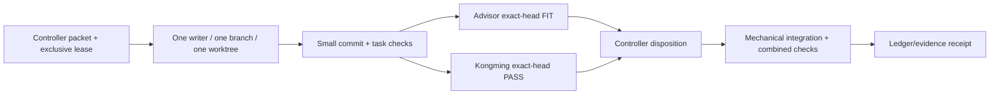

# Nexora v0.1 Implementation Plan

> Status: **execution guide from a truthful M0 baseline**. All items below are
> planned unless an accepted exact-head receipt says otherwise. This file does
> not certify product implementation or authorize a provider, paid service,
> release, deployment, or first push.

## 1. Authority and inputs

| Item | Value |
|---|---|
| Formal Goal | `nexora-v0.1-m0-m4` |
| Goal boundary | M0-M4 / Prompt Phases 0-21 |
| Accepted base | `0373ecfe2fc11ae6c7799131073036aa586c4d66` |
| Pinned semantic candidate | `91c16ea317b856060ed34eb7464e72ac8e496620c6aa0679ec9fc9dfe3a31246` |
| Requirements inputs | source `98716a…4a`, parent catalog `2c9bd…a5e`, child catalog `60fed…a1c` |
| M0 evidence inputs | `M0-T01-scout-0373`, `M0-T02-scout-0373`, `M0-T03-scout-0373` |
| Task boundary | M0-D01 writes only this file and `docs/project-assessment.md` |

The canonical, executable dependency/ownership authority remains
[`m0-m4-execution-ledger.md`](../plans/260809-1030-nexora-master-production-build/m0-m4-execution-ledger.md).
This document makes its sequence and gates legible; it does not replace a task
packet, lease, receipt, or controller disposition.

## 2. Delivery principles

1. Build a vertical, tenant-safe product slice, not a dashboard mock or a
   checklist of disconnected features.
2. Preserve PostgreSQL as business truth. Caches, vectors, private Realtime,
   and NATS are derived/delivery concerns with durable recovery paths.
3. Treat authorization as data selection: membership and policy predicates are
   applied before storage, retrieval candidates, and model context.
4. Keep shared authority boundaries single-writer: migrations, root dependency
   controls, contracts/generated outputs, and integration branches never have
   concurrent owners.
5. Commit only coherent, validated increments with Conventional Commit syntax;
   a commit, fixture, or unit test alone never proves an accepted capability.
6. Label all fixtures, deterministic tests, and planned states honestly. Live
   external, performance, distribution, recovery, and deployment claims need
   their distinct evidence classes.

## 3. Sequenced work plan

### M0 — establish a truthful, reviewable baseline (Prompt Phase 0)

| Order | Work and owner | Dependencies | Required output/evidence | Do not do |
|---:|---|---|---|---|
| 0.1 | M0-T01 Workspace/toolchain Scout, M0-T02 Requirements Scout, M0-T03 Runtime Scout | Active Goal | Read-only receipts for repo/tool truth, catalog coverage, and runtime limitations | Mutate product/control files or infer unavailable external capabilities |
| 0.2 | M0-D01 Documentation assessment writer | M0-T01..T03 PASS | This assessment and implementation plan, linked to pinned provenance and gaps | Claim an application, provider, or deploy exists |
| 0.3 | M0-T04 Architect and M0-T05 security planner | M0 scouts PASS; separate branches/paths | System/data/trust diagrams; threat model with tenant/auth/storage/Realtime/upload/RAG STOP tests | Change C0 pins or implement product features |
| 0.4 | M0-T06 Project Manager | Exact M0-T04/T05 frozen interfaces | Dependency, collision, ownership, estimates, open-decision, and resume packet synthesis | Pretend frozen interfaces are accepted main |
| 0.5 | M0-T07A Advisor and M0-T07B Kongming, then M0-I01 Controller | Same M0 candidate | Advisor FIT, Kongming PASS, dispositions, sequential mechanical docs merges, combined M0 checks | Self-review/self-merge or merge on stale receipts |

M0 is accepted only when each assertion is evidence-backed, unresolved
contradictions are zero or explicitly STOP/HOLD, and no M0 participant has
mutated the Goal/control-plane to solve a material decision.

### M1 — create a reproducible platform (Prompt Phases 1-3)

1. **M1-T01 Repository foundation** creates the product skeleton and
   reproducible governance: directory layout, standards, formatter/lint/editor
   configuration, Makefile, environment template, Compose and baseline CI. It
   must prove a clean public-safe first clone; it does not own Node manifests.
2. **M1-DB01** is the dedicated migration owner. It establishes a single
   Flyway authority, non-exposed application schemas, explicit privileges/RLS,
   extension compatibility, rollback notes and Testcontainers apply evidence.
3. **M1-T02 Java platform** owns the API module after M1-T01/M1-DB01
   integration: health/readiness, OpenAPI, problem details, telemetry and
   migrations consumption. M0's Java/Maven mismatch is a hard compatibility
   check before pinning the wrapper/runtime.
4. **M1-D00/D01A-D01C/D02** build UX architecture then three quarantined
   Stitch directions; the user selects one before a single canonical design
   system. Generated Stitch output is reference/provenance, never copied into
   product as finished UI.
5. **M1-DW01** is the sole Node dependency-window owner. It establishes
   compatible, license/security-reviewed package pins and deterministic lockfile
   before M1-T03 or contract consumers run.
6. **M1-T03 web foundation** builds the SSR web/Studio shell with strict TS,
   branded tokens and owned Ant Design wrappers, complete states, keyboard/a11y
   and 375px/desktop checks; it cannot modify dependency-control files.
7. **M1-T04 contracts** creates stable API/schema/client contract checks after
   the Java, web and frozen dependency inputs exist.

M1 is mechanically integrated only after all required heads and combined
fresh-clone/install/Compose/build/test checks remain reproducible. A dependency
revision is bounded to the special one-time M1-DW01R1 path; a second request is
a STOP/replan, not an ad-hoc package edit.

### M2 — implement tenant CMS and publishing (Prompt Phases 4-11)

| Sequence | Capability outcome | Owner/gate emphasis |
|---|---|---|
| 2.1 | Identity, authenticated organization membership and tenant context | Server-derived tenant authority; no browser-controlled organization selector |
| 2.2 | Role and permission evaluation | App and database/storage policy deny matrices, audit-safe behavior |
| 2.3 | CMS core and allowed content entities | Tenant keys, validation, deletion/audit semantics and complete API/UI states |
| 2.4 | Versioned schema-driven renderer | Canonical JSON Schema fixtures across Java/TypeScript; no arbitrary execution |
| 2.5 | Builder and preview | Immutable command/undo model, autosave conflict behavior, keyboard equivalent to drag/drop |
| 2.6 | Immutable versioning/publishing, themes and workflow | Approval path, typed SEO/canonical/social/sitemap output, new-version rollback and review/audit evidence |
| 2.7 | Private Realtime only where authorized | Durable refetch remains correct on disconnect; Realtime does not become truth |

The M2 integration scenario is an authenticated member with an authorized role
who manages an allowlisted profile, composes one of the approved schemas,
previews/autosaves, submits for review, publishes immutably, and rolls back by
creating a new version. The scenario must include a hostile tenant and denied
cases; it is not satisfied by a happy-path UI alone.

### M3 — establish durable events and bounded realtime (Prompt Phases 12-14)

The execution order corrects a source-order hazard:

```text
event vocabulary
  -> transactional outbox and idempotency
  -> private Realtime notification plus durable refetch
  -> gated Go/NATS ingress with a real persistence consumer
```

The Go/NATS task cannot become `READY` before the outbox head is integrated and
its ADR/review conditions are met. A frozen producer interface may be consumed
only by its named bounded consumer and must be jointly evidenced before either
becomes `MERGE_READY`. Failure, duplicate, retry, ordering, cancellation,
disconnect, and recovery behavior are part of acceptance.

### M4 — deliver secure knowledge and RAG (Prompt Phases 15-21)

1. **Knowledge management:** tenant-aware source lifecycle, private storage
   references, role/access metadata, deletion/tombstone semantics and audit.
2. **Document ingestion:** size/type/attempt/concurrency ceilings; hostile
   input handling; durable job progress rather than an unverified live stream.
3. **pgvector and hybrid retrieval:** versioned chunking/embedding contracts,
   lexical-plus-vector evaluation fixtures, and source eligibility checks.
4. **Secure RAG:** authorize tenant/user/source before retrieval candidates and
   again before context; persist tenant-scoped chat lifecycle; show only
   authorized, resolvable citations; handle no-answer, low confidence, cancel,
   regenerate, resume, and deletion.
5. **Reranking and RAG observability:** explicit model/version parameters,
   deterministic/live separation, evaluation corpus checksum, retrieval/citation
   metrics, traces with safe metadata and red-team leakage/prompt-injection/XSS
   fixtures.

An unauthorized chunk in retrieval candidates or model context is a STOP. URL
ingestion stays disabled until its SSRF gate is independently accepted. A
provider result is not evidence of tenant isolation, citation correctness, or
production availability.

## 4. Ownership and integration workflow

For every material task, the Controller creates a bounded packet containing the
Goal/catalog identity, accepted base SHA, exact paths, branch, worktree, lease
generation, dependencies, checks, evidence expectations, and stop conditions.



Reviewers/scouts are read-only and independent. The writer cannot self-accept
or self-merge. Any rebase, squash, conflict resolution, generated-file drift,
or semantic patch change after review invalidates receipts and requires fresh
exact-head review. Workers neither push `main` nor invoke R3 actions.

## 5. Validation and evidence schedule

| Checkpoint | Minimum evidence before advancing |
|---|---|
| Every task | Allowed-path diff equality, clean worktree, secret scan, packet checks, relevant lint/type/build/test, control-ledger verification, and truthful limitations |
| M0 | Pinned identity revalidation; repository/tool/runtime scout facts; architecture/threat/delivery docs; whole-plan consistency sweep; same-candidate dual review |
| M1 | Fresh-clone instructions, deterministic dependency install, migration/container checks, Java/web/contract validation, accessibility and SSR boundaries |
| M2 | Tenant and permission denial matrix; schema fixtures; publishing immutability/rollback; workflow/audit and 375px/desktop keyboard evidence |
| M3 | Transactional outbox/idempotency/retry/recovery tests; private delivery authorization; joint frozen-interface evidence where applicable |
| M4 | Retrieval/context leakage tests; authorized citation resolution; deletion propagation; evaluation corpus checksum; deterministic versus live-provider evidence separation |
| Later public/release work | Explicit R3 authorization plus source/artifact identity, images/SBOM/provenance, rollout/rollback, backup/restore, and stage-matched media/repository evidence |

No checkpoint may use a passing unit test to prove a database, provider,
browser, deployment, availability, backup/restore, or published artifact.

## 6. Explicit non-goals and escalation path

This v0.1 Goal does not close M5-M8. Analytics, personalization,
recommendations, notifications, audit/search completion, security hardening,
performance, container/Kubernetes/Helm/Terraform/GitOps, production CI/CD,
disaster recovery, final media, attacker review, and staff engineering review
remain Future Goal work unless the user formally expands scope.

For the active Goal, first push, paid provisioning, credentialed provider
calls, release, and deploy are forbidden until the user grants separate
authority. Do not use keepalive/ping activity as continuity evidence. A request
to change product scope, data/tenant policy, hosting, budget, provider, release
target, security posture, or completion semantics is `NEEDS_USER` and routes to
the C0 decision/re-pin procedure rather than being patched inside a delivery
task.

## 7. Immediate handoff

M0-D01 is ready only for independent exact-head review. The Controller should
retain this branch until Advisor FIT and Kongming PASS are recorded against its
commit and then perform a mechanical integration with combined checks. In
parallel, M0-T04 and M0-T05 proceed on their exclusive documentation branches.
No M1 writer should dispatch until M0-I01 is accepted on `main`.
