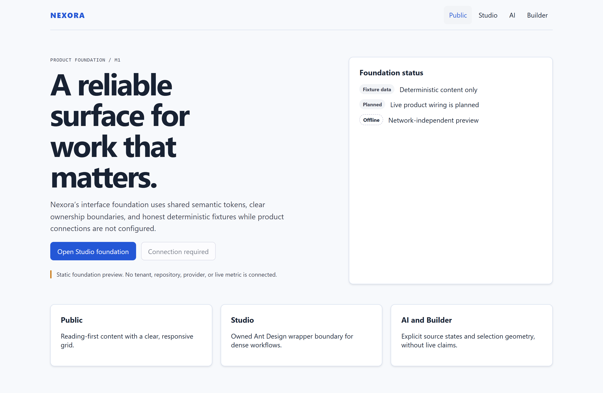
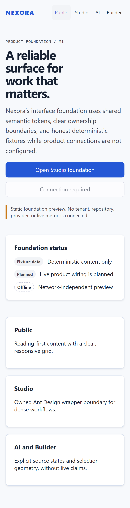
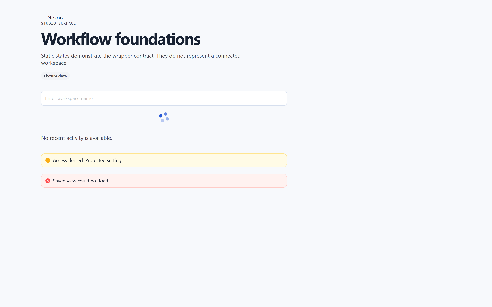
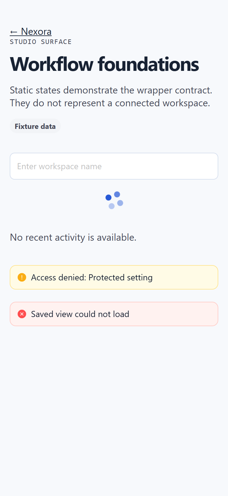
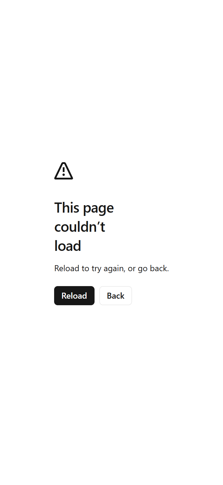
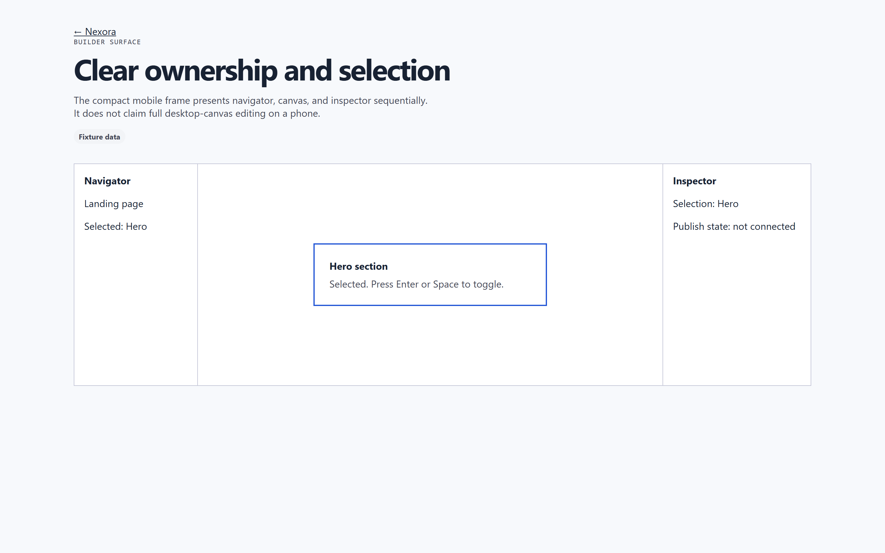
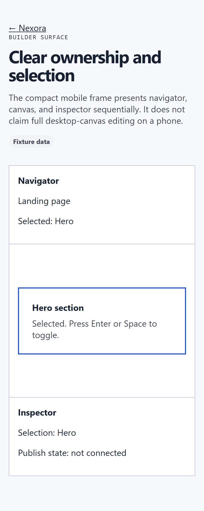

# Nexora foundation preview walkthrough

**Fixture label: deterministic synthetic preview.** Every surface below is a
static Next.js foundation preview with no connected tenant, repository,
provider or live metric. The walkthrough uses only the built web foundation at
product SHA `fde842a`; it is not hosted-provider or production evidence.

## Transcript

1. **Home** — The public surface states the foundation status with three
   fixture labels: deterministic content only, live product wiring planned,
   network-independent preview. Hero actions are visible; the disabled
   secondary action is labelled "Connection required".
2. **Studio** — The dense-workflow surface shell renders with its owned
   component boundary; no tenant data is loaded.
3. **AI** — The knowledge chat shell renders its idle state; a connected
   organization is required before any retrieval call, and none is connected.
4. **Knowledge** — The workspace shell renders without documents, matching the
   unconnected foundation state.
5. **Builder** — The builder surface renders its compact frame; no canvas data
   is loaded.

The recording loops back to Home. Working captures exist at 1440px desktop and
375px mobile viewports with 2x device scale; per-file SHA-256 digests and the
runtime tuple are recorded in `docs/media-manifest.json`.

## Captures

Working per-surface captures, plus the scripted tour — all from the same
fixture build as the transcript above. The knowledge captures and the AI
desktop capture recorded 404/load-failure pages in that build and were
removed rather than published as product evidence.

| Surface | Desktop | Mobile |
|---|---|---|
| Home |  |  |
| Studio |  |  |
| AI | — |  |
| Builder |  |  |

Scripted tour (same fixture build):

