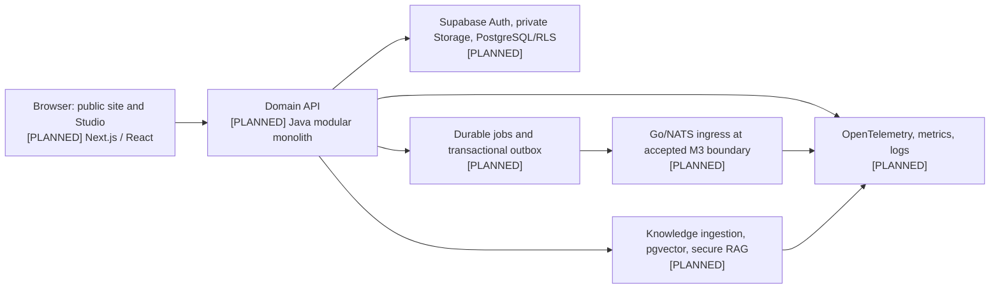

# Nexora Project Assessment

> Assessment state: **baseline only**. This document records what was observed
> at the formal Goal's initial commit and what remains planned. It is not a
> product-completion, runtime, provider, deployment, or security certification.

## 1. Purpose and provenance

This is the Prompt Phase 0 assessment required by source requirements
`REQ-S124-4031` and `REQ-S124-4033`. It supports the finite
`nexora-v0.1-m0-m4` Goal (M0-M4 / Prompt Phases 0-21); Prompt Phases 22-43
remain mandatory in the master program but are outside this Goal.

| Provenance item | Observed or pinned identity |
|---|---|
| Accepted repository baseline | `0373ecfe2fc11ae6c7799131073036aa586c4d66` on `main` |
| Formal Goal | `nexora-v0.1-m0-m4` (control-ledger C0-07 event) |
| Control-plane semantic candidate | `91c16ea317b856060ed34eb7464e72ac8e496620c6aa0679ec9fc9dfe3a31246` (`NEXORA-SEMANTIC-DIGEST-1`) |
| Master source SHA-256 | `98716a1c79cd0f82a20888249a9d1d70482f13da10effea741bd246dde988b4a` |
| Parent requirement catalog digest | `2c9bdc1ee2a19231e93a79ef00500d1e7c004685364856f18bd3378b562e8a5e` |
| Expanded child catalog digest | `60fed551338384a6c5d3e46a049c1fc95a28839991db73c96f53546a44b25a1c` |
| Phase-0 scout receipts | `M0-T01-scout-0373`, `M0-T02-scout-0373`, `M0-T03-scout-0373` |
| Governing plan | `plans/260809-1030-nexora-master-production-build/` |

The catalog records 2,043 requirements included in the first Goal and 894
future requirements. These are routing facts from the M0-T02 receipt, not a
claim that the included requirements are implemented.

## 2. Observed repository baseline

At the accepted baseline, the repository contains only the approved
control-plane material: Git metadata, `.gitignore`, `.env.example`, a
comment-only project AgentKit configuration, and the canonical planning set.
There are **no observed** application modules, package manifests, Maven wrapper,
Go modules, database migrations, tests, Docker/Compose definitions, CI
workflows, deployed services, production data, screenshots, GIFs, or release
artifacts.

`origin` is configured as `https://github.com/JasonTM17/Nexora.git`; this
assessment does not infer that any local commit has been pushed or that a
remote branch/release exists. First push, paid provisioning, credentialed
provider calls, release, and deploy remain outside the authority of this task.

### Environment and control observations

| Area | Baseline observation | Consequence |
|---|---|---|
| Secrets | `.env.example` contains names only; `.env*` is ignored except the template | No credential value is recorded here; any previously exposed credential must be rotated before provider work. |
| AgentKit | `.agentkit/config.yaml` is a comment-only shared template and blocks private-value configuration | Runtime registration and effective routing are `[GAP]`; no agent/provider capability is inferred. |
| Product source | No `apps/`, `packages/`, `database/`, or service source was observed | M1 begins repository foundation; no feature may be described as existing. |
| External integrations | M0-T03 reported no active Stitch, Supabase, Vercel, or GitHub MCP and no product runtime | All integration and live evidence are `[PLANNED]` and require separately authorized tasks. |
| Local control | C0 final binding and the formal Goal are recorded in the common local control ledger | The ledger is governance evidence, not a product runtime. |

## 3. Product boundary to preserve

Nexora is planned as a multi-tenant digital-experience platform: schema-driven
content composition and immutable publishing, organization knowledge,
permission-aware RAG, experiments/analytics/personalization, and production
operations. The v0.1 Goal is deliberately narrower: a real integrated tenant
CMS, publishing, knowledge, and secure-RAG slice, classified as
`v0.1.0-alpha.1` when its separate evidence gates are eventually met.

The following are non-negotiable design invariants for all later writers:

1. Tenant context comes from authenticated membership, never a browser-supplied
   organization identifier alone.
2. Application authorization and database/storage policies both enforce tenant
   isolation.
3. Only versioned, allowlisted component schemas render; arbitrary script,
   React, CSS, and unsanitized HTML are excluded.
4. Published versions are immutable; rollback creates a new version.
5. PostgreSQL is durable business truth; caches, Realtime, NATS, and vectors
   cannot become the only authority.
6. Retrieval authorization happens before model-context construction, and every
   visible citation must resolve to an authorized source and chunk.
7. Automation, uploads, retries, concurrency, tokens, and spend have explicit
   ceilings.
8. Claims about runtime behavior, security, availability, media, packages, or
   deployment require the corresponding observed evidence class.

## 4. Planned architecture and deliberate boundaries

The following architecture is a **pinned planning direction**, not an observed
implementation:



The planning baseline calls for Next.js 16/React 19/strict TypeScript with
Tailwind for branded public surfaces and owned Ant Design wrappers for Studio;
Java 25-compatible Spring Boot modular monolith; PostgreSQL/Supabase with
Flyway as migration authority and pgvector; durable PostgreSQL jobs/outbox
before private Realtime and the Go/NATS boundary; and provider adapters rather
than a provider being trusted as a system authority. Exact package, image,
extension, and model pins are intentionally **not** invented in this document:
their owning M1+ tasks must verify compatibility, license, security, resource,
and reproducibility evidence first.

## 5. Gap and risk assessment

| ID | Baseline gap or risk | Impact | Required owner/gate | Status |
|---|---|---|---|---|
| G-01 | No monorepo/toolchain/CI/Compose/migration baseline | No reproducible product build | M1-T01, M1-DB01, M1-T02, M1-DW01; fresh-clone and combined checks | `[PLANNED]` |
| G-02 | No identity, membership, RLS, storage, or authorization implementation | Cross-tenant access would be unacceptable | M2 identity/RBAC owners; app + DB/storage deny tests | `[PLANNED]` |
| G-03 | No schema/rendering/publishing implementation | Unsafe or mutable content could be introduced | CMS/schema/builder/publishing task chain; schema fixtures and immutable-version evidence | `[PLANNED]` |
| G-04 | No durable event/outbox/recovery behavior | Realtime could be mistaken for source of truth | M3 event/outbox owners; idempotency, failure, and durable-refetch tests | `[PLANNED]` |
| G-05 | No knowledge ingestion/retrieval implementation | Unauthorized source material could enter context | M4 ingestion/vector/secure-RAG owners; retrieval and context leakage fixtures | `[PLANNED]` |
| G-06 | No provider/runtime evidence | Generated response, availability, cost, or latency cannot be claimed | Provider adapter task with explicit authority, budget ceilings, and separated deterministic/live evidence | `[GAP]` |
| G-07 | No production deployment/recovery evidence | "Always on" or production-ready claim would be false | Future M6-M8 hardening/deploy/restore program; explicit user R3 authorization | `[DEFERRED OUTSIDE v0.1]` |
| G-08 | Java CLI/Maven runtime compatibility mismatch observed by M0-T01 | Foundation could select an unusable toolchain | M1-T01/M1-T02 verify exact runtime and wrapper pins before Java consumers | `[OPEN]` |
| G-09 | AgentKit runtime is unregistered; no configured kits/agents | Workflow automation cannot be represented as live capability | Controller records only observed inventory; configure only under a bounded, approved task | `[GAP]` |

Critical stop conditions remain: any secret in tracked material; a tenant,
authorization, source-citation, or retrieval-context leak; unreviewed
dependency/contract drift; a claim based only on fixtures; provider/cost action
without authority; or release/deploy without rollback and restore evidence.

## 6. Dependency strategy

The implementation must not attempt all features at once. The dependency spine
is intentionally serialized at shared authority boundaries:

```text
M0 truthful baseline
  -> M1 repository, database, Java, UX/design, and Node dependency window
  -> M2 identity/tenancy/RBAC -> CMS -> page schema -> builder/publishing/workflow
  -> M3 event vocabulary -> transactional outbox -> private Realtime and gated Go ingress
  -> M4 knowledge management -> ingestion -> pgvector -> hybrid retrieval -> secure RAG
```

M3's numeric phase order does not override durable safety: the Go ingress may
not become ready before the outbox and its required review/interface gates. M4
is permitted only after its stated M2/M3 integration dependencies; a retrieved
but unauthorized chunk is an unconditional STOP.

Each write task receives one intent branch, one project-local worktree, one
exclusive lease, exact paths, a bounded packet, small conventional commits, and
independent exact-head Advisor FIT plus Kongming PASS for material work. The
Controller alone advances the ledger and performs mechanical integration.

## 7. Evidence posture and non-goals

Current evidence is static repository/control-plane and read-only scout
evidence. It does **not** establish a successful build, test suite, browser
experience, database, queue, provider call, live service, deployment,
availability target, backup, restore, Docker image, SBOM, GitHub Release,
repository About configuration, screenshot, or GIF.

No product code is created by M0-D01. This task does not:

- choose exact dependency/model/provider versions or inspect credentials;
- provision Supabase/Vercel/GitHub/Docker resources or make paid calls;
- push, release, deploy, configure a public repository, or assert uptime;
- alter the pinned plan, requirements catalog, decisions, control ledger, or
  Goal; or
- substitute proposed diagrams or fixture data for running-product evidence.

The next work is the bounded M0 architecture and threat-model pair already
leased on their own branches, followed by M0 delivery-contract synthesis and
same-candidate independent review. Any change to scope, security posture,
provider/data policy, hosting, budget, release target, or completion semantics
must stop and return through the C0 decision/re-pin path.
