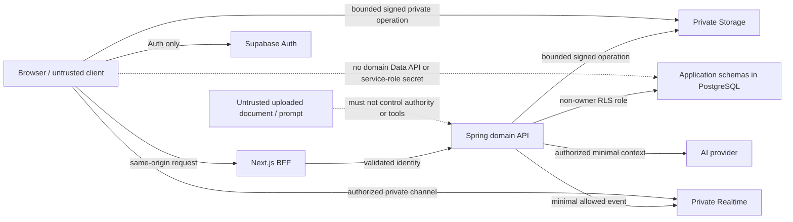

# Nexora v0.1 Threat Model

## Status, scope and evidence boundary

- Status: `M0 BASELINE — PLANNED CONTROLS; NOT YET IMPLEMENTED OR HOSTED`.
- Owner packet: `M0-T05`, branch `docs/m0-threat-model`, goal `nexora-v0.1-m0-m4`.
- Scope: v0.1 M0-M4 / Prompt Phases 0-21. This document covers tenant isolation, Auth, private Storage, private Realtime, document upload/ingestion, RAG and AI-provider boundaries.
- Out of scope: implementation, credential use, provider calls, paid provisioning, production configuration or a claim of compliance/certification.
- Primary policy inputs: accepted `DEC-006` through `DEC-011`, `DEC-016`, `DEC-020`, `DEC-023`, `DEC-028`; the pinned execution ledger; `supabase-platform-boundary.md`; and `acceptance-and-evidence.md`.

The repository is still a planned baseline. Therefore **none of the mitigations below is evidence that a runtime control exists**. A later task can mark a control implemented only with the named test/receipt against its exact candidate.

## Assets, actors and security objectives

| Asset | Classification | Security objective |
|---|---|---|
| Membership, roles and tenant identifiers | Restricted identity metadata | A subject receives authority only from current membership in the requested tenant; deny by default. |
| CMS/domain records and audit metadata | Tenant confidential | Every query, mutation, cache key and event is tenant-bound; cross-tenant access is impossible by default. |
| Uploaded source objects and extracted text | Tenant confidential; may contain sensitive data | Private-by-default, object key derived from authoritative tenant/resource context, malware-safe lifecycle and deletion propagation. |
| Documents, chunks, vectors and citations | Tenant confidential / derived data | Authorization applies before retrieval, context construction and citation resolution; deletion/tombstone removes future eligibility. |
| Chat sessions/messages and generated answers | Tenant confidential | Tenant/user ownership, safe history lifecycle, no hidden context or raw prompts leaked. |
| Session tokens, provider keys, service credentials | Secret | Env/secret authority only; never browser bundle, tracked content, logs, traces, screenshots or receipts. |
| Realtime messages and progress | Minimal tenant metadata | Private authorization, allowlisted payload, durable API remains the source of truth. |
| Provider request/minimal context | Restricted transmitted data | Only authorized, minimized context is sent; output is treated as untrusted and never bypasses authorization. |

Actors include unauthenticated visitors, authenticated members, removed members with a stale token, malicious tenant administrators, compromised browsers/extensions, an attacker controlling uploaded document contents, a compromised third-party provider, and an operator with excessive privilege. The system must also tolerate benign failure: expired tokens, retries, duplicate/reordered events, scanner outage, provider timeout and partial deletion.

## Trust boundaries and intended request paths

The browser has no authority to access application-domain tables through Data API. Domain requests go through the same-origin BFF and Spring. Direct browser interactions are limited to approved Auth, a server-bounded signed private Storage operation and an authorized private Realtime operation. PostgreSQL and Supabase are defense-in-depth layers, not substitutes for Spring domain authorization.

## Mandatory invariants

1. **Tenant authority is server-derived.** A client-supplied tenant ID, object path, channel name, document ID or role never establishes tenant authority.
2. **Authorization is checked at every data transition.** This includes request routing, database/RLS access, signed URL issuance, upload completion, ingestion, retrieval candidate selection, LLM context construction, citation opening, Realtime join/read/write and deletion/export.
3. **Secrets cannot cross the client/evidence boundary.** Secret-shaped values in source, Git, logs, media or receipts are an immediate STOP.
4. **Private data is not made public for convenience.** No public bucket, public Realtime channel, implicit Data API grant, `service_role` browser use, owner/BYPASSRLS runtime identity or broad `SECURITY DEFINER` shortcut.
5. **Durable truth does not depend on Realtime or a provider.** PostgreSQL/API state is authoritative; Realtime is invalidation/progress only, and generation has explicit no-answer/failure behavior.
6. **Untrusted text is data, not instruction.** Upload contents, retrieved chunks and model output cannot alter authorization, invoke arbitrary tools, escape rendering sanitization or suppress evidence/citations.
7. **Deletion has a per-plane proof.** A deletion request is not complete until the required application, object, derived-vector/chunk, chat/export, telemetry/provider limitation, backup/restore and future-retrieval effects are accounted for under `DEC-016`.

## Threat register and planned controls

Risk uses a conservative planned rating: Critical (C), High (H), Medium (M). An unmitigated C/H item blocks its owning milestone from acceptance.

| ID | Boundary / threat | Planned controls and evidence owner | STOP condition |
|---|---|---|---|
| TM-TEN-01 | A caller chooses another tenant by changing a path, header, JWT-adjacent claim, cache key or resource ID. | M2-C01 freezes membership/role/tenant contract; M2-T01/T02 enforce membership-derived authorization; M2-DB01/DB02 apply composite tenant constraints, non-owner runtime role and RLS; M2 integration proves hostile two-tenant matrix. | Any cross-tenant read, write, cache hit, export, page, object, vector, chat, audit or admin action succeeds. |
| TM-TEN-02 | Pooled database connection retains prior tenant/session context. | Transaction-local tenant context, explicit reset, no owner/BYPASSRLS runtime role; pool reuse tests under real runtime identity. | A connection reused after tenant A can access tenant A state as tenant B. |
| TM-AUTH-01 | Forged, expired, wrong issuer/audience or stale membership token reaches domain authorization. | Spring validates token issuer/audience/expiry; current membership is checked server-side; session/callback redirect allowlist and Auth rate controls are captured later. | Invalid/expired/removed-member token receives domain or private-channel authority. |
| TM-AUTH-02 | Privilege escalation through role-edit, last-owner removal, confused deputy or client role claim. | M2-T02 deny-by-default evaluator, role vocabulary, last-owner and escalation tests; sensitive operations audited with safe metadata. | User can grant/retain a role not permitted by current tenant policy. |
| TM-STO-01 | Object enumeration, path traversal or a signed URL for another tenant/object. | Private buckets; server derives tenant/resource key; bounded method/content-type/size/expiry; verify object ownership and scan state before URL issuance. | Arbitrary object key, other-tenant object, expired URL or unapproved method succeeds. |
| TM-STO-02 | Public bucket, browser service secret or direct domain Data API bypass leaks data. | M1 database/platform evidence proves app schemas unexposed and explicit grants; web bundle/secret scans; Storage remains private. | A domain relation is API-reachable by an API role, a bucket is public, or a service secret appears client-side. |
| TM-UPL-01 | Malware, zip bomb, oversized/polyglot file or content-type spoof reaches extraction/storage. | Upload policy with allowlist, size/count limits, streamed inspection, content signature check, quarantine and scanner result state; fail closed when scanner unavailable for protected ingest. | Unscanned/failed/oversized/disallowed object becomes readable, extractable or retrievable. |
| TM-UPL-02 | Malicious document causes parser exploit, SSRF, local-file read or outbound fetch. | Sandboxed/bounded extractors, no arbitrary URL fetch, disabled dangerous parser features, CPU/memory/time limits, safe error metadata; controlled fixtures. | Extractor can access network/filesystem outside its isolated input or exhausts service without containment. |
| TM-RT-01 | Guessable/public channel permits cross-tenant join/read/write. | Private channels only; documented `realtime.messages` policy derives current membership/resource permission; identifier is never authorization; anonymous/removed-member deny matrix. | Unauthorized join, receive, send or Presence access succeeds. |
| TM-RT-02 | Event carries document body, prompt, token, secret or stale state and becomes truth. | Versioned allowlist of IDs/versions/job state/safe display metadata only; durable API refetch handles expiry/removal/reconnect/duplicate/reorder/missed event. | Payload contains protected body/secret, or correctness depends solely on an event. |
| TM-RAG-01 | Unauthorized chunks/vectors enter retrieval candidates or LLM context through filter omission, stale index, cache collision or direct vector query. | M4-C01 defines document/chunk/vector/access contract; M4 database and M4-T03/T04/T06 enforce authorization before retrieval and context, tenant-safe index/cache keys and adversarial allow/deny corpus. | Any unauthorized source enters candidates, reranking, context or answer. |
| TM-RAG-02 | Citation points to an unauthorized, stale, fabricated or deleted source. | Citation contains resolvable authorized source/chunk/version evidence; reauthorize when opening/reloading; tombstone/deletion removes eligibility; no-answer when evidence is insufficient. | Citation cannot resolve to authorized evidence, or deleted content remains retrievable. |
| TM-RAG-03 | Prompt injection in document/chat tells model to reveal data, ignore policy or call tools. | Treat retrieved/user text as untrusted; fixed instruction/data separation; no authority/tool grant from content; permission filter precedes context; adversarial injection evaluation and redacted traces. | Injection causes unauthorized context disclosure, policy bypass, hidden prompt exposure or tool/action execution. |
| TM-RAG-04 | Model output is unsafe HTML/XSS, overclaims facts or leaks another user's history. | Output/citation renderer sanitizes and uses safe link policy; tenant/user session ownership; streaming/reload/cancel/regenerate lineage; no-answer/error state and truthful fixture/live labels. | Rendered answer executes script/unsafe URL, lacks session authorization, or presents unsupported fact as cited evidence. |
| TM-PROV-01 | Provider adapter leaks excess context/secret, follows hostile URL, logs raw content or silently changes model/base URL. | Env-only secret reference, allowlisted base URL/model configuration, minimal authorized context, redacted telemetry, deterministic CI provider, provider phase verifies live identity only under separate authority. | Secret/raw protected prompt/source is tracked or logged; provider receives unauthorized context; unapproved endpoint/model is used. |
| TM-PROV-02 | Provider outage/retry/cost abuse creates duplicate work or user-visible false success. | Request idempotency, concurrency/attempt ceilings, bounded retry/timeout/cancel, kill switch, persisted stream state and explicit degraded/no-answer response; DEC-011 limits still require authorized calls. | Unlimited retry/cost, duplicate generation, hidden failure or claimed live provider behavior without receipt. |
| TM-LIFE-01 | Account/tenant deletion leaves objects, vectors, chat, analytics or provider/backup residue without disclosure. | M4 lifecycle contract inventories every plane, owner, retention, purge/anonymize action and restore reconciliation; backup/object planes proven separately. | Deletion is marked complete without per-plane evidence, or future retrieval works after purge/tombstone. |
| TM-OPS-01 | Logs/traces/metrics/screenshots expose tenant content, tokens, prompts or secrets. | Structured allowlisted/redacted observability, sampling/cardinality bounds, secret scan and media provenance; retain only safe metadata. | Sensitive raw content or secret-shaped value appears in an artifact, log, trace, screenshot or Git history. |

## STOP-test matrix

These are acceptance tests to be implemented by the named later task. They are not reported as passing in M0. Each test must record exact commit, fixture/corpus revision, runtime identity and result; a test that cannot run is `HOLD`, not a pass.

| Test ID | Exercise | Required negative assertion | Planned owner / evidence |
|---|---|---|---|
| STOP-TEN-01 | Tenant A requests every Tenant B page, API resource, admin action, object, document, vector, chat, audit and export route by ID/path/header. | 401/403/404-safe response as policy dictates; no body, timing/cache distinction or side-effect disclosure. | M2-I01 two-tenant hostile fixture matrix. |
| STOP-TEN-02 | Reuse a pooled DB connection across Tenant A then Tenant B under non-owner runtime role. | B cannot observe A rows; transaction context is reset after both success and error. | M2-DB01/M2-I01 integration evidence. |
| STOP-AUTH-01 | Submit forged, expired, wrong issuer/audience and removed-member tokens; then attempt Realtime join. | Domain/API/Storage/Realtime access denied; no fallback to cached membership. | M2-T01 plus M3-T03 evidence. |
| STOP-STO-01 | Alter signed object key, tenant prefix, method, expiry and content type; probe public URL/Data API/service secret in built client. | All unauthorized forms fail; bucket/relation remains private and no secret is bundled. | M1-DB01, M4-T01 and web security checks. |
| STOP-UPL-01 | Upload EICAR-like safe test sample, oversized archive, spoofed MIME, zip bomb fixture and parser-SSRF fixture. | Quarantine/rejection; no extraction/retrieval/public download; bounded resource use and safe error. | M4-T01/T02 ingestion evidence. |
| STOP-RT-01 | Anonymous, other-tenant and removed-member clients guess/subscribe/send on private channels; replay/reorder events. | Join/read/write denied; payload is allowlisted; client refetches durable truth without disclosure. | M3-DB01/M3-T03 integration evidence. |
| STOP-RAG-01 | Run cross-tenant and revoked-access queries at candidate, rerank, context and citation-open stages. | Unauthorized chunk never appears at any stage; authorized answer keeps resolvable evidence. | M4-T03/T04/T06 adversarial corpus. |
| STOP-RAG-02 | Place adversarial injection strings in documents and chat, including instruction override, data exfiltration and malicious markdown/URL payloads. | No instruction/authority bypass; no hidden prompt/context disclosure; sanitized rendering; explicit safe failure/no-answer where needed. | M4-T06/T07/T08 evaluation and browser evidence. |
| STOP-PROV-01 | Inspect config/build/log/trace/test fixtures and simulate provider timeout/429/invalid output. | No value secret exposure; allowlisted endpoint only; bounded retry/cancel/idempotency; user receives truthful degraded state. | M4-T05/T06/T08 provider and observability evidence. |
| STOP-LIFE-01 | Delete document/account/tenant in isolated fixture; reconcile application records, objects, chunks/vectors, chat, analytics and restore drill data. | Future retrieval/access is denied; unrecoverable provider/backup limits are recorded rather than hidden. | M4 lifecycle evidence; later M7 restore proof for hosted claim. |
| STOP-OPS-01 | Run secret scanners and inspect intentional redaction fixtures across logs, traces, screenshots and receipts. | No secret-shaped or raw protected data leaves the approved safe metadata policy. | Every task packet; security/observability acceptance. |

## Control ownership and escalation

- M1 establishes repository, platform, schema-exposure and secret-hygiene foundations; it cannot claim hosted Supabase configuration without separate authority.
- M2 owns identity, tenancy, RBAC, RLS and two-tenant fixtures. Any tenant ambiguity blocks M2 onward.
- M3 owns event contract/outbox and private Realtime policy/adapter. Realtime remains a progressive delivery mechanism.
- M4 owns storage/ingestion, knowledge lifecycle, permission-aware retrieval, chat, provider adapter, citations, evaluation and redacted observability.
- M6/M7 retain production hardening, paid tier, live-provider, backup/PITR, restore, SLO and deployment proof. Those are intentionally not declared complete by M0-M4.

Escalate immediately to Controller + Advisor + Kongming as `STOP` for a C/H finding, secret exposure, cross-tenant success, unauthorized retrieval/context, unsupported deletion claim, or an action needing an external/R3 authority. A remediation is a new exclusive writer packet; reviewers do not repair the candidate they judge.

## Residual-risk statement

This is a security design baseline, not a security assessment or production authorization. Residual risks remain until each planned control has exact-head implementation and evidence. In particular, no hosted configuration, provider behavior, backup/restore result, scanner efficacy, performance ceiling or compliance outcome can be inferred from this document.
