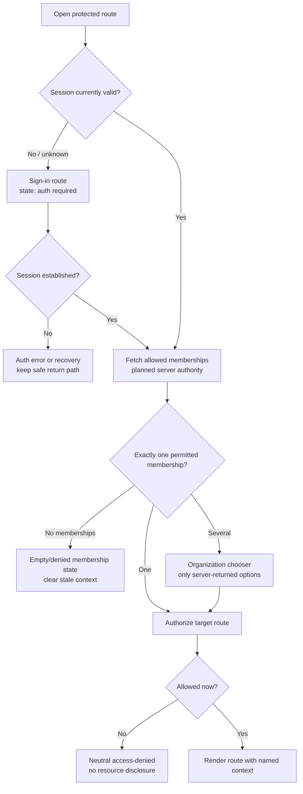
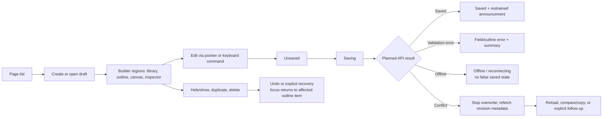
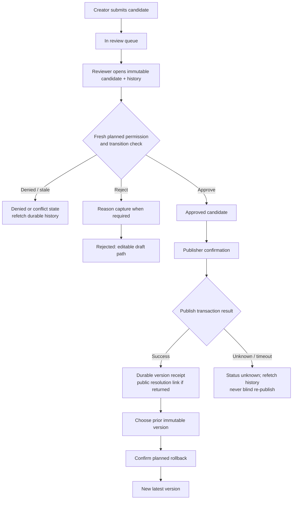
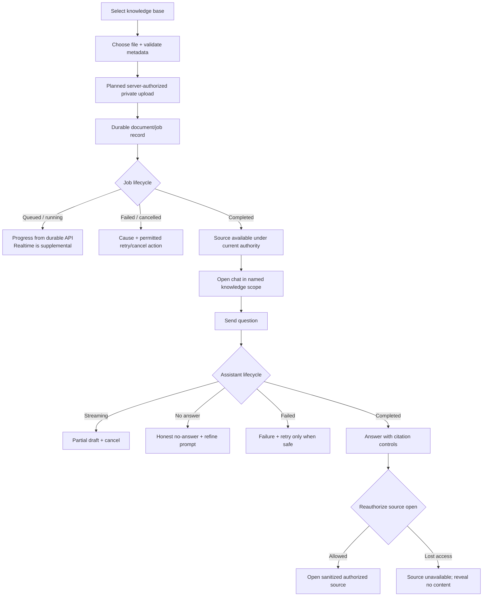

# Wireflows

These wireflows are **Planned** interaction contracts, not implemented flows.
They make failure, authority and responsive behavior explicit for later design
and build work.

## W1 — protected deep link and tenant context

At 375px, the organization control is a labelled button that opens a focus
managed dialog/drawer. On desktop it may be in the persistent Studio header.
In both forms selection alone does not change authority; planned route data is
refetched after the server evaluates current membership.

## W2 — draft builder, autosave and conflict recovery

The desktop canvas is a precision workspace. At 375px, the same draft remains
inspectable and editable through the outline, property inspector and keyboard
commands; preview remains available, while precision layout composition is
clearly marked desktop-oriented. No horizontal canvas scroll is required to
reach save, undo or navigation.

## W3 — review, publication and rollback

The review route puts candidate state, decision controls and reasons before
secondary metadata at 375px. Desktop may position candidate, history and
decision context side-by-side. In both layouts approval/publish/rollback use
textual confirmation and never rely on a color-only status or a client-side
workflow transition.

## W4 — document lifecycle and grounded chat

At 375px, sources open in a labelled modal/drawer and focus returns to the
citation control when closed. On desktop, a persistent source rail is allowed.
Progress, streaming and citations remain secondary to durable authorization:
the UI never exposes raw prompts, provider credentials, hidden reasoning or
unauthorized source metadata.
