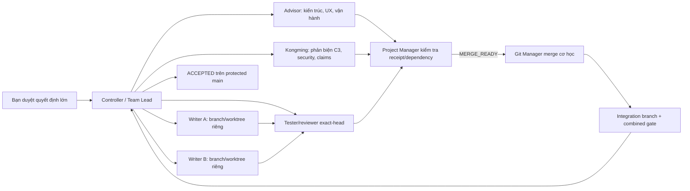

# Tóm tắt duyệt Nexora — Phương án A

## Mình sẽ xây gì

Nexora là nền tảng trải nghiệm số đa tenant, gồm CMS/page builder, workflow xuất bản, Realtime, kho tri thức và RAG có kiểm soát quyền. Master plan giữ đủ Prompt Phase 0-43. Goal đầu tiên hữu hạn chỉ chạy M0-M4 / Prompt Phase 0-21 để tạo `v0.1.0-alpha.1`; M5-M8 tiếp tục bằng các Goal sau cho analytics/personalization, hardening, production deployment/DR và hoàn thiện cuối.

`v0.1.0-alpha.1` là sản phẩm tích hợp thật nhưng chưa được gọi là production-certified. Mốc đủ điều kiện tuyên bố production luôn sẵn sàng nằm sau khi M6/M7 đã đo security, observability, tải, deployment, rollback và restore.

## Công nghệ đề xuất

| Lớp | Chọn | Vai trò |
|---|---|---|
| Web | Next.js 16 App Router, React 19, TypeScript strict, Tailwind CSS 4, Ant Design 6.x | Public brand tùy biến, Studio/admin/builder chuyên nghiệp và same-origin BFF; deploy chính lên Vercel |
| UI design | Stitch khám phá 3 hướng, chốt DESIGN.md; AntD token/wrapper cho Studio; custom/Tailwind cho public; đánh giá Ant Design X 2.x cho RAG | Có chất Nexora riêng, không biến ảnh concept hay theme AntD mặc định thành sản phẩm |
| Domain backend | Java 25, Spring Boot 4.1, Maven modular monolith | Quyền domain, CMS, workflow, publish, knowledge, RAG orchestration |
| Event ingress | Go 1.26 + NATS JetStream, chỉ giữ khi benchmark/chức năng chứng minh cần thiết | Ingestion/consumer chuyên biệt; không giành transaction truth từ Spring/Postgres |
| Data/platform | Supabase Auth, PostgreSQL/pgvector, private Storage, private Realtime; Flyway là migration authority | Identity và managed data plane; Spring vẫn là cổng dữ liệu domain |
| AI | DeepSeek `deepseek-v4-flash` qua adapter env-only; TEI + Qwen3-Embedding-0.6B 1024 chiều làm baseline embedding | Generation tách khỏi embedding/reranking, có budget, timeout và degraded state |
| Quality | JUnit/Testcontainers, Vitest/Testing Library, Playwright, k6, axe, contract tests | Unit -> integration -> browser -> load/security evidence |
| Operations | Docker/Buildx, GHCR, Kubernetes, Helm, Terraform, Argo CD, OpenTelemetry | Image bất biến, deployment có kiểm soát, quan sát và phục hồi |

M0 chỉ ghi candidate/rationale từ source chính thức và chỉ rõ owner/gate; không giả vờ tạo lockfile/BOM khi chưa có product artifact. Trong M1 trở đi, đúng boundary owner mới pin exact version vào lockfile/BOM/container/model revision trước khi task phụ thuộc chạy. Với Node, M1-DW01 độc quyền toàn bộ package manifests và `pnpm-lock.yaml`; frontend/contract worker chỉ đọc frozen head. Nếu benchmark hoặc chi phí không bảo vệ được Go/NATS hay local embedding, Advisor đề xuất đơn giản hóa; quyết định thay đổi phải được ghi ADR và bạn duyệt nếu đổi scope.

Supabase có một contract riêng theo thay đổi platform hiện hành: domain table nằm trong schema ứng dụng không expose qua Data API; grant và RLS là hai lớp phải test độc lập; chỉ policy/trigger mà Supabase công bố hỗ trợ mới được chạm các schema `auth/storage/realtime`; `realtime.messages` dùng private-channel policy nhưng không biến Nexora thành owner của schema đó. Extension managed không được tuyên bố “pin version” bằng câu SQL—hệ thống phải ghi version thực cài và chạy compatibility/query-plan gate. PostgreSQL PITR không chứa bytes đã xóa trong Storage, nên restore drill có hai mặt phẳng DB và object riêng. Xem [Supabase Platform Boundary](./supabase-platform-boundary.md).

UI tham khảo pattern từ Linear (density/keyboard), Webflow (canvas/navigator/inspector), Sanity (schema/workflow/live preview), Notion (content-first), Vercel (typography/status) và Stripe (editorial storytelling), nhưng có “do-not-copy” ledger. Ba hướng Stitch là Signal Atelier (khuyến nghị), Luminous Grid và Warm Intelligence. Sau khi bạn chọn, design-system owner mới map token vào AntD; không chạy song song cả AntD và shadcn như hai hệ thống đầy đủ.

Frontend còn có một ADR bắt buộc theo từng bề mặt: Studio/auth là route động có thể dùng strict nonce CSP; public schema pages phải giữ cơ chế cache đã đo bằng external/static CSS, hash hoặc phương án tương thích khác—không áp nonce blanket và không mặc định `unsafe-inline`. HTML/asset Stitch bị xem là input không tin cậy, chỉ inspect offline/no-network sau khi scan script, URL, handler, font, image và dependency; không copy code/dependency/remote asset vào production.

Innovation backlog đề xuất một trục khác biệt mạnh hơn “CMS có chatbot”: adaptive decision receipt với deterministic core hash để giải thích vì sao một trải nghiệm được chọn; provenance/impact radar nối source -> chunk -> citation -> answer/page; answer trust receipt đo riêng material-claim coverage/correctness/freshness/no-answer/spoof; continuous AI quality canary theo slice/minimum sample/zero-leakage/cost-latency; AI co-editor chỉ đề xuất typed schema patch và phải reauthorize trên server ở lúc apply với exact draft, deterministic diff và audit từng operation; user-controlled accessibility adaptation; C2PA media credentials ở giai đoạn sau, khi đã live-pin đúng spec/UX revision. Generic action-agent/connector fabric bị `REJECT_NOW` cho baseline vì attack surface. Mỗi Goal mặc định `accepted_innovation_hooks: []`; hook chỉ được thêm khi có DEC, requirement/task ID, estimate, dual receipt cùng revision và re-pin khi thay đổi material contract. Tất cả hiện là `PENDING_DUAL_REVIEW`, không tự động mở rộng Goal M0-M4; xem [Innovation and Differentiation Backlog](./innovation-and-differentiation-backlog.md).

## Những điểm đã bổ sung ở final audit

- Master prompt được pin bằng logical source ID + SHA-256, không ghi đường dẫn attachment riêng tư; 141 parent requirements phủ liên tục preamble `REQ-P000` và `REQ-S000..139` trên lines 1-5169. Sau Git seed/ledger, C0-01R trên branch/worktree/lease riêng mới được tách từng normative bullet thành child ID, gắn owner/task/test/disposition và chứng minh không còn dòng yêu cầu nào không được phân loại.
- Exact revision không còn là một hash mơ hồ: `NEXORA-SEMANTIC-DIGEST-1` định nghĩa file set, UTF-8/LF normalization, thứ tự, framing, manifest và hai implementation PowerShell/Node phải ra cùng kết quả trước khi Advisor/Kongming ký.
- Tất cả linked worktree chuyển vào ignored `D:\Nexora\.worktrees\`; target phải là strict descendant, có `git check-ignore` receipt và không được broad-clean.
- Chatbot M4 có `chat_sessions/chat_messages`, tenant/user ownership, stable history pagination, idempotent send, persisted stream state, reload/resume/cancel/regenerate lineage, history delete và reauthorize citation khi mở lại.
- DEC-016 nay bao phủ account khác tenant deletion, user export, chat/document purge, analytics anonymization, telemetry/provider/backups và purge-on-restore; các retention default v0.1 đã được bạn chấp thuận, nhưng plan không claim compliance certification.
- Profile được đưa vào M2; bookmarks/topic follows vào M5; CMS/publishing M2 có SEO title/description/canonical/OG/Twitter/sitemap/robots/allowlisted JSON-LD; builder có hide/show bền vững; shell có breadcrumb/contextual help accessible.
- Có seed pack chuẩn `Nexora University` với pages/documents/personas đúng master prompt, tenant đối chứng, deterministic checksum, ephemeral credentials, safe reset và được dùng chung cho E2E/RAG/media thật.

## Team agent vận hành như thế nào

Mỗi task có outcome, owned paths, forbidden paths, base SHA, plan digest, dependency, test matrix, model/effort thực dùng, writer lease và stop conditions. Tối đa hai writer trên các path thật sự rời nhau; high-risk chỉ một writer. Worker commit theo cụm nhỏ bằng Conventional Commits; reviewer đọc đúng HEAD và không sửa bài mình review. Project Manager chỉ đánh dấu `MERGE_READY` khi receipt/dependency đủ; Git Manager thực hiện merge cơ học; Controller chỉ `ACCEPTED` sau combined-main gate. Advisor/Kongming là checkpoint theo risk/milestone, không phải reviewer bắt buộc của từng commit.

Theo yêu cầu bắt buộc của bạn, mọi việc quan trọng đều có dual gate: Advisor đánh giá product/UX/operability/cost fit, Kongming phản biện architecture/security/failure/evidence trên cùng exact candidate. C3/R3, scope, kiến trúc, auth/tenant/publish/RAG, migration/contract chung, hướng UI/design system, budget/provider/license, milestone, release/media/GHCR, deploy/SLO/rollback/restore và Goal completion đều không được đi tiếp nếu thiếu một receipt hoặc có `HOLD/STOP`. Việc C1/C2 cơ học trong contract đã duyệt không cần hai agent xem từng commit; nếu thay đổi boundary/risk/claim/cost thì tự động nâng gate.

Thread có quyền ghi luôn có đúng một branch, một worktree dưới `D:\Nexora\.worktrees\` và một lease. Thread chỉ đọc như Advisor, Kongming, scout, tester hay arbiter không tạo branch; nếu phát hiện cần sửa, Project Manager mở một writer task/branch mới. Quy trình đầy đủ từ task packet, đặt tên branch, tạo worktree, timeout, repair, exact-head review đến merge receipt nằm trong [Thread, Branch and Worktree Runbook](./thread-branch-worktree-runbook.md).

Keepalive của agent là checkpoint có thể resume: Goal/task ID, branch/worktree, HEAD, lease generation, lệnh/session đang chạy, bằng chứng và bước tiếp theo. Authority là một SQLite control ledger duy nhất nằm dưới absolute Git common directory (`<git-common-dir>\agentkit\nexora-control-ledger.sqlite`), nên mọi worktree cùng nhìn một DB; `.agentkit/state/**` trong worktree chỉ là cache/projection. C0 tạo schema version + genesis gắn baseline SHA, semantic/source/catalog digests và Decision Log revision, rồi hai process từ hai temporary worktree tranh cùng một lease và bắt buộc chỉ một bên thắng. Chat/heartbeat không có authority. Khi timeout hoặc handoff, lead đối chiếu process/Git rồi thu hồi lease nguyên tử trước khi giao lại.

C0-03 đã dùng đúng một ngoại lệ bootstrap: Git Manager tạo local root seed commit trực tiếp trên `main`, chỉ gồm allowlist plan/governance/ignore/env-template, không product code, không writer song song và không push. Ledger hiện có authority; việc ghi nhận các decision đã chốt và sinh child catalog vẫn chạy ở hai branch/worktree/lease riêng, được review exact-head rồi Git Manager merge cơ học. Final Goal chỉ pin SHA sau hai merge này, không pin seed SHA.

## Luồng triển khai theo Goal

1. Người dùng đã chấp thuận Apache-2.0 và toàn bộ mặc định C0, gồm DEC-011/DEC-016; secret/provenance gate vẫn chạy trước mọi public action. DEC-011 giữ DeepSeek USD 5/25 calls, Stitch 3 hướng/4 màn hình mỗi hướng/2 edit pass mỗi màn hình/36 operations tổng, cloud mới USD 0 nếu chưa có R3 riêng.
2. C0-03 đã bootstrap local Git `main`, thêm `origin` nhưng chưa push, tạo đúng một allowlisted root commit và canonical ledger/genesis. C0-05 đã PASS two-worktree contention test trong `D:\Nexora\.worktrees\` và task-graph dry-run Go/NATS/outbox trên đúng user-decision receipts.
3. Ledger đang dispatch `docs/c0-decision-ratification`; branch này có worktree/lease, exact-head dual review và sẽ được merge cơ học trước. Chỉ từ exact main SHA đó mới dispatch `docs/c0-requirements-catalog`, cũng review/merge riêng. Sau combined public-safe check, hai digest implementation pin final main SHA + semantic/source/parent/child-catalog identities bằng manifest không chứa private path.
4. C0-06 kiểm lại receipt C0-05, chạy final binding, runtime inventory, same-candidate Advisor/Kongming activation review và Goal warmup; chỉ khi `READY` mới tạo Goal M0-M4 chính thức với innovation hooks rỗng.
5. Mỗi milestone có worker branches -> exact-head review -> integration branch -> combined gate -> merge `main`.
6. M4 chỉ hoàn tất release khi public `origin/main` khớp exact reviewed head và quyền R3 cho prerelease đã được duyệt; nếu quyền bị giữ lại, Goal là `NEEDS_USER`, không phải hoàn thành giả.
7. Các Goal M5-M8 tiếp tục đến production deployment, DR, final polish, red-team và Staff review.

## Repo, hình ảnh và GitHub khi hoàn thiện

- README có hero capture thật, quick start chạy lại được, kiến trúc, khả năng đã kiểm chứng và hạn chế.
- Sơ đồ context/service/trust/publish/RAG/deployment có source diagram-as-code và SVG/PNG render.
- Ảnh desktop + 375px; GIF luồng build -> publish -> public update -> upload -> cited chat; có alt text/transcript.
- `docs/media-manifest.json` ghi SHA-256, `product_sha`, route/state/viewport, data class, fixture/provider, migration/event/schema revision, Vercel deployment ID, API/consumer image digest, tool và ngày capture; không tự ghi SHA của chính commit chứa nó. R00I-B receipt bên ngoài candidate tree ghi `evidence_sha` + manifest digest và chứng minh `product_sha..evidence_sha` chỉ là docs/media; tag/GitHub Release receipt mới map `release_sha -> evidence_sha + manifest digest`, còn `evidence_sha..release_sha` chỉ được là release metadata.
- GitHub About, URL, topics, social preview, policies, CODEOWNERS và required checks được kiểm tra trực tiếp.
- GitHub Releases có changelog, migration/rollback, checksums, digests và limitations.
- GHCR xuất image Spring/Go/web portable theo SemVer + SHA, pin digest; có SBOM, provenance, vulnerability scan và attestation verify.

M4 không giao tất cả cho một “docs agent”: R00A chỉ viết architecture, R00B chỉ capture media/GIF; Git Manager tích hợp A/B ở R00I-A, R00C mới branch từ evidence base đó để viết README/index, rồi R00I-B tích hợp cuối. R01 là branch release riêng của một Release Manager. Nhờ vậy architecture, media và public claims đều có writer/reviewer đúng chuyên môn, không hai agent cùng sửa release branch.

Ảnh concept Stitch không được giả làm sản phẩm. Dashboard demo phải ghi rõ fixture; secret hoặc dữ liệu thật không xuất hiện trong ảnh, log, SBOM hay release.

## Production continuity

Vercel chạy web; Supabase paid production chạy Auth/Postgres/Storage/Realtime; backend critical dự kiến chạy managed Kubernetes tối thiểu hai replica, có probes, graceful shutdown, autoscaling, rolling/canary, outbox/JetStream và digest pinning. Browser domain traffic đi qua same-origin Next.js BFF rồi tới Spring; chỉ Auth, signed private Storage và private Realtime được phép gọi Supabase trực tiếp. Preview dùng kiểm UX, nhưng release candidate phải là một staged Production deployment tạo từ exact SHA/cấu hình production, kiểm đúng deployment ID rồi mới promote không rebuild bởi một deployment authority duy nhất.

Mục tiêu ứng viên để bạn duyệt ở M6/M7 là 99.9% cho public/CMS/publish/retrieval, 99.5% cho generation phụ thuộc DeepSeek, critical-service RTO tối đa 30 phút và full data-plane RTO tối đa 60 phút. Postgres/pgvector RPO tối đa 15 phút; Storage object là mặt phẳng backup riêng với RPO tối đa 60 phút; JetStream dựa trên outbox replay và snapshot cho state không thể rebuild. Rollback app tối đa 10 phút. Đây là mục tiêu cần đo và drill, không phải lời hứa hiện tại. Supabase Free chỉ dùng dev; ping cron chỉ là synthetic monitoring, không phải cách chống sập.

## Những gì chưa được làm ở thời điểm hiện tại

- Chưa tạo formal Goal và chưa có product code. C0-03 đã tạo local Git `main`, cấu hình `origin` và tạo một public-safe seed commit; chưa push.
- Chưa gọi Stitch/DeepSeek trả phí, chưa provision Vercel/Supabase/backend, chưa deploy.
- Chưa tạo ảnh/GIF/release/container vì chưa có build chạy thật để làm bằng chứng.
- Khóa từng được dán trong chat phải rotate trước live smoke hoặc production; chỉ secret mới trong env/secret manager mới được dùng.

## Quyết định và gate còn lại

Apache-2.0 đã được chốt ở DEC-015; toàn bộ default C0, gồm repository, merge/push authority, budget, auth/tenant/data/AI, lifecycle/retention, release identity, CSP/cache policy và Supabase boundary, đã được người dùng chấp thuận. Trước formal Goal vẫn phải hoàn tất C0 exact-head reviews, child-requirement catalog, final digest/binding và warmup. Trước production: Vercel/Supabase tier, Kubernetes provider/region, SLO/RPO/RTO, on-call/alert channel, DNS/email, embedding compute và chi phí tháng vẫn cần authority riêng.

Khuyến nghị của team là giữ nguyên Phương án A: hoàn tất `v0.1.0-alpha.1` ở M4, rồi dùng Goal M6/M7 riêng để chứng minh production continuity. Nếu bắt Goal đầu phải live production luôn, scope phải mở rộng qua tối thiểu M6/M7, re-estimate và pin plan/Goal mới.
