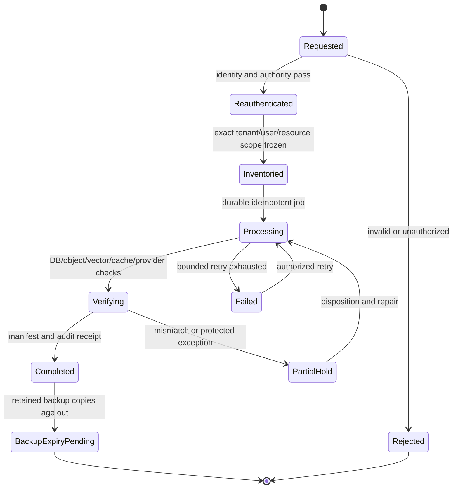

# Nexora Data Lifecycle and Privacy Contract

## Status and Honesty Boundary

- Status: `ACCEPTED V0.1 DEFAULTS` under expanded `DEC-016`.
- Scope: design and testable lifecycle behavior; this plan does not claim GDPR, CCPA or another legal certification.
- Activation rule: M4 storage/chat work must implement and evidence the accepted v0.1 fields of DEC-016. Later analytics/production retention values remain explicit later-Goal decisions where appropriate.

Privacy behavior is implemented as domain state and evidence, not a privacy-policy sentence. Deletion, export, anonymization and retention must cross database, Storage, vectors, caches, jobs, events, providers, telemetry and backups without allowing a hidden copy to become normal application truth.

## Data Inventory and Authority

| Data class | Examples | Durable authority | Export | Active-plane deletion/anonymization |
|---|---|---|---|---|
| Identity/profile | Supabase user ID, profile, preferences | Supabase Auth identity plus Spring profile domain | User profile and membership-safe fields | Delete/anonymize according to account/membership decision; never delete another tenant owner implicitly |
| Tenant membership/RBAC | memberships, roles, invitations | Spring/PostgreSQL | User's memberships/roles where disclosure is authorized | Revoke membership; preserve safe audit evidence under accepted policy |
| CMS/publishing | drafts, versions, reviews, comments, media | PostgreSQL plus private Storage | Owned/authorized content only | Archive/delete under tenant authority; immutable published/audit history uses accepted tombstone/redaction rules |
| Knowledge | documents, versions, chunks, vectors, jobs | PostgreSQL plus private Storage | Authorized source metadata/content where policy permits | Object -> document -> chunk -> vector -> cache/index/job propagation with verification |
| Chat/RAG | sessions, messages, citations, retrieval runs/results, feedback | PostgreSQL | User's authorized sessions/messages and safe citation metadata | Session/message deletion plus trace/result/provider-metadata propagation; source authorization is rechecked at export time |
| Personalization | profile attributes, follows, bookmarks, consent | PostgreSQL | User-readable choices and consent history | Direct delete; derived signals invalidated/recomputed |
| Analytics | events, assignments, aggregates | Event store/PostgreSQL | Raw user-linked data only when accepted and safe | Delete or anonymize user link; aggregation threshold and re-identification risk tested |
| Audit/security | bounded safe actor/action/resource/result metadata | Append-oriented audit store | Only fields legally/product-authorized for the requester | Retention/redaction exception requires accepted rationale; never preserve prompt/source/secret payloads |
| Telemetry | logs, spans, metrics, diagnostics | Observability backend | Normally summarized metadata, not other users' traces | Redaction at collection; bounded retention and deletion feasibility documented |
| Backup/DR | DB backups, object copies, stream snapshots | Approved backup authorities | Not served directly as user export | Expires by retention schedule; restored old data re-enters purge/reconciliation before cutover |

## Lifecycle State Machine

Every request has a stable ID, requester, verified authority, scope digest, requested action, state version, timestamps, per-plane results, retry count, safe error, audit reference and evidence manifest. Jobs are idempotent and concurrency-safe; duplicate requests do not duplicate exports or skip a plane.

## User Data Export

1. Require recent authentication and rate/abuse limits; high-risk tenant export also requires tenant authority and R3 classification.
2. Freeze the authorized user/tenant scope at a transactionally recorded version; never accept arbitrary tenant IDs from the request body.
3. Produce a machine-readable manifest plus JSON/CSV and owned binary files where accepted. Every file has type, byte size and SHA-256.
4. Reauthorize each private source/citation at collection time. Cross-tenant objects, secrets, internal authorization policy, other users' data and unsafe telemetry are excluded and recorded by reason.
5. Encrypt at rest, expose through a short-lived one-use or tightly bounded signed download, and delete the export artifact after the accepted window.
6. UI shows requested/processing/ready/expired/failed states and what categories were included/excluded. Logs contain only safe IDs and counts.

## Account, Membership and Tenant Deletion

- Leaving one organization is not automatically global account deletion. Last-owner, sole-admin, pending-transfer and legal/business retention states block with a precise remediation path.
- Account deletion requires reauthentication, revokes sessions/tokens, removes profile/preferences/bookmarks/topic follows/chat history according to accepted policy, handles authored content ownership explicitly and queues derived-data purge.
- Tenant deletion is a separate destructive R3 workflow with inventory, impact preview, ownership confirmation, cooling/grace window if accepted, backup checkpoint, final authorization and post-delete verification. It is never triggered by a routine user account endpoint.
- Knowledge deletion removes future retrieval eligibility first, then object/chunk/vector/index/cache state. A deleted source can never remain retrievable while cleanup is pending.
- Chat deletion covers sessions, messages, retrieval-run/result links, feedback and cached/provider-side metadata controllable by Nexora. Provider retention limitations are disclosed rather than invented.
- Audit tombstones use bounded safe metadata. An exception that retains user-linked fields requires an accepted purpose, access policy and expiry.

## Analytics Anonymization and Redaction

- Collect only allowlisted event fields with declared purpose, consent basis, tenant, schema version and retention class.
- Direct identifiers are removed or replaced with purpose-specific rotating pseudonyms; small cohorts and rare attributes are suppressed/aggregated to reduce re-identification risk.
- “Anonymous” is not claimed solely because a user ID was hashed. Tests consider stable joins, free text, URLs, IP/user-agent, tenant IDs and rare combinations.
- Raw prompts, document text, secrets, access tokens and unrestricted free-form properties are denied at event/log ingestion.
- Consent withdrawal and deletion emit an idempotent invalidation that reaches raw events, derived profiles, recommendation features and cached aggregates according to accepted feasibility/retention.

## Retention Decision Matrix — Values Required in DEC-016

| Plane | Decision needed before use | Verification |
|---|---|---|
| Auth/session/profile | account closure grace, session revocation and profile erasure/anonymization | login/session/profile negative tests |
| CMS/published/audit | archive, published-version and audit exception windows | query/API/restore behavior |
| Storage source/export | active object, deleted-object copy and generated-export expiry | inventory/hash reconciliation |
| Chunk/vector/index/cache | delete propagation deadline and reindex behavior | retrieval zero-result plus physical inventory |
| Chat/RAG trace/feedback | user deletion controls, default retention and redaction | UI/API/export/delete/citation tests |
| Events/analytics | raw versus aggregate windows, anonymization threshold | query and re-identification review |
| Logs/traces | environment-specific retention and field denylist | sink query and redaction fixtures |
| Backups/snapshots | retention, encryption/key custody and purge-on-restore process | isolated restore and post-restore purge |
| Provider | DeepSeek/request metadata retention settings and deletion limitations | current provider contract/config receipt |

The accepted defaults below may be amended only through a new user decision and same-candidate dual review. Until implementation evidence exists, code uses deterministic fixtures and makes no production-retention claim.

### Accepted v0.1 defaults

These are accepted planning defaults for the alpha, not current behavior, implementation evidence, or legal advice:

| Item | Accepted v0.1 value |
|---|---|
| Account deletion | Reauthenticate; block last-owner deletion until transfer; revoke refresh sessions immediately; domain authorization denies removed membership on the next request; active-plane purge job target <=24h after final confirmation |
| Tenant deletion | Separate R3 operation, impact inventory, ownership transfer checks, explicit second confirmation and 7-day cooling window; no automatic cascade from account deletion |
| User export | JSON plus approved files and manifest; encrypted/short-lived download expires after 24h; generated export artifact purged <=24h after expiry |
| Chat history | User-visible default 90 days for completed sessions; per-session delete; canceled/failed draft diagnostics 7 days; active-plane deletion target <=24h |
| Detailed RAG traces | Redacted metadata 30 days; no raw prompt/chunk text in default trace; aggregate quality metrics 180 days |
| CMS soft-deleted drafts/media | 30-day recoverable window, then purge unless an accepted tenant/audit hold applies; published-version retention remains tenant-policy controlled and visible |
| Raw analytics | 90 days; derived anonymized/aggregated metrics 13 months only after re-identification review and minimum-cohort policy |
| Application logs/traces | 7 days in preview/non-production, 30 days in production candidate; security incidents use a separately approved hold |
| Safe audit metadata | 365 days; contents remain bounded to actor/action/resource/result identifiers and never prompts, source bodies or secrets |
| PostgreSQL recovery | Paid PITR target and retention selected with DEC-017/M7 cost; a restored environment replays the deletion ledger before serving |
| Storage backup copies | Separate encrypted versioned export/replication, 30-day retention; DB PITR never stands in for object-byte recovery |
| DeepSeek/provider | v0.1 live smoke uses synthetic/non-sensitive fixtures only until current provider retention/processing terms and configuration are recorded and accepted |

Advisor may recommend shorter windows after cost/data-minimization review; Kongming must challenge resurrection, partial-delete and re-identification paths on the same decision candidate.

## Ownership and Delivery

- M0/C0: Data Steward produces the inventory and decision packet; Advisor reviews usability/cost and Kongming reviews erasure gaps, hidden copies and false compliance claims.
- M2 identity owner implements profile/account/membership boundaries; the migration train owns lifecycle fields and constraints.
- M4-C01 freezes document/chat/delete/export contracts; M4-DB01 owns schema; dedicated backend/UI tasks implement chat history and lifecycle controls without migration ownership.
- M5 analytics/personalization owners implement anonymization, consent withdrawal, bookmark/topic-follow deletion and derived-signal invalidation.
- M6 attacks export authorization, deletion bypass, log/event redaction and re-identification.
- M7 proves backup/object/stream expiry and purge-on-restore in an isolated environment.
- M8 publishes truthful retention/export/delete runbooks and limitations.

## Acceptance Evidence

- Two-tenant export contains only the authorized subject/tenant and verifies every manifest digest.
- Account deletion handles last-owner/transfer and revoked-session cases without cross-tenant side effects.
- Chat/session deletion disappears from UI/API/retrieval traces and does not leave authorized citations pointing to deleted private sources.
- Document deletion makes object/chunk/vector/cache retrieval ineligible before completion and reconciles all planes.
- Analytics fixtures show direct identifiers/free text rejected and accepted pseudonym/aggregation behavior.
- Restoring an older isolated backup re-runs the deletion ledger before any cutover and does not resurrect purged data as served truth.
- Failures remain resumable/audited; partial completion is never labeled success.

## Stop Conditions

Legal-compliance certification without independent evidence, account deletion that silently deletes a tenant, cross-tenant export, public or long-lived export URL, deleted source still retrievable, hash-only “anonymization” claim, raw prompt/document/secret telemetry, backup presented as immediately erased, unbounded cleanup retry, dashboard/manual deletion without durable receipt, or an unaccepted retention value presented as production policy.
