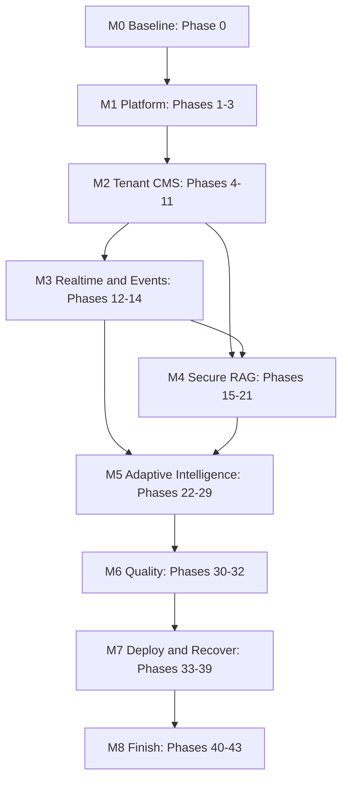

# Nexora Delivery Roadmap

## Strategy

Keep all Prompt Phases 0-43 as durable phase contracts. Execute them through nine integration milestones. A prompt phase is not accepted in isolation when its end-to-end behavior depends on a later phase; the dependency and final integration receipt remain visible.

## Dependency Flow



## Milestone M0 — Truthful Baseline

Prompt phases: 0.

Exit:

- Real repository boundary and existing assets inventoried.
- Product/outcome, target users, deployment intent, data policy and first release line approved.
- Toolchain versions live-verified.
- Architecture, threat model, decision log and dependency map exist.
- Source hash plus parent/child requirement catalogs have zero unclassified normative lines; two independent implementations reproduce the semantic candidate digest.
- AgentKit runtime, routes, privacy/artifact gate and workflow configuration validated.
- No product implementation claim based on the empty repository.

## Milestone M1 — Buildable Platform

Prompt phases: 1-3.

Integrated scenario:

```text
fresh clone
→ one documented setup
→ serialized M1-DW01 creates the exact Node package manifests/lockfile and frozen install passes
→ dependencies start
→ migrations apply
→ Supabase exposure/grant/managed-schema/extension compatibility gates pass
→ Spring health/OpenAPI/logging work
→ Next.js shell renders breadcrumbs/contextual help and complete states
→ CI runs the same baseline gates
```

Shared ownership: M1-T01 serializes non-Node root governance/Makefile/Compose/CI; M1-DW01 serializes every Node dependency manifest plus `pnpm-lock.yaml`; generated contracts and base configuration keep their own exclusive owners. Application workers consume frozen heads and cannot inherit these paths.

## Milestone M2 — Secure Tenant CMS and Publishing

Prompt phases: 4-11.

Integrated scenario:

```text
authenticated organization member
→ authorized role
→ manage an allowlisted profile
→ compose page from five schemas including hide/show
→ autosave/preview
→ submit/review/approve
→ immutable publish with typed SEO/canonical/social/sitemap output
→ visitor renders without frontend redeploy
→ rollback creates new version
```

Gate includes the deterministic Nexora University pack plus a hostile tenant, deny matrix, builder keyboard/hide-show alternative, theme/SEO constraints, audit records, 375px/desktop evidence and Realtime-independent durable correctness.

## Milestone M3 — Realtime and Durable Events

Prompt phases: 12-14.

Integrated scenario:

```text
committed domain change
→ outbox row in same transaction
→ bounded publisher
→ NATS transport where justified
→ authorized Realtime notification
→ disconnected client recovers from durable state
```

Realtime/NATS are delivery mechanisms. PostgreSQL remains the truth.

Task-level order intentionally corrects the numeric prompt order where durable safety requires it:

```text
freeze event vocabulary
-> establish transactional outbox truth and idempotency contract
-> add private Realtime delivery and durable refetch
-> add the bounded Go/NATS ingress only with a real persistence consumer,
   failure evidence and benchmark against the Spring alternative
```

Prompt Phase 13 remains inside accepted M0-M4 scope, but it cannot pass from a skeleton/health check or claim M5 analytics. Detailed sequencing is in [M0-M4 Execution Ledger](./m0-m4-execution-ledger.md).

### Dependency authority

Phase frontmatter `dependencies` preserves the non-forward prompt traceability graph. Runtime dispatch for the first Goal is governed by the task ledger and explicit `dispatch_after` safety gates. In the numeric-order exception, the Go Prompt Phase 13 file declares `dispatch_after: [15]`: execution Phase 15 / Prompt Phase 14 outbox must have its exact M3-T02 head `INTEGRATED` on the milestone branch before the Go task becomes `READY`. That is provisional same-milestone integration, not `ACCEPTED` main. The M3-T04/M3-T05 frozen-interface exception and joint-evidence gate remain binding. A scheduler that ignores `dispatch_after`, canonical dependency states or the execution ledger is not authorized for Nexora.

## Milestone M4 — Secure Knowledge and RAG

Prompt phases: 15-21.

Integrated scenario:

```text
authorized upload
→ durable job
→ hostile-input extraction limits
→ chunks and embeddings
→ lexical + vector retrieval
→ permission predicates before context
→ persisted tenant-scoped chat session/message lifecycle
→ streamed grounded answer with cancel/regenerate/resume
→ authorized citations
→ history reload and deletion propagation
→ evaluation and trace inspection
```

Unauthorized chunk in candidates/context is an unconditional STOP. URL ingestion remains off until the SSRF gate is independently accepted.

## Milestone M5 — Adaptive Product Intelligence

Prompt phases: 22-29.

Integrated scenario:

```text
stable flag/experiment assignment
→ exposure and conversion event
→ durable analytics persistence
→ honest aggregate
→ tenant-safe bookmarks and topic follows
→ rules-based personalization
→ explainable recommendation
→ durable notification
→ authorized global search and audit
```

No winner or recommendation claim without real event provenance and statistically honest limitations.

## Milestone M6 — Security, Observability and Measured Performance

Prompt phases: 30-32.

Exit:

- Threat model attacks every exposed surface and fixes are regression-tested.
- Logs/metrics/traces correlate without sensitive payloads.
- Alerts link to owned runbooks.
- Load tests have reproducible environments and before/after artifacts.
- No hard-coded performance target is claimed without contemporary evidence.

## Milestone M7 — Deployability and Recovery

Prompt phases: 33-39.

Integrated scenario:

```text
reviewed main SHA
→ Vercel preview and reproducible non-root GHCR images
→ SBOM, scans, provenance and attestation
→ rendered Kubernetes/Helm
→ reviewed Terraform plan
→ GitOps reconciliation
→ controlled promotion, health observation and rollback
→ isolated backup/restore drill
```

Manifests alone are HOLD. Deployment and recovery require live/staging evidence at the approved target.

## Milestone M8 — Product and Portfolio Finish

Prompt phases: 40-43.

Exit:

- Every critical UI route and state receives responsive/accessibility/copy review.
- Documentation and media contain only evidence-backed claims.
- Requested screenshots/GIF and rendered architecture diagrams reconcile through the media manifest.
- GitHub About, Releases and GHCR packages reconcile to the accepted source/artifact/deployment identities.
- Final attacker review findings are fixed or explicitly accepted.
- Staff-level review explains every technology boundary, consistency model, failure mode, security control, operational workflow and reproducibility path.

## Corrected Cross-Phase Dependencies

1. Prompt Phase 9 owns durable transactional publish/version/rollback. Realtime invalidation completes in Phase 12 and outbox reliability in Phase 14.
2. Prompt Phase 22 requires audit semantics before dedicated Phase 28. Establish minimal safe audit contract during foundations; Phase 28 completes coverage/UI.
3. Prompt Phase 23 owns experiment domain and stable assignment. Phase 24 completes real exposure/conversion ingestion and dashboard metrics.
4. Prompt Phase 15 progress always works through durable job polling/refetch; Realtime is progressive enhancement.
5. Prompt Phase 31 completes observability, but every earlier service owns baseline telemetry when introduced.
6. Prompt Phases 33-38 may scaffold only when contracts stabilize; acceptance waits for real artifact/deployment evidence.
7. Prompt Phase 39 cannot pass from documentation alone; deployment/storage targets and restore drill must exist.

## Parallel Execution Windows

| Window | Safe parallel work | Serialized boundaries |
|---|---|---|
| M0 | Read-only scouts/researchers/reviewers | Plan authority and final synthesis |
| M1 | Java service and web shell after workspace contract | Root config, lockfile, Compose, CI, contracts |
| M2 | Backend domain and frontend UX after frozen API/schema; seed writer after domain integration | Migrations, auth/tenant/profile context, page visibility schema, SEO/publishing state, canonical seed roots |
| M3 | Realtime client and Go collector after event/outbox contracts freeze | Event vocabulary, outbox schema, NATS subjects, persistence consumer, Compose |
| M4 | Retrieval API and conversation API may split after one interaction contract; UI waits for both; seed extends sequentially | Document/chunk/vector/retrieval/citation/chat schemas and canonical seed roots |
| M5 | UI/query/read-only analytics streams | Event envelope, experiment assignment, audit schema |
| M6 | Read-only attack/performance/telemetry reviews | Security middleware, telemetry conventions, shared test environment |
| M7 | Per-service image/manifests after stable boundaries | Registry/tag policy, values, Terraform state, environment wiring |
| M8 | Route-specific read-only audits | Global tokens/styles, README, claims and release ledger |

## Accepted Release Strategy

`DEC-001` is accepted. Three layers are deliberately separated:

- **Master program plan:** all Prompt Phases 0-43 / M0-M8 remain mandatory.
- **First formal Goal:** finite `v0.1` scope ending after M4 / Prompt Phase 21.
- **Runtime tasks:** bounded thread/branch/worktree units that cannot complete the Goal independently.

M5-M8 are `FUTURE_GOAL`, not missing v0.1 work. The proposed first release label is `v0.1.0-alpha.1`, a production-shaped developer preview; full production-ready claims remain blocked by the M6-M8 security, deployment, recovery and final-review gates. See [v0.1 Release Contract](./release-v0.1-contract.md), [Production Continuity](./production-continuity-and-hosting.md) and [Documentation/GitHub Distribution](./documentation-media-and-github-release.md).

## Innovation Overlay

[Innovation and Differentiation Backlog](./innovation-and-differentiation-backlog.md) is a non-executable overlay, not a tenth milestone. Small provenance/decision/evaluation fields may strengthen existing M2/M4 acceptance only after same-revision Advisor/Kongming and user disposition. Adaptive simulation, AI co-editing, impact automation, Content Credentials and connectors remain later experiments; they do not alter Option A, phase counts, estimates or completion semantics by appearing in the backlog.
