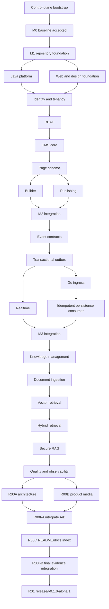

# Nexora v0.1 M0-M4 Execution Ledger

## Status

- Planning state: `DISPATCHED — M3 INTEGRATION IN PROGRESS`.
- Goal scope: v0.1 M0-M4 / Prompt Phases 0-21.
- M0-M2 and M3-T01/T02/T03 are accepted on `main`; M3-T04 (Go ingestion),
  M3-T05 (persistence consumer), M3-R01 (runtime wiring) and the admission
  guard coverage are `INTEGRATED` on `integration/v0.1-m3` and provisional
  until the M3-I01 gate closes.
- Every task below becomes runnable only after its dependency, decision, branch, worktree, ownership and acceptance packet is materialized against a real Git SHA.
- A table row is not proof that an agent, branch, worktree, test or capability exists.

## Dependency-State Legend

- `ACCEPTED`/`accepted_main`: the referenced prior milestone identity is on approved `main` with combined-main evidence. This term is never used for an unmerged worker branch.
- `INTEGRATED`: the exact same-milestone head is mechanically present on the named milestone integration branch and has the required incremental combined checks; it remains provisional.
- `frozen_interfaces`: an exact `IMPLEMENTED/VERIFYING` producer head/digest may be consumed only for the bounded interface named in the task packet; it is neither PASS nor `MERGE_READY`, head movement blocks both tasks, and joint evidence is required where specified.
- `MERGE_READY`: an exact worker head has independent PASS receipts and may be mechanically integrated. It is not `ACCEPTED`.
- Read-only scouts/reviewers produce identified PASS/FIT receipts rather than writer-branch states. Every runtime packet materializes one of these explicit classes; a bare contextual task ID is not scheduler input.

## Control-Plane Activation Wave

This wave occurs after plan approval but before formal Goal creation. Rows execute by the explicit dependency/gate text rather than lexical ID order. The only write before the durable ledger exists is C0-03's narrowly bounded Git Manager seed commit; every later semantic write uses a branch, project-local worktree and lease.

| ID | Owner | Effect | Output | Gate |
|---|---|---|---|---|
| C0-01 | Advisor + Kongming + Controller | R0 | Two independent recommendations and a user decision receipt for each remaining material Goal blocker, one decision at a time; no semantic file is edited yet | Same-decision Advisor FIT + Kongming PASS plus explicit user answer; unresolved answer remains `HOLD` |
| C0-02 | Git Manager | R0 preflight | Resolve and verify exact `D:\Nexora`, current no-Git fact, supplied origin syntax, intended `main`, ignore/env requirements and the seed staged-path allowlist without creating or modifying any file, Git metadata, config or remote state | Read-only repository/target/allowlist receipt; public-safe secret/provenance scan; exact user-approved parent candidate digest; no mutation |
| C0-03 | Git Manager | R1 local seed exception | As one exclusive operation, initialize exact `D:\Nexora` on `main`, configure supplied origin without pushing, write only approved ignore/env-template/governance paths, reserve ignored `D:\Nexora\.worktrees\`, prove `git check-ignore`, and create root seed commit `chore(repo): seed approved Nexora control plane` | C0-02 PASS; one Git Manager, one direct-main seed commit, explicit staged-path equality, no product code, no concurrent task, clean seed head and no push |
| C0-04 | Project Manager + independent reviewer | R1 local | Resolve the absolute Git common directory; create `<git-common-dir>\agentkit\nexora-control-ledger.sqlite`, versioned schema and genesis event bound to seed SHA/parent plan digest/user-decision receipt, with child catalog explicitly `PENDING_C0_01R` | All worktrees resolve one canonical DB; unique active-boundary lease constraint and hash chain verified; only C0 decision/catalog writers are dispatchable before final binding |
| C0-05 | Project Manager + tester | R1 local/read-only | Two-process/two-temporary-worktree contention test plus read-only dependency-graph dry-run, both before either semantic C0 writer dispatches | C0-04 PASS plus exact C0-01 user-decision receipts; exactly one same-boundary lease succeeds; `M3-T04` cannot become `READY` before `M3-T02` is `INTEGRATED` and the Go/NATS ADR is dual-reviewed; M3-T05 can consume only a pinned M3-T04 frozen interface while M3-T04 remains non-`MERGE_READY`; head movement blocks both and joint evidence is required for both `MERGE_READY`; either failed proof, bypass or deadlock is `STOP` |
| C0-01D | Decision ratification writer, terra medium R1 + independent reviewer + Advisor + Kongming | `docs/c0-decision-ratification` in `D:\Nexora\.worktrees\Nexora-c0-decision-ratification` | Apply only the exact user-approved values to the dispatch-time explicit allowlist containing `decision-log.md`, accepted decision records and affected activation-contract paths; never write the expanded child catalog | C0-01 receipts + C0-05 PASS; active exclusive lease; semantic diff equals approved answers; exact-head dual receipts before `MERGE_READY` |
| C0-I01D | Git Manager + independent tester | approved `main`; mechanical integration only | Integrate the exact C0-01D `MERGE_READY` head and run decision/public-safety checks | No semantic edits during merge; exact decision head is present on clean main and its SHA is recorded for C0-01R dispatch |
| C0-01R | Requirements Catalog writer, terra high R1 + independent requirements reviewer + Advisor + Kongming | `docs/c0-requirements-catalog` in `D:\Nexora\.worktrees\Nexora-c0-requirements-catalog` | Create only `master-requirements-catalog-expanded.md`; expand all 141 parent spans/lines `1..5169` and every `UREQ-*` into stable child IDs with disposition, task/owner and acceptance evidence | C0-I01D PASS with exact decision head on main + C0-05 PASS; active exclusive lease; zero unclassified normative lines; no silent duplicate/defer; exact-catalog-digest Advisor FIT + Kongming PASS before `MERGE_READY` |
| C0-I01R | Git Manager + independent tester | approved `main`; mechanical integration only | Integrate the exact C0-01R `MERGE_READY` head and run combined decision/catalog/public-safety checks | No semantic edits during merge; clean main; user-approved decisions and child catalog both present at exact final control-plane head |
| C0-06 | Controller + Project Manager + two digest implementations + independent reviewer + Advisor + Kongming | R0 | Public-safe `NEXORA-SEMANTIC-DIGEST-1` manifest, final control-plane SHA, source/parent/child-catalog digests, ledger/genesis/contention/dependency-graph receipts, final ledger-binding event, runtime inventory and Goal Warmup receipt | C0-I01R PASS plus the unchanged C0-05 PASS identities; Node/PowerShell path/content/digest equality; manifest has logical/relative paths only; same-candidate dual receipts and technical `READY` |
| C0-07 | Controller | Goal creation | Finite Goal pinning M0-M4 plan SHA/digest, source/catalog digests and an empty default innovation-hook set | User-approved Goal text, dual receipts, no R3 expansion |

First remote push is not implicit in the read-only C0-02 preflight or C0-03 seed exception. It follows the accepted `DEC-004` policy.

## Dependency Spine



## M0 — Truthful Baseline

No product implementation happens in M0.

| Wave | Task ID | Thread/role | Planned branch | Exclusive paths | Depends on | Exact acceptance |
|---:|---|---|---|---|---|---|
| 1 | M0-T01 | Workspace/toolchain Scout, terra medium R0 | none | none | C0-07 Goal active | Current files, Git, remote, tools, versions and absences recorded without secrets |
| 1 | M0-T02 | Requirements Scout, terra medium R0 | none | none | C0-07 Goal active | Recompute source/parent/child catalog coverage; Prompt Phase 0-43 and M0-M4 mapping have no omission or weakened post-activation requirement |
| 1 | M0-T03 | Runtime Scout, terra medium R0 | none | none | C0-07 Goal active | Live AgentKit/subagent/model/tool/control inventory or explicit gaps |
| 1 | M0-D01 | Documentation-assessment writer, terra high R1 | `docs/m0-project-assessment` | `docs/project-assessment.md`, `docs/implementation-plan.md` only | C0-07 Goal active + `USCOPE-001` discharged by this accepted C0-01D scope amendment + M0-T01 through M0-T03 PASS receipts | Create the two source-required assessment/implementation-plan documents from the pinned child-catalog requirements; record provenance, risks, sequencing, owners and non-goals without claiming product completion; exact-head Advisor FIT + Kongming PASS before `MERGE_READY` |
| 2 | M0-T04 | Architect, sol high R1 | `docs/m0-architecture` | `docs/architecture/**`, approved ADR drafts | M0-T01 through M0-T03 PASS receipts | System/data/trust diagrams, module boundaries, alternatives and failure semantics |
| 2 | M0-T05 | Security planner/reviewer, sol high R1 | `docs/m0-threat-model` | `docs/security/**` | M0-T01 through M0-T03 PASS receipts | Tenant/Auth/Storage/Realtime/upload/RAG/provider threat model and STOP tests |
| 3 | M0-T06 | Project Manager, terra high R1 | `docs/m0-delivery-contract` | Active plan ledger and receipts | M0-T04 and M0-T05 exact-head `frozen_interfaces` report pins | Dependencies, ownership, estimates, open decisions and resume packet synchronized |
| 4A | M0-T07A | Advisor, sol high R0 | none | none | M0-T04 through M0-T06 same-candidate digest in `VERIFYING` | Independent FIT/HOLD/STOP review of outcome, UX, operability, cost and plan alignment |
| 4B | M0-T07B | Kongming, sol high R0 | none | none | M0-T04 through M0-T06 same-candidate digest in `VERIFYING` | Independent PASS/HOLD/STOP C3 review of contradictions, security, failure modes and evidence |
| 5 | M0-I01 | Controller + Git Manager | approved `main` target; no M0 integration branch | Mechanical merge of M0 `MERGE_READY` docs only | M0-T07A FIT + M0-T07B PASS on same candidate | Sequential exact-head docs merges, dispositions, combined M0 checks, clean main and no unresolved v0.1 blocker |

M0-D01 does not exist as a pre-Goal writer: this C0-01D amendment grants only its post-Goal packet boundary and does not create either owned document. M0-T01 through M0-T03 run in parallel; M0-D01, M0-T04 and M0-T05 may run in parallel after their stated dependencies because their paths are disjoint; the Controller serializes final authority.

## M1 — Repository and Platform Foundation

| Wave | Task ID | Thread/role | Branch | Exclusive paths | Dependencies | Review focus |
|---:|---|---|---|---|---|---|
| 1 | M1-T01 | Foundation worker, terra high R2 | `chore/repository-foundation` | Non-Node root governance/build paths, `.github/**`, Compose, Makefile, tool pins, worktree-local `.agentkit/state/` projection/cache ignore, license and directory skeleton; explicitly no Node package manifest/workspace/lockfile | M0-I01 `ACCEPTED` on main | Fresh clone, exact toolchain pins, secret/provenance gates, local/CI parity; ignored projection never replaces the common-directory ledger |
| 2A | M1-DB01 | Schema/migration train owner, sol high R2 | `feature/database-foundation` | `database/migrations/**` and migration-only fixtures/docs | M1-T01 `INTEGRATED` + DEC-028 accepted revision | One baseline migration authority, non-exposed application schemas, explicit grants/RLS, observed extension compatibility, roles/rollback notes and clean Testcontainers apply |
| 2B | M1-T02 | Critical Java worker, sol high R2 | `feature/java-platform` | `apps/platform-api/**` excluding migration files; Java CI slice | M1-T01 + M1-DB01 `INTEGRATED` | Spring start, migration consumption, OpenAPI, errors, health/readiness, telemetry, Testcontainers |
| 2C0 | M1-D00 | UX architecture writer, sol high R1 | `design/m1-ux-architecture` | `docs/ux/architecture/**` only: journeys, IA, route/state inventory and wireflows | M1-T01 `INTEGRATED` + accepted parent/child requirements | Outcome/persona coverage, responsive state inventory, accessibility/navigation semantics and exact-head Advisor/Kongming review before integration |
| 2C1 | M1-D01A | Stitch direction writer A, sol high R1 | `design/m1-signal-atelier` | `.stitch/directions/signal-atelier/**`, `assets/designs/signal-atelier/**` only | M1-D00 exact head `INTEGRATED` | Direction A evidence/provenance only; no canonical DESIGN.md or product code |
| 2C2 | M1-D01B | Stitch direction writer B, sol high R1 | `design/m1-luminous-grid` | `.stitch/directions/luminous-grid/**`, `assets/designs/luminous-grid/**` only | M1-D00 exact head `INTEGRATED` | Direction B evidence/provenance only; path intersection with A is empty |
| 2C3 | M1-D01C | Stitch direction writer C, sol high R1 | `design/m1-warm-intelligence` | `.stitch/directions/warm-intelligence/**`, `assets/designs/warm-intelligence/**` only | M1-D00 exact head `INTEGRATED` + one design slot released | Direction C evidence/provenance only; maximum two direction writers remains enforced |
| 2D | M1-D02 | Design-system owner, sol high R1 | `design/m1-nexora-design-system` | Canonical `.stitch/DESIGN.md`, `assets/designs/selected/**` and design decision record only | M1-D01A through M1-D01C `INTEGRATED` + Advisor/Kongming scorecards + explicit user selection | One canonical selected-direction-derived token/component contract; no product code |
| 2E | M1-DW01 | Node dependency-window owner, terra high R2 | `chore/m1-node-dependency-window` | Only root `package.json`, `pnpm-workspace.yaml`, `pnpm-lock.yaml`, `.npmrc` and `package.json` under `apps/web`, `packages/design-tokens`, `packages/ui-core`, `packages/ui-studio`, `packages/ui-ai`, `packages/ui-builder`, `packages/contracts` | M1-T01 + M1-D02 `INTEGRATED`; DEC-025 accepted revision | Exact compatible pins, provenance/license/security review, deterministic lockfile, frozen install and temporary import/SSR probe; no product source |
| 3B | M1-T03 | Frontend foundation worker, terra high R2 | `feature/web-design-foundation` | `apps/web/**`, `packages/design-tokens/**`, `packages/ui-{core,studio,ai,builder}/**` excluding every `package.json`; no root dependency controls, lockfile, backend or migrations | M1-DW01 + M1-D02 `INTEGRATED`; DEC-027 accepted revision | Frozen install with zero dependency-control diff; Next/AntD SSR, strict TS, branded tokens/wrappers, per-surface CSP/cache, states, 375px/desktop and keyboard/a11y |
| 3 | M1-T04 | Contract owner, sol high R1 | `feature/platform-contracts` | `packages/contracts/**` excluding `packages/contracts/package.json`; OpenAPI generation only | M1-T02 + M1-T03 + M1-DW01 `INTEGRATED` | Frozen install with zero dependency-control diff, generated-client drift, stable error/auth/trace contract |
| 3R | M1-DW01R1 (conditional) | Same Node dependency-window boundary owner + independent reviewer | `chore/m1-node-dependency-revision` | Exact M1-DW01 allowlist only; never product/generated source | A reviewed ledger request from BLOCKED M1-T03 or M1-T04, exact current integration head and no active dependency writer | At most one bounded M1 revision: requested package/version only, rationale/provenance/license/security, frozen install and zero unrelated diff; Git Manager integrates it, invalidates all requester receipts and re-dispatches requester from the new head; another request is `STOP` for replan |
| 4 | M1-I01 | Git Manager + independent tester/reviewer | `integration/v0.1-m1` | Mechanical `MERGE_READY` heads only | M1-T01, M1-DW01, M1-T02 through M1-T04, M1-D00 and M1-D02 `INTEGRATED`; if invoked, M1-DW01R1 also `INTEGRATED` and requester re-dispatch evidence current | Fresh-clone frozen install, combined Compose/build/test and same-head Advisor/Kongming milestone receipts before main |

Merge order: repository foundation -> database foundation/Java platform as gated -> UX architecture -> Stitch directions -> selected design system -> serialized Node dependency window -> approved web foundation -> generated contracts. M1-T03 and M1-T04 never edit Node dependency-control files. If either emits a reviewed request, only conditional M1-DW01R1 may change them; Git Manager integrates that head first, revokes the requester lease/receipts and re-dispatches it from the new exact integration head. Any second M1 dependency request is `STOP` for Controller replan. Other shared-root or migration changes remain dedicated owner tasks; Java/web workers never take migration ownership.

Planned commit clusters:

- `chore(repo): initialize Nexora monorepo governance`
- `chore(dev): add reproducible local dependency stack`
- `chore(ci): add baseline validation workflow`
- `chore(deps): pin M1 Node dependency window`
- conditional `chore(deps): reconcile one reviewed M1 dependency request`
- `chore(api): initialize Spring platform application`
- `feat(api): add stable validation and error contract`
- `feat(observability): add platform health and telemetry baseline`
- `chore(web): initialize Next.js product shell`
- `feat(ui): add approved Nexora tokens and primitives`
- `feat(web): add resilient route and error boundaries`

## M2 — Secure Tenant CMS and Publishing

M2 uses one high-risk writer until tenant and permission contracts are frozen. Frontend and backend can split only after those contracts pass independent review.

| Wave | Task ID | Thread/role | Branch | Exclusive paths | Dependencies | Review/STOP focus |
|---:|---|---|---|---|---|---|
| 1 | M2-C01 | Tenant/permission contract owner, sol high R1 | `feature/tenant-permission-contracts` | Frozen identity/tenant/permission API, schema and test-fixture contracts only | M1-I01 `ACCEPTED` on main | Membership authority, role vocabulary, DB-role/RLS/session contract and two-tenant fixtures |
| 2 | M2-DB01 | Schema/migration train owner, sol high R2 | `feature/m2-schema-auth` | Ordered identity/tenant/profile/RBAC migrations, policies and DB fixtures only | M2-C01 `INTEGRATED` | Single writer, forced RLS, composite tenancy constraints, profile lifecycle fields, runtime/migration roles and rollback notes |
| 3A | M2-T01 | Critical identity backend worker, sol high R2 | `feature/identity-tenancy` | Spring identity/tenant/auth/profile modules and backend tests; no migrations/UI | M2-C01 + M2-DB01 `INTEGRATED` | JWT/JWKS, membership-derived tenant, allowlisted profile, lifecycle hooks, pool context reset, removed member, cross-tenant STOP |
| 3B | M2-U01 | Organization/profile access UI worker, terra high R1 | `feature/organization-access-ui` | Auth callback/onboarding/org-switch/profile UI paths only | M2-T01 API `frozen_interfaces` exact head | Same-origin BFF, complete auth/org/profile states, CSRF/session expiry, stale profile conflict and 375px/keyboard evidence; head movement blocks both |
| 4A | M2-T02 | Critical RBAC backend worker, sol high R2 | `feature/rbac` | Spring authorization modules/evaluator/tests; no migrations/UI/contracts | M2-T01 + M2-DB01 `INTEGRATED` | Deny by default, last owner, escalation, stale permission and tenant matrix |
| 4B | M2-U02 | RBAC admin UI worker, terra high R1 | `feature/rbac-admin-ui` | Member/role/permission administration UI only | M2-T02 API `frozen_interfaces` exact head | Denied/loading/error/conflict states, destructive confirmation and accessible tables/forms; head movement blocks both |
| 5 | M2-C02 | CMS/publish contract owner, sol high R1 | `feature/cms-publishing-contracts` | CMS/version/publish/theme/workflow/SEO API/domain contracts and canonical fixtures only | M2-T02 `INTEGRATED` | Aggregate/state/idempotency/audit plus typed SEO/canonical/sitemap/robots contract; no migration or UI write |
| 6 | M2-DB02 | Same schema/migration train owner, sol high R2 | `feature/m2-schema-cms` | Ordered CMS/page/version/theme/workflow/SEO migrations and DB fixtures only | M2-DB01 + M2-C02 `INTEGRATED` | One sequential migration writer; uniqueness/FK/index/RLS/retention/SEO snapshot and expand/contract evidence |
| 7A | M2-T03 | CMS backend worker, terra high R2 | `feature/cms-core` | Spring CMS aggregate/API/backend tests only | M2-DB02 `INTEGRATED` | Tenant slug constraints, typed SEO validation, optimistic concurrency, archive, pagination and audit |
| 7B | M2-U03 | CMS workspace UI worker, terra high R1 | `feature/cms-workspace-ui` | Page list/create/basic editor/SEO metadata UI only | M2-T03 API `frozen_interfaces` exact head | Empty/loading/error/denied/conflict and SEO preview states, keyboard and responsive evidence; head movement blocks both |
| 8A | M2-T04 | Page-schema contract worker, sol high R2 | `feature/page-schema` | `packages/contracts/page-schema/**` and server validation adapter only | M2-T03 + M2-C02 `INTEGRATED` | Versioned JSON Schema, five fixtures, durable block visibility, hostile payloads and fallback contract |
| 8B | M2-T05 | UI block worker, terra high R1 | `feature/page-blocks` | `packages/ui-core/blocks/**` and component fixtures only | M2-T04 schema `frozen_interfaces` exact head | Five branded accessible blocks, responsive behavior, no arbitrary code/HTML/style; head movement blocks both |
| 9A | M2-T06 | Frontend builder worker, terra high R2 | `feature/page-builder` | Builder state/canvas/library/inspector/preview paths only | M2-T04 + M2-T05 `INTEGRATED` | Keyboard-equivalent DnD, hide/show/undo, autosave/offline/conflict and browser/a11y |
| 9B | M2-T07 | Critical publishing backend worker, sol high R2 | `feature/publishing` | Spring publishing/version/cache/public-resolver/SEO backend and tests only | M2-T03 + M2-T04 + M2-DB02 `INTEGRATED` | Immutable versions, idempotency, tenant cache key, SEO snapshot/canonical/sitemap/robots, rollback and outage correctness |
| 10A | M2-U04 | Publishing/public UI worker, terra high R1 | `feature/publishing-ui` | Preview/history/review-facing publication UI, public rendering and crawler-output paths | M2-T07 API `frozen_interfaces` exact head | Same-origin flow, publish/rollback conflicts, canonical/OG/Twitter/JSON-LD/sitemap/robots and degraded states; head movement blocks both |
| 10B | M2-T08 | Theme backend worker, terra high R2 | `feature/theme-engine` | Spring theme/token serialization backend and tests only | M2-T05 + M2-T07 + M2-DB02 `INTEGRATED` | Constrained tokens, versioned theme publish/rollback and unsafe value rejection |
| 11A | M2-T09 | Workflow backend worker, sol high R2 | `feature/content-workflow` | Spring review/approve/reject state machine and tests only | M2-T02 + M2-T07 + M2-DB02 `INTEGRATED` | Server-owned transitions, fresh permissions, immutable history and stale conflict |
| 11B | M2-U05 | Theme editor UI worker, terra high R1 | `feature/theme-editor-ui` | Theme editor/preview UI only | M2-T08 API `frozen_interfaces` exact head | Contrast/focus, constrained controls, preview/save/failure states; head movement blocks both |
| 12 | M2-U06 | Review workflow UI worker, terra high R1 | `feature/content-workflow-ui` | Review queue/detail/action UI only | M2-T09 API `frozen_interfaces` exact head | Denied/stale/conflict/reason/confirmation states and keyboard evidence; head movement blocks both |
| 12B | M2-S01 | Demo seed writer, terra high R1 | `test/m2-demo-seed` | `test-fixtures/demo/**` and `database/seed/**` only; no migrations/domain/UI | M2-T03 + M2-T07 through M2-T09 `INTEGRATED` | Deterministic Nexora University users/pages/theme/workflow, no committed credentials, idempotent safe reset and manifest checksum |
| 13 | M2-I01 | Tester + security reviewer + Git Manager | `integration/v0.1-m2` | Mechanical `MERGE_READY` heads only | M2-T06 through M2-T09 + M2-U01 through M2-U06 + M2-S01 `INTEGRATED` | Two-tenant compose/publish/rollback/SEO/seed, zero leakage and same-head Advisor/Kongming milestone receipts before main |

Safe parallel windows:

- M2-DB01 and M2-DB02 are executed by the same migration-train owner, sequentially; no domain/UI row may edit `database/migrations/**`.
- At most two disjoint writers run: for example M2-T01/M2-U01 only after API freeze permits it, or M2-T06/M2-T07 after page/CMS contracts freeze.
- M2-T08 and M2-T09 may run together only after M2-DB02 and publishing/RBAC contracts freeze; their UIs wait for their own exact API heads.
- Every table row is a work package. Dispatch materializes one child task per listed exclusive path group plus separate exact-head test/review; a work package itself is never handed to one agent if it contains more than one writer boundary.

Key commit clusters are the phase-level commits in Prompt Phases 4-11; each branch should normally preserve domain/test/UI concerns in 1-3 independently understandable commits, while never leaving integration broken merely to satisfy a count.

## M3 — Realtime and Durable Events

| Wave | Task ID | Thread/role | Branch | Exclusive paths | Dependencies | Review/STOP focus |
|---:|---|---|---|---|---|---|
| 1 | M3-T01 | Event contract owner, sol high R2 | `feature/event-contracts` | Event/channel/subject/outbox contracts and safe payload allowlist | M2-I01 `ACCEPTED` on main | Versioning, tenant authority, PII allowlist, idempotency keys, subject ownership |
| 2 | M3-DB01 | Same schema/migration train owner, sol high R2 | `feature/m3-schema-events` | Application-owned outbox/event-ledger migrations/indexes/fixtures plus provider-documented `realtime.messages` policy DDL only | M3-T01 `INTEGRATED` + DEC-028 accepted revision | One migration writer; no managed-schema custom objects/indexes/functions; private-channel policy, retention, lease/locking, idempotency and rollback contract |
| 3 | M3-T02 | Critical outbox backend worker, sol high R2 | `feature/transactional-outbox` | Spring outbox transaction/publisher/state machine and tests; no migration/shared contract | M3-T01 + M3-DB01 `INTEGRATED` | Same transaction, crash windows, poison event, bounded retry and at-least-once/idempotency |
| 4A | M3-T03 | Realtime worker, terra high R2 | `feature/realtime-delivery` | Spring/Supabase service adapter, web subscription/hooks and policy-conformance tests only; no SQL or migrations | M3-T02 `INTEGRATED` | Consume the integrated M3-DB01 policy contract; private channels, reconnect/refetch, removal/expiry, bounded retry and negative conformance evidence |
| 4B | M3-T04 | Go worker, terra high R2 | `feature/go-event-ingestion` | `services/event-ingestion/**` and service-local tests/container only | M3-T02 `INTEGRATED` + same-revision ADR Advisor FIT/Kongming PASS + Controller disposition | Auth/rate/body limits, NATS publish failure/backpressure, benchmark against Spring and raw load receipt |
| 5 | M3-T05 | Event consumer worker, sol high R2 | `feature/event-persistence-consumer` | Spring idempotent consumer/event-ledger backend paths only | M3-T01 + M3-DB01 `INTEGRATED`; M3-T04 exact-head `frozen_interfaces` pin | Real durable raw-event persistence, duplicate/replay behavior and no M5 analytics claim; M3-T04 stays `IMPLEMENTED/VERIFYING` until joint evidence exists |
| 6 | M3-R01 | Root runtime-wiring owner, terra high R2 | `chore/m3-runtime-wiring` | Explicit NATS/Go/Spring Compose, root CI/Make targets and environment-name templates only | M3-T03 through M3-T05 `INTEGRATED` | One bounded root diff, exact image/health wiring, no contract/migration mutation, clean failure startup |
| 7 | M3-I01 | Tester + reviewer + Git Manager | `integration/v0.1-m3` | Mechanical `MERGE_READY` heads only | M3-T03 through M3-T05 `INTEGRATED` + M3-R01 `MERGE_READY` | Merge M3-R01, run publish/event durability outage scenario and obtain same-head Advisor/Kongming milestone receipts before `main` |

Prompt Phase 13 remains in M3, but durable truth is implemented first. Git Manager incrementally integrates each `MERGE_READY` prerequisite onto `integration/v0.1-m3`; this yields `INTEGRATED`, never `ACCEPTED`, before downstream dispatch. Go/NATS cannot pass from a service skeleton: it requires an idempotent persistence consumer plus benchmark/failure evidence against the simpler Spring endpoint. To avoid a dependency cycle, M3-T04 freezes its exact interface/fixture head in `IMPLEMENTED/VERIFYING`; that frozen head may dispatch M3-T05 but is not `MERGE_READY`. A changed M3-T04 head blocks both tasks. M3-T04/M3-T05 receive joint consumer/failure evidence, then both become `MERGE_READY` and are mechanically integrated; the phase-level consumer criterion is discharged only at M3 integration. M3-DB01 is the only migration/SQL/RLS policy writer: it owns application objects and only the provider-documented managed-table policies allowed by the Supabase platform boundary; it never claims the managed schema. M3-T03 consumes its integrated policy and owns only adapters, web lifecycle and conformance tests; M3-R01 is the only root Compose/CI writer and starts after M3-T03 through M3-T05 are integrated. The Go worker owns none of those shared boundaries. M3 does not claim analytics, experimentation or notification completion from M5. Advisor and Kongming independently review the same boundary ADR and the Controller disposes every finding before code is dispatched. The C0 graph dry-run must prove these state edges and must not mistake a frozen interface, `MERGE_READY`, `INTEGRATED` or `ACCEPTED` for one another.

## M4 — Secure Knowledge and RAG

| Wave | Task ID | Thread/role | Branch | Exclusive paths | Dependencies | Review/STOP focus |
|---:|---|---|---|---|---|---|
| 1 | M4-C01 | Knowledge/RAG contract owner, sol high R1 | `feature/knowledge-rag-contracts` | Document/job/chunk/vector/access/citation/chat-session/message/lifecycle schema and canonical fixture contracts only | M3-I01 `ACCEPTED` on main + accepted retention/embedding decisions | Tenant/access/deletion/export/provenance/chat-state contracts frozen before storage/schema work |
| 2 | M4-DB01 | Same schema/migration train owner, sol high R2 | `feature/m4-schema-train` | Knowledge/document/job/chunk/vector/chat-session/message/trace migrations, policies, indexes and DB fixtures only | M4-C01 `INTEGRATED` | One writer; pgvector and chat dimension/index/RLS/retention/deletion/lineage plus rollback evidence |
| 3A | M4-T01 | Critical knowledge backend worker, sol high R2 | `feature/knowledge-management` | Spring knowledge/document/storage/job backend and tests; no migrations/UI | M4-C01 + M4-DB01 `INTEGRATED` | Private storage, bounded signed operations, durable jobs, object deletion and tenant tests |
| 3B | M4-U01 | Knowledge workspace UI worker, terra high R1 | `feature/knowledge-workspace-ui` | Knowledge list/upload/job progress/recovery UI only | M4-T01 API `frozen_interfaces` exact head | Upload/progress/retry/denied/error/empty states, 375px and keyboard evidence; head movement blocks both |
| 4 | M4-T02 | Ingestion worker, terra high R2 | `feature/document-ingestion` | Parser/chunker/job worker and hostile fixtures only | M4-T01 `INTEGRATED` | PDF/MD/text limits, no network, deterministic chunks, restart/resume and provenance |
| 5 | M4-T03 | Critical vector worker, sol high R2 | `feature/vector-retrieval` | Embedding adapter/vector query/index-plan tests; no migration | M4-T02 + M4-DB01 `INTEGRATED` | Fixed model/revision/dimension, pre-candidate predicates, deletion/reindex and cost bounds |
| 6 | M4-T04 | Retrieval worker, sol high R2 | `feature/hybrid-retrieval` | FTS/vector adapters, RRF fusion and evaluation corpus only | M4-T03 `INTEGRATED` | Predicate parity, deterministic ranking, top-K bounds and corpus provenance |
| 7 | M4-T05 | RAG interaction contract owner, sol high R1 | `feature/rag-interaction-contracts` | Stream/citation/no-answer/provider/trace plus conversation/history contracts only | M4-T04 + M4-C01 `INTEGRATED` | Frozen security/provider/citation/session/message/pagination/idempotency/lifecycle contract for backend/UI split |
| 8A | M4-T06 | Critical RAG API worker, sol high R2 | `feature/secure-rag-api` | Context/provider/query/stream backend and tests only | M4-T05 `INTEGRATED` | Authorized context only, injection resistance, cancellation/timeout and citations |
| 8B | M4-T06B | Conversation persistence API worker, sol high R2 | `feature/rag-conversation-api` | Chat session/message/history/export-delete backend paths and tests only; no retrieval provider/migrations/UI | M4-T05 + M4-DB01 `INTEGRATED` | Tenant/user ownership, stable pagination, idempotent send, persisted stream state, resume/regenerate lineage, deletion and source reauthorization |
| 9A | M4-T07 | Frontend RAG worker, terra high R2 | `feature/rag-chat-ui` | Knowledge chat/history UI and citation renderer only | M4-T06 + M4-T06B `INTEGRATED` | Same-origin SSE, history/reload/cancel/regenerate/delete, partial/no-answer/error/denied states, safe citations and 375px/a11y |
| 9B | M4-S01 | RAG demo seed writer, terra high R1 | `test/m4-demo-seed-rag` | Sequential extension of `test-fixtures/demo/**` and `database/seed/**` only | M4-T03 + M4-T07 `INTEGRATED`; M2-S01 accepted seed manifest | Required named synthetic documents/users, expected chunks/citations/allow-deny queries, idempotent safe reset and no secret/production target |
| 10A | M4-T08 | RAG quality backend worker, terra high R2 | `feature/rag-quality` | Optional rerank, redacted trace/feedback API and evaluation scripts/reports only | M4-T06 + M4-T07 + M4-S01 `INTEGRATED` | Rerank disabled without gain; reproducible Recall@K/citation/no-answer report on accepted seed digest |
| 10B | M4-U02 | RAG quality UI worker, terra high R1 | `feature/rag-quality-ui` | Trace/feedback/evaluation admin UI only | M4-T08 API/fixture `frozen_interfaces` exact head | Redacted truthful dashboard, complete states and fixture/live labels; head movement blocks both |
| 11 | M4-I01 | Tester + dedicated security reviewer + Git Manager | `integration/v0.1-m4` | Mechanical `MERGE_READY` heads only | M4-T08 + M4-U01 + M4-U02 + M4-S01 `INTEGRATED` | Upload -> process -> retrieve -> persist/resume chat -> stream -> citation/delete; unauthorized context/history is STOP; same-head Advisor/Kongming milestone receipts required before main |
| 12A | R00A | Architecture evidence writer | `docs/m4-alpha-architecture` | `docs/architecture/**` only | M4-I01 `ACCEPTED` `product_sha` on main | Sources/renders match accepted M0-M4 topology; renderer version/digests, security/data review and exact-head dual receipts produce `MERGE_READY` |
| 12B | R00B | Product capture writer | `docs/m4-alpha-media` | `docs/product/media/**`, `docs/product/walkthrough.*`, `docs/media-manifest.json` only | Same accepted `product_sha`; may run beside R00A as the second writer | Real 375px/desktop captures/GIF from the accepted seed digest, raw/edit digest, alt/transcript, runtime tuple and provider/fixture labels produce an exact-head `MERGE_READY` receipt |
| 13A | R00I-A | Git Manager + bounded tester | `integration/v0.1-m4-evidence` | Mechanical integration of R00A and R00B `MERGE_READY` heads only | A/B receipts frozen | Sequentially merge A/B, run link/provenance/path checks and record the exact `INTEGRATED` evidence-base head; no semantic edits |
| 13B | R00C | Docs/index writer | `docs/m4-alpha-docs` | `README.md`, `docs/product/index.md`, `docs/evidence/v0.1.0-alpha.1/**` only | R00I-A exact `INTEGRATED` head | Branch from evidence base; claim index/quick start references present media/architecture evidence; exact-head review produces `MERGE_READY` |
| 14 | R00I-B | Git Manager + combined tester/reviewer | `integration/v0.1-m4-evidence` | Mechanical integration of R00C `MERGE_READY` head only | R00I-A `INTEGRATED` + R00C `MERGE_READY` | Combined links/build/smoke, docs-only `product_sha..evidence_sha` proof, secret/provenance scan and same-candidate dual review before merge to accepted main |
| 15 | R01 | Release Manager writer | `release/v0.1.0-alpha.1` | Release notes/evidence reconciliation and approved metadata only | R00I-B `ACCEPTED` on main; branch from that exact evidence head | Live-provider/full-alpha gate, mandatory remote equality, GitHub About/prerelease evidence, M7 limitations, Advisor FIT + Kongming PASS on exact candidate and user R3 authority |

Safe parallel windows:

- M4-T06 and M4-T06B may run in parallel only after the M4-T05 contract exact HEAD is integrated; M4-T07 waits for both exact backend heads so persistence and stream contracts cannot diverge.
- Tester may prepare read-only hostile/evaluation fixtures while a worker writes, but fixture code changes require a separate `test/...` writer branch.
- M4-DB01 is the only migration writer; M4-C01/M4-T05 are the only contract writers for their disjoint frozen paths. M4-T01/M4-T03/M4-T06/M4-T06B/M4-T08 never edit those shared boundaries. M4-S01 and M2-S01 are sequential owners of the same seed roots and never edit product/migration code.
- Every backend/UI pair is separately dispatched and reviewed even when one table wave shows safe parallel execution.
- R00A and R00B are the only parallel release-evidence writers and start from the same accepted `product_sha`. They become `MERGE_READY`, not `ACCEPTED`. R00I-A integrates both heads first; R00C branches from that exact `INTEGRATED` evidence base so its links resolve. R00I-B then integrates C and runs the full evidence gate before main can become `ACCEPTED`. R01 receives its own single-writer branch from that accepted evidence head. No two agents write the release branch, and no state name is overloaded.

## Exact-Head Gate Per Branch

Before `MERGE_READY`, the Manager independently records:

1. Repository root, intended branch and worktree.
2. Accepted base SHA and current head SHA; expected ancestry.
3. Clean status or explicitly owned uncommitted paths.
4. Focused commits and cumulative changed paths.
5. `git diff --check` for incremental and cumulative range.
6. Targeted unit/integration/browser/security commands with exit codes.
7. Generated artifact and design/model provenance.
8. Credential/secret-shaped addition scan without printing values.
9. Tester and reviewer verdicts tied to the same head.
10. Known limitations and what the evidence did not prove.

Any head change returns the task to `VERIFYING`.

## Integration Wave Protocol

For each milestone:

```text
freeze exact `MERGE_READY` worker HEADs
-> merge contract/migration owner first
-> run contract/schema checks
-> merge one dependent branch
-> run its targeted plus combined checks
-> continue sequentially
-> run milestone end-to-end and security scenario
-> independent milestone review
-> merge integration branch to main
-> record main merge SHA and release receipt
```

No batch merge of several unverified branches. A combined failure is attributed through evidence and returned as a new bounded fix task.

## v0.1 Final Gate Matrix

| Gate | Required evidence |
|---|---|
| Repository | Fresh clone, pinned tools, local/CI parity, clean main and public-safe history |
| Tenancy/RBAC | Two-tenant allow/deny matrix at API, database, storage and Realtime layers |
| CMS/publishing | Five blocks, accessible builder, review/publish/rollback, no frontend redeploy |
| Events | Private Realtime fallback, NATS outage recovery, outbox crash/duplicate/poison tests |
| Knowledge | Secure upload, hostile parser limits, durable restart-safe jobs and deletion propagation |
| Retrieval | Versioned corpus, lexical/vector predicate parity, deterministic fusion and quality metrics |
| RAG | Captured authorized candidate/context IDs, real citations, no-answer, provider failure and injection tests |
| UI | 375px and desktop browser evidence, keyboard, focus, reduced motion, loading/error/empty/denied/conflict/offline |
| AI/provider | Deterministic CI plus separately labeled DeepSeek and embedding live smoke within budget |
| Docs/media | Real M0-M4 screenshots, requested GIF, architecture renders, media manifest, alt/transcript and exact product-source SHA |
| Release | Exact reviewed release SHA, claims/secret/provenance scan, documented M6/M7 limitations, mandatory remote/GitHub prerelease equality after R3 authority; otherwise `NEEDS_USER` |

## Stop Conditions

- Repository/remote identity differs from the approved target.
- Credential value is staged, logged, committed, displayed or placed in a task prompt.
- Two active writers own the same shared boundary.
- Tenant authority derives from an untrusted organization identifier alone.
- Any cross-tenant API/database/storage/Realtime success.
- Published content is mutable or a cache/Realtime path becomes the only truth.
- Event retry is unbounded or a dual write can silently lose a committed event.
- URL/file parser has unbounded network, decompression, CPU, memory, page or content access.
- Unauthorized RAG candidate or context reaches provider construction.
- Citation is fabricated, stale-authorized or not resolvable.
- Mock/unit/config evidence is presented as live provider, deployment, security or scale proof.
- Reviewed HEAD moves before merge.
- Semantic conflict is resolved by the mechanical Git Manager.
