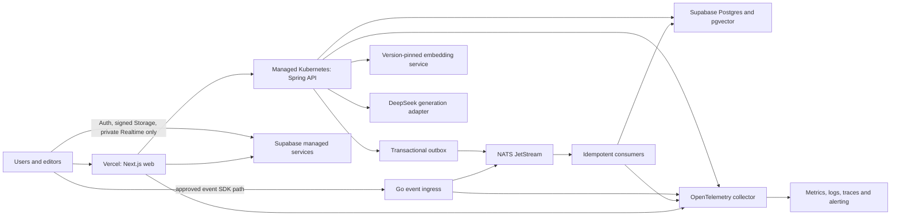
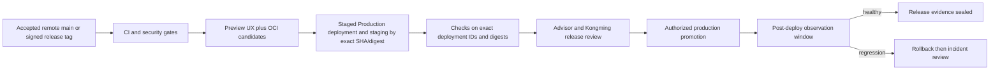

# Nexora Production Continuity and Hosting Contract

## Outcome and Honesty Boundary

The target is a resilient, observable and recoverable production service, not an impossible promise that no dependency will ever fail. “Keep alive” is implemented through managed availability, redundancy, health/readiness, safe deployment, graceful degradation, monitoring, backups and drills. Periodic self-pings may be used as synthetic detection only; they are not an availability control and may not be used to hide a sleeping or undersized production architecture.

## Proposed Production Topology

The logical roles are accepted for planning: Vercel hosts the Next.js experience and same-origin BFF; Supabase supplies identity, PostgreSQL/pgvector, private object storage and approved Realtime paths; Spring owns domain authorization and durable domain writes. Browser domain requests do not call Spring directly in v0.1. The final managed Kubernetes provider/region, NATS service, GPU embedding route and paid plan sizes remain later-Goal cost decisions.

## Candidate Service Objectives — User Approval Required Before M7

| Objective | Initial candidate | Measurement |
|---|---:|---|
| Public read and authenticated CMS/publish availability | 99.9% per calendar month | External synthetic journeys plus server-side completion signals |
| Authorized retrieval availability | 99.9% per calendar month | Retrieval journey without requiring generation provider success |
| RAG generation availability | 99.5% per calendar month | End-user generation success including DeepSeek dependency failure |
| Critical service recovery | RTO <= 30 minutes | Full-outage timeline from detection through validated core-service recovery |
| PostgreSQL/pgvector recovery point | RPO <= 15 minutes | PITR recovery point plus application reconciliation drill |
| Storage-object recovery point | RPO <= 60 minutes initially | Off-site/versioned export watermark and checksum manifest; never inferred from database PITR |
| JetStream recovery point | No accepted domain event lost while outbox replay window is valid; snapshot RPO <= 15 minutes for non-rebuildable stream state | Outbox replay plus stream snapshot/restore drill |
| Full data-plane restore | RTO <= 60 minutes candidate | Isolated DB/object/stream/config restore and cutover validation; may breach the monthly SLO and triggers incident/error-budget handling |
| Deployment rollback | <= 10 minutes for application-only regression | Promotion/rollback drill with post-rollback probes |

These are candidates, not present capabilities or contractual guarantees. A 99.9% 30-day SLO has about 43.2 minutes of error budget, so the critical-path RTO is set below that single-outage ceiling and still does not guarantee the SLO. M0 records traffic/data/cost assumptions and a decision schedule; M6 defines each SLI denominator and establishes measurement; M7 proves or revises the targets with user approval and a cost envelope.

SLIs count platform-caused timeouts, dependency failures and server-side rate limiting that prevents a valid critical journey. Client-invalid 4xx responses are excluded from the request denominator but remain security/product metrics; 429 is reported separately and counts as journey failure when capacity policy blocks an otherwise valid user. Maintenance and provider outages are never silently removed—any exclusion requires an accepted policy and is disclosed with the error-budget report.

## Platform Continuity Controls

### Vercel web

- Separate Local, Preview and Production environments with environment-scoped secrets.
- Use one deployment authority. Proposed default: GitHub Actions with a pinned Vercel CLI and auto-production-domain assignment disabled for release candidates; mixing manual, Git auto-deploy and CI authority is STOP.
- Preview verifies branch UX but is not treated as the production artifact because production promotion may rebuild with Production environment configuration.
- Build a staged Production deployment from the accepted source SHA and production configuration, run deployment checks/E2E/synthetics against that exact deployment ID, then promote that same staged deployment without rebuild.
- Receipt records Vercel team/project, deployment ID/URL, source SHA, framework/build output digest where observable, environment-variable-name/config fingerprint, regions and check results.
- A rollback candidate is eligible only when its deployment ID previously served or is otherwise eligible, required secrets are not revoked, configuration is recoverable and database/schema compatibility still passes. Instant rollback configuration/env limitations are tested and documented.
- Structured logs, Web Analytics/Speed Insights where approved, OpenTelemetry correlation and external synthetic journeys.
- Region alignment with the API/database, cache policy, CSP/security headers, WAF/rate controls and spend alerts appropriate to the selected plan.
- No cron ping intended merely to keep the frontend awake.

### Supabase data plane

- Production uses a non-pausing paid plan; Free projects remain development-only because inactivity pausing and backup limitations are incompatible with this continuity target.
- RLS on every browser-exposed relation, private Storage policies, private Realtime authorization, least-privilege service/database roles and audited `service_role` handling.
- Domain tables live in application-owned schemas outside the Data API. The API is disabled when possible; otherwise exposed schemas and every grant are explicit, with no dependence on legacy automatic `public` privileges.
- Custom objects never enter managed `auth`, `storage` or `realtime` schemas. Only provider-documented policies/triggers on supported tables are permitted, and `realtime.messages` policy DDL is owned by one migration-train task.
- Managed extension migrations omit requested version clauses; promotion records the actually installed PostgreSQL/extension versions and proves application/query-plan compatibility.
- Connection pooling and limits sized through load evidence; application and migration identities are separate.
- PostgreSQL PITR/backups cover database state only. Private Storage objects use a separately versioned/off-site export or replication process, object-hash manifest and DB/object reconciliation watermark.
- Restore order is explicit: infrastructure/config and roles -> database/PITR -> custom-role credential reset -> Storage objects -> Auth/RLS/Storage/Realtime validation -> tenant/CMS/RAG reconciliation -> approved cutover.
- Secret values and custom-role passwords are recreated from the approved secret authority, not assumed to be present in database backup.
- Performance/Security Advisor checks, index/slow-query review, capacity alerts and launch load tests.
- Read replica or higher-availability options are justified by measured failure/capacity needs, never claimed because a toggle exists.
- SSL enforcement, network restrictions where compatible with the selected server egress, privileged-account MFA/multiple-owner recovery, custom SMTP, CAPTCHA/rate settings and configuration drift are explicit production receipts rather than dashboard assumptions.

### Spring and Go backend

- Minimum two production replicas per critical stateless service across failure domains where the provider supports it.
- Startup, liveness and readiness probes have different semantics; readiness fails when accepting traffic would be unsafe, while liveness never masks dependency outages with endless restarts.
- Resource requests/limits, disruption budget, topology spread, rolling/canary strategy, graceful shutdown, request draining and migration compatibility.
- Timeouts, bounded retries with jitter, circuit breaking, bulkheads and idempotency; no retry storm or unbounded queue.
- Transactional outbox before publish; JetStream durable consumers, explicit ack/redelivery, DLQ/quarantine, replay and duplicate-safe persistence.
- Go ingress publishes validated events into JetStream; it is not downstream of the stream. Spring outbox publishes a second approved source path and every business consumer is idempotent.
- M7 selects managed NATS or a file-backed JetStream cluster with replication factor 3, persistent volumes across independent failure domains, retention sized beyond the outbox replay window, quorum/leader-loss tests and snapshot/restore drills.
- Autoscaling follows measured CPU/concurrency/lag signals and preserves minimum capacity; scale-to-zero is disabled for the critical API unless explicitly reclassified.
- Immutable digest deployment, least-privilege runtime identity, read-only filesystem where practical and no secrets in images/manifests/logs.

### Network, region and version-skew contract

- Browser domain traffic is same-origin through the Vercel Next.js BFF. Direct browser exceptions are only Supabase Auth, server-approved signed private Storage and authorized private Realtime.
- DNS/TLS, cookie domain/SameSite, CSRF token/Origin checks, JWT issuer/audience, CORS denial/default, API ingress authentication, WAF/rate limits and SSE proxy cancellation/backpressure are frozen in an ADR before hosted validation.
- Vercel Functions, Kubernetes API/consumers, Supabase and NATS are placed using measured latency, egress, residency and failure-domain evidence; “same region” is verified from actual platform configuration, not provider marketing.
- Web N/N-1, API N/N-1, schema expand/migrate/contract, event-envelope N/N-1 and consumer replay compatibility are tested. Deployment order preserves the prior application version until rollback eligibility expires.

### AI and embedding dependencies

- DeepSeek generation, embedding and reranking remain separate adapters with independent timeouts, budgets, telemetry and circuit breakers.
- Provider outage returns an honest degraded/no-generation state; authorized retrieval may remain available without pretending a generated answer exists.
- Embedding model/dimension changes require a versioned re-index migration and rollback plan.
- The production TEI/GPU route must have measured capacity and restart behavior; local-development availability is not production evidence.

## Failure and Degradation Matrix

| Failure | Required behavior | Recovery proof |
|---|---|---|
| DeepSeek unavailable | Preserve CMS/publish; chat shows bounded retry/degraded state without fabricated answer | Fault-injection browser/API receipt |
| Realtime unavailable | Durable state remains authoritative; clients poll/refetch/reconnect with backoff | Publish/notification fallback test |
| NATS/consumer unavailable | Domain transaction commits with outbox; backlog/lag alerts; idempotent replay within retention | Stop/restart/replay plus quorum/snapshot test |
| Embedding service unavailable | Upload job pauses/retries within budget; no partial “indexed” success | Job restart and state-machine test |
| One backend replica fails | Traffic drains to ready replicas; in-flight handling is documented | Pod/process kill test |
| Bad web/API deployment | Checks block promotion or operator rolls back exact artifact | Timed rollback drill |
| PostgreSQL recovery needed | Restore PITR in isolation, recreate role credentials, validate Auth/RLS/tenancy/CMS/RAG | Database DR receipt with achieved RPO/RTO |
| Storage-object recovery needed | Restore versioned objects by manifest, reconcile watermark/ownership with restored DB | Object restore receipt and checksum/tenant verification |
| JetStream recovery needed | Prefer authoritative outbox replay; restore snapshots only for classified non-rebuildable state | Replay/snapshot receipt with duplicate and gap checks |

## Deployment and Release Flow

Database migrations use expand/migrate/contract sequencing and a single migration authority so the preceding application version can survive rollback. Production promotion is blocked when accepted remote main/tag, Vercel project/deployment/config fingerprint, backend image/attestation subjects, JetStream/event contract, migration version or evidence index disagree. A web OCI image is a portability artifact and is never claimed to be the artifact Vercel serves.

## Observability, Alerting and Incident Control

- One trace/correlation identifier crosses browser, Vercel, Spring, Go, NATS and database/provider spans where supported.
- Structured redacted logs; golden signals for traffic, errors, latency and saturation; queue lag, outbox age, job age, provider failures, connection use and restore freshness.
- Alerts are actionable, deduplicated and routed to an acknowledged owner with severity, runbook and escalation timer.
- Synthetic checks exercise public health plus at least one safe critical journey; they detect failure but do not manufacture availability.
- Incident runbook covers declare, contain, rollback/fail over, communicate, recover, validate, postmortem and follow-up ownership.
- Error budget governs release pace; repeated SLO breach pauses feature promotion until reliability is restored.
- SLI reports are separated by public read, authenticated CMS/publish, authorized retrieval and external-provider generation so a healthy static page cannot hide a broken editor or RAG dependency.

## Agent Keepalive Versus Product Continuity

Agent workflow keepalive means checkpointing Goal/task state, exact Git head, worktree, writer lease, running command/session and next safe action so another turn can resume without duplicate work. It does not leave an uncontrolled agent or shell loop running forever. Product continuity is the deployed-system design above; the two mechanisms have separate evidence and owners.

## Milestone Mapping

- M0: record data classification, candidate SLO/RPO/RTO, assumptions, cost questions and the later decision schedule; do not claim acceptance of DEC-017.
- M1-M4: build health, telemetry, durable jobs/outbox, provider degradation and local integration evidence into each service.
- M6: complete threat, observability and load baselines; define alert thresholds and capacity.
- M7: provision approved staging/production, publish immutable artifacts, prove promotion/rollback and isolated restore.
- M8: final resilience/red-team review, operator rehearsal and honest production evidence index.

Option A remains intact: the first M0-M4 Goal is a production-shaped `v0.1.0-alpha.1`, not an always-on production certification. The always-on launch claim becomes eligible only after M6/M7 gates; expanding the first Goal instead requires a new user decision and re-estimate.

## Required Decisions Before Paid Production

1. Monthly cost ceiling and expected launch load/data volume.
2. Vercel and Supabase plan tiers plus region placement.
3. Managed Kubernetes provider, regions/failure domains and on-call ownership.
4. Accepted SLO/RPO/RTO and maintenance/exclusion policy.
5. Embedding compute/provider strategy and failover budget.
6. DNS/domain, transactional email, alert channels and incident contacts.
7. Retention/deletion, backup encryption/key custody and disaster authority.
8. Storage-object export/replication target, checksum/watermark policy and restore owner.
9. Managed NATS versus self-managed JetStream R3, retention, persistent storage and snapshot authority.

## Advisor and Kongming Gates

Advisor reviews architectural fit, capacity model, operability, degradation UX and total complexity/cost. Kongming independently challenges single points of failure, false green health, retry amplification, RLS/role bypass, migration rollback, stale backups, mutable artifacts, SLO math and unsupported “zero downtime” claims. Production promotion requires both exact-candidate verdicts plus user authority defined in `DEC-004`.

## Stop Conditions

Free/sleeping service presented as production, ping hack presented as resilience, single critical replica without accepted risk, missing rollback, untested restore, mutable image, destructive production drill, unbounded retry/queue, missing on-call owner, budget absent before paid action, or availability claim without measured SLI window.
