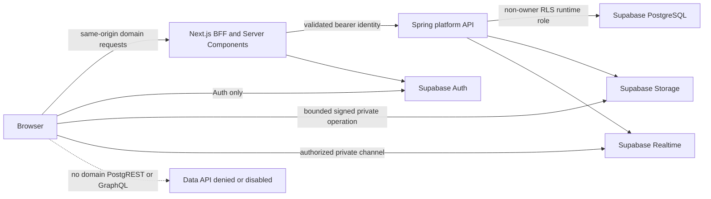
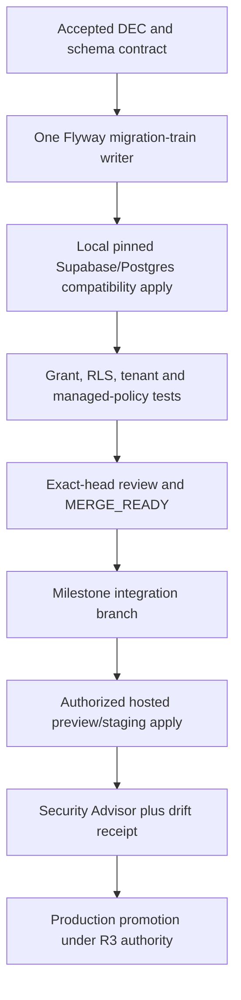

# Nexora Supabase Platform Boundary

## Status and Purpose

- Status: `PROPOSED FOR USER APPROVAL` under `DEC-028`.
- Applies to: M0-M4 implementation compatibility and later M7 hosted-production proof.
- Source review date: 2026-08-09.
- Purpose: keep Supabase useful for identity, managed PostgreSQL, private Storage and private Realtime without turning provider schemas, implicit Data API grants or dashboard state into hidden application authority.

This contract supplements `DEC-006`, `DEC-007`, `DEC-008` and `DEC-023`. Spring remains the domain authorization and write boundary. Supabase product configuration is evidence-bearing platform state; it is not permission to bypass the domain API.

## Approved Request Paths

| Surface | Browser authority | Server authority | Production default |
|---|---|---|---|
| Auth | Supabase SSR cookie flow and approved callback routes | Validate issuer, audience, expiry and current membership | Enabled with redirect allowlist, MFA/OTP/rate/SMTP controls |
| Domain tables | None | Spring through direct pooled PostgreSQL connection and non-owner RLS role | Data API disabled or application schemas unexposed |
| Storage | Only server-approved bounded signed upload/download against private buckets | Object classification, tenant-derived key, scan state and ownership | Private; no public source bucket |
| Realtime | Private channels after documented RLS authorization | Publish minimal versioned invalidation/progress events | Private-only; durable API refetch is truth |
| Admin/service | Never a browser `service_role` | Least-privilege secret authority and audited operations | No service secret in web bundles, logs or media |

## Schema and Object Ownership

| Boundary | Owner | Allowed application changes | Forbidden changes |
|---|---|---|---|
| Application schemas such as `nexora`, `rag` and `audit` | Nexora Flyway migration train | Tables, views, functions, RLS, grants, indexes and extensions required by accepted tasks | A second migration history, owner/BYPASSRLS runtime use, unreviewed `SECURITY DEFINER` |
| `public` | Platform plus explicitly reviewed compatibility objects only | No domain table by default; any exception needs explicit grants/RLS and a recorded reason | Reliance on automatic `anon`, `authenticated` or `service_role` grants |
| `auth` | Supabase | Documented foreign keys, policies or triggers only where the current platform explicitly supports them | Custom tables/functions/indexes, destructive migration-table operations, ownership/privilege tampering |
| `storage` | Supabase | Documented policies/triggers on supported Storage tables | Custom objects, destructive migration-table operations, public-bucket shortcut |
| `realtime` | Supabase | Documented RLS policies/triggers on `realtime.messages` for private-channel authorization | Custom tables/functions/indexes, writes to migration history, treating messages as durable domain truth |

Custom helper functions referenced by managed-table policies live in an application-owned schema, have an empty/fixed `search_path`, fully qualified object names, minimum `EXECUTE` grants and direct tests. A provider-supported policy on `realtime.messages` does not make Nexora the owner of the `realtime` schema.

## Data API Contract

1. M0 records whether the project Data API can be disabled for the chosen Auth/Storage/Realtime topology. If yes, production disables it.
2. If the Data API must remain enabled, only an explicit exposed-schema allowlist is configured; application/domain schemas remain absent.
3. New domain tables never rely on historical automatic grants. Migrations explicitly revoke or grant each role and test grants separately from RLS.
4. `anon` and `authenticated` receive no domain table privileges in v0.1. `service_role` is not used as the normal Spring database identity.
5. A future direct PostgREST/GraphQL use needs a new ADR, minimum per-object grants, RLS allow/deny fixtures, rate/abuse limits, browser threat review and same-revision Advisor/Kongming receipts.
6. CI fails if a domain schema enters the exposed-schema list, a new domain relation is reachable by an API role, or a migration restores broad default privileges.

This explicitly absorbs Supabase's 2026 shift to opt-in Data API grants. A successful request caused by an old project's implicit privileges is not portable evidence.

## Realtime Authorization Contract

1. Topics follow `scope:tenant-or-resource-id:purpose` but the identifier alone never grants access.
2. Production channels set `private: true`; public channels are disabled where the platform setting permits.
3. Read/write policies on `realtime.messages` derive current membership/resource permission from server-owned database truth. Anonymous and removed-member fixtures must fail.
4. Policies are limited to the provider-documented operations and table. Migrations do not add tables, functions or indexes in `realtime`.
5. Payloads contain only allowlisted IDs, versions, job state and safe display metadata; no secret, token, raw document, prompt, chunk or private content body.
6. Token expiry, membership removal, reconnect, duplicate, reorder and missed-event tests prove eventual convergence through a durable Spring API refetch.
7. Realtime authorization latency, join failures, reconnect rate and message volume receive bounds and observability; Presence is used minimally and never for correctness.

## Migration and Configuration Authority

- Flyway is the single application schema-history authority. Supabase CLI migrations, Dashboard SQL and ad-hoc console fixes do not form a second history.
- Supabase project/Auth/Storage/Realtime settings that are not expressible through the approved infrastructure provider are captured as an explicit configuration manifest plus redacted before/after receipt and drift check.
- Migration and runtime identities are distinct. Runtime is non-owner and lacks `BYPASSRLS`; tenant context is transaction-local and pool-reset tested.
- Expand/migrate/contract sequencing keeps the preceding application version rollback-compatible. Destructive or irreversible changes require backup/restore preconditions and R3 authority.
- M3-DB01 may write application-owned event/outbox objects and the provider-documented `realtime.messages` policies only. M3-T03 cannot edit migrations.

## Extension and Version Drift

- Managed Supabase extension SQL never depends on `CREATE EXTENSION ... VERSION` or `ALTER EXTENSION ... UPDATE TO ...`; Supabase may ignore explicit version requests.
- A migration uses the supported extension name without an explicit version clause. Preflight records the actually installed PostgreSQL and extension versions from the target.
- The compatibility receipt pins: Supabase project reference hash, PostgreSQL engine build where exposed, installed `vector` version, migration checksum, application SHA, embedding dimension/model revision and representative query-plan tests.
- Local Compose images and CLI versions are pinned by exact version/digest, but local parity is not proof of the managed version. A supported-range compatibility test and hosted smoke are required before a hosted claim.
- Provider version drift that leaves the tested range blocks promotion, opens a compatibility task and may require index rebuild/re-evaluation; it is never silently normalized by editing an applied migration.

## Environment and Secret Separation

| Environment | Supabase use | Data | Secret rule |
|---|---|---|---|
| Local | Pinned local stack where practical | Deterministic synthetic fixtures | Local untracked env only |
| CI | Disposable local database/Supabase-compatible services | Synthetic two-tenant hostile fixtures | Ephemeral least-privilege secrets |
| Preview | Isolated project/branch only when approved | Sanitized seed, never production copy by default | Preview-scoped secret authority |
| Staging | Production-shaped isolated project | Classified test data | Rotation and access logging |
| Production | Paid non-pausing project | Real tenant data under accepted retention | Dedicated secret manager, audited break-glass |

The DeepSeek key previously pasted into chat is unrelated to Supabase credentials but follows the same rule: rotate before any live smoke, store only the replacement in an approved secret authority, and never copy a secret value into a plan, task packet, screenshot or receipt.

## Backup, Restore and Continuity

- Paid-plan backup/PITR covers PostgreSQL state, not deleted Storage object bytes. Storage needs a separate versioned/off-site export or replication stream plus checksum and database/object watermark.
- Restore receipts account for provider downtime during restore. No zero-downtime database-restore claim is permitted.
- Custom role passwords/secrets are recreated from the secret authority because database backups do not prove they are recoverable.
- Restore rehearsal uses an isolated new project when possible: infrastructure/config -> database/PITR -> roles/secrets -> Storage objects -> Auth/RLS/Storage/Realtime tests -> tenant/CMS/RAG reconciliation -> authorized cutover.
- The drill records requested and achieved recovery point/time, missing-object count, checksum mismatches, migration/extension versions, manual steps and follow-up owner.
- Production launch also requires SSL enforcement, network restrictions where compatible with dynamic server egress, Security Advisor disposition, MFA on privileged accounts, multiple ownership/break-glass review, custom SMTP and rate/CAPTCHA settings appropriate to launch load.

## Required Evidence Matrix

| Gate | Minimum evidence | Failure disposition |
|---|---|---|
| Schema exposure | Exposed-schema/config receipt plus API-role reachability tests | `STOP` on unintended relation |
| RLS/tenancy | Two-tenant positive/negative tests under real runtime role and pooled connections | `STOP` on any cross-tenant success |
| Managed schemas | Migration diff proves only documented policies/triggers on supported tables | `STOP` on custom/destructive managed-schema DDL |
| Realtime | Private join/read/write denial matrix, expiry/removal, reconnect/refetch and rate bounds | `HOLD` if local-only compatibility is claimed as hosted proof |
| Extensions | Observed installed version, supported-range test, query/index plan and migration checksum | `HOLD` on untested drift or explicit-version assumption |
| Backups | Current backup/PITR inventory plus isolated DB/object reconciliation drill | `STOP` on fabricated RPO/RTO or missing Storage plane |
| Production config | Redacted project/region/plan/SSL/network/Auth/SMTP/rate configuration receipt | `HOLD` on dashboard-only unrecorded state |

## Milestone Placement and Ownership

- M0: accept `DEC-028`, verify current Supabase changelog/docs, freeze schema/exposure policy, cost/tier questions and compatibility test matrix.
- M1-DB01: create application schemas/roles/grants/RLS baseline, extension compatibility probe and local reproducible migration path.
- M2-DB01 and M2-DB02: exclusively own tenant/CMS policies and two-tenant database fixtures.
- M3-DB01: own application event/outbox migrations plus documented `realtime.messages` policies; M3-T03 owns adapter/web lifecycle and conformance only.
- M4 database owner: own document/chunk/vector schema and observed-version/query-plan evidence; provider adapters cannot edit migrations.
- M6: complete threat model, Security Advisor, abuse/capacity/latency evidence and observability.
- M7: provision approved paid environments, prove exact migration/config drift, backup inventory, rollback and isolated restore.
- M8: reconcile live configuration, limitations, diagrams, runbooks and release claims against exact deployment evidence.

Every material Supabase boundary change receives independent same-candidate Advisor `FIT` and Kongming `PASS` plus Controller disposition. A reviewer is read-only; fixes are assigned to a new exclusive writer task.

## Current Primary Sources

- [Supabase breaking change: restricted auth, storage and realtime schema operations](https://supabase.com/changelog/34270-restricting-access-on-auth-storage-and-realtime-schemas-on-april-21-2025)
- [Supabase breaking change: new public tables require explicit Data API grants](https://supabase.com/changelog/45329-breaking-change-tables-not-exposed-to-data-and-graphql-api-automatically)
- [Supabase Data API security](https://supabase.com/docs/guides/api/securing-your-api)
- [Supabase Realtime authorization](https://supabase.com/docs/guides/realtime/authorization)
- [Supabase extension version pinning deprecation](https://supabase.com/changelog/extension-version-pinning-ignored)
- [Supabase production checklist](https://supabase.com/docs/guides/deployment/going-into-prod)
- [Supabase backups and PITR](https://supabase.com/docs/guides/platform/backups)

## Stop Conditions

Implicit Data API exposure, browser domain PostgREST, public production channels, service-role secret in a browser, custom objects/indexes/functions in managed schemas, destructive provider migration-table edits, two migration histories, dashboard-only unrecorded production changes, extension compatibility inferred from a requested SQL version, local emulation presented as managed proof, database PITR presented as Storage recovery, or production continuity claimed without an isolated restore receipt.
