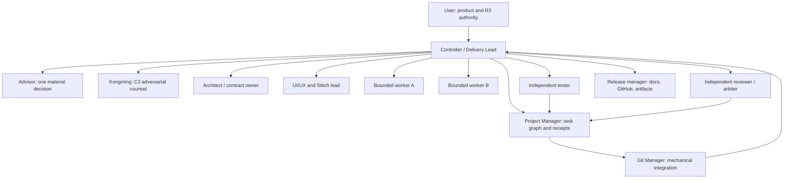
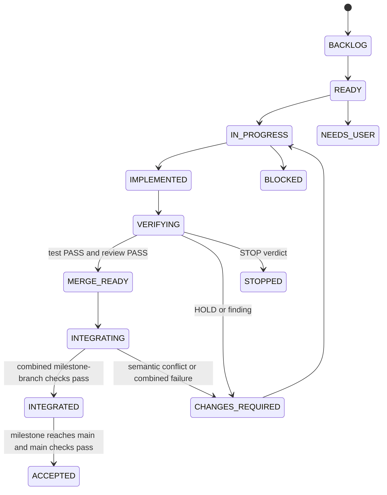

# Nexora Team Operating Model

## Purpose

Run the implementation as a supervised software team. Each implementation thread is a bounded job with one owner, one branch, one worktree, frozen inputs and an independent acceptance path. The Controller acts as Delivery Lead; it does not treat subagent completion as merge authority.

The normative step-by-step dispatch, lease, worktree, timeout, review and integration procedure is [Thread, Branch and Worktree Runbook](./thread-branch-worktree-runbook.md). Read-only counsel/review threads intentionally have no implementation branch; any repair becomes a new writer task.

## What "Thread" Means

For this program, a logical implementation thread is:

```text
durable task record
+ subagent role and resolved model
+ isolated Git branch/worktree
+ exclusive path ownership
+ frozen base and contracts
+ expected output and checks
+ exact-head tester/reviewer receipts
+ manager integration decision
```

Internal subagent threads are surfaced for inspection by the Codex app and report back to the main Controller. User-owned separate Codex tasks are reserved for outcomes the user wants to steer independently; they are not a substitute for the Controller's bounded subagent delegation.

## Team Structure



## Role, Model and Authority

The live route is revalidated at dispatch. A missing qualified route causes `BLOCKED`; critical work is never silently downgraded.

| Role | Preferred model/effort | Authority | May write | Must not do |
|---|---|---|---|---|
| Controller / Delivery Lead | `gpt-5.6-sol`, high | C3 coordination, decomposition, user communication, final acceptance decision | Plan/ledger and exceptional bounded integration support | Broadly implement, self-test, self-review and self-merge the same scope |
| Advisor | `gpt-5.6-sol`, high | C3/R0 interview and decision framing | None | Implement or merge |
| Kongming | `gpt-5.6-sol`, high; xhigh/max only for measured hard forks | C3/R0 go/no-go and adversarial counsel | None | Override user authority or produce casual implementation |
| Architect / Planner | `gpt-5.6-sol`, high | C3/R0-R1 contracts, ADRs, dependency graph | Approved plan/architecture paths | Product scope drift |
| Project Manager | `gpt-5.6-terra`, high | C2/R1 runtime ledger, dependency and receipt checks | Plan/task ledger | Product code, semantic Git conflict resolution |
| UI/UX Lead | `gpt-5.6-sol` high for direction; `terra` high for bounded UI work | C2/C3 design decisions under Stitch workflow | Design artifacts or explicitly assigned UI paths | Paste generated HTML as finished production UI |
| Critical worker | `gpt-5.6-sol`, high | C3/R2 auth, tenancy, publishing, migrations, secure RAG | One exclusive worktree scope | Merge, main push, widen scope |
| Normal worker | `gpt-5.6-terra`, medium/high | C2/R1-R2 bounded implementation | One exclusive worktree scope | Shared-path edits outside contract |
| Tester | `gpt-5.6-terra`, medium | C2/R0 exact-head behavior verification | None by default | Repair product code in the test task |
| Security reviewer / arbiter | Independent `gpt-5.6-sol`, high | C3/R0 exact-head PASS/HOLD/STOP | Review receipt only | Fix its own findings or review a different HEAD |
| Debugger | `gpt-5.6-terra` high; escalate to sol | C2/C3 evidence-backed root cause | Diagnostic report; fix only in a new owned task | Repeat the same failed hypothesis unchanged |
| Git Manager | `gpt-5.6-terra`, low/medium | C1/R1-R3 mechanical Git actions | Exact approved paths/metadata | Decide scope, resolve semantic conflicts, unapproved push |
| Release Manager | `gpt-5.6-terra`, medium; sol review for high-risk release | C2/R1-R3 docs/media/GitHub/artifact orchestration | Assigned docs/workflows and approved external metadata | Publish stale head, invent claims, bypass security/user gates |

Official model guidance describes `gpt-5.6-sol` as the flagship capability route and `gpt-5.6-terra` as the balanced intelligence/cost route. Runtime/account availability still has to be observed; a static config name is not proof.

## Capacity and Parallelism

Current observed capacity is four total active slots, including the Controller.

| Work shape | Slot allocation | Writer limit |
|---|---|---:|
| High-risk auth/tenant/publish/RAG | Controller + one writer + tester + reviewer | 1 |
| Mature disjoint scopes | Controller + two writers + one contract reviewer/tester | 2 |
| Read-only discovery | Controller + up to three scouts/reviewers | 0 |
| Mechanical integration | Controller + Git Manager + tester + reviewer as needed | 0 product writers |

Never run three writers. Never parallelize writers across the same migration sequence, root manifest, lockfile, generated API client, page schema, permission vocabulary, event vocabulary, global design tokens, telemetry conventions or environment wiring.

Project Manager is invoked at boundaries and through durable state; it does not permanently consume a slot when no management decision is needed.

## Git Topology

```text
main
  |- pre-Goal C0 train (sequential, mechanically integrated to main)
  |    |- docs/c0-decision-ratification
  |    \- docs/c0-requirements-catalog
  |- M0 reviewed documentation train (no M0 integration branch)
  |    |- docs/m0-architecture
  |    |- docs/m0-threat-model
  |    \- docs/m0-delivery-contract
  |- integration/v0.1-m1
       |- chore/repository-foundation
       |- feature/database-foundation
       |- feature/java-platform
       |- design/m1-ux-architecture
       |- design/m1-signal-atelier
       |- design/m1-luminous-grid
       |- design/m1-warm-intelligence
       |- design/m1-nexora-design-system
       |- chore/m1-node-dependency-window
       |- chore/m1-node-dependency-revision    (conditional, at most once)
       |- feature/web-design-foundation
       \- feature/platform-contracts
  |- integration/v0.1-m2
       |- feature/tenant-permission-contracts
       |- feature/m2-schema-auth
       |- feature/identity-tenancy
       |- feature/organization-access-ui
       |- feature/rbac
       |- feature/rbac-admin-ui
       |- feature/cms-publishing-contracts
       |- feature/m2-schema-cms
       |- feature/cms-core
       |- feature/cms-workspace-ui
       |- feature/page-schema
       |- feature/page-blocks
       |- feature/page-builder
       |- feature/publishing
       |- feature/publishing-ui
       |- feature/theme-engine
       |- feature/content-workflow
       |- feature/theme-editor-ui
       |- feature/content-workflow-ui
       \- test/m2-demo-seed
  |- integration/v0.1-m3
       |- feature/event-contracts
       |- feature/m3-schema-events
       |- feature/transactional-outbox
       |- feature/realtime-delivery
       |- feature/go-event-ingestion
       |- feature/event-persistence-consumer
       \- chore/m3-runtime-wiring
  |- integration/v0.1-m4
       |- feature/knowledge-rag-contracts
       |- feature/m4-schema-train
       |- feature/knowledge-management
       |- feature/knowledge-workspace-ui
       |- feature/document-ingestion
       |- feature/vector-retrieval
       |- feature/hybrid-retrieval
       |- feature/rag-interaction-contracts
       |- feature/secure-rag-api
       |- feature/rag-conversation-api
       |- feature/rag-chat-ui
       |- test/m4-demo-seed-rag
       |- feature/rag-quality
       \- feature/rag-quality-ui
  |- integration/v0.1-m4-evidence
       |- docs/m4-alpha-architecture          (R00A)
       |- docs/m4-alpha-media                 (R00B)
       |- R00I-A mechanical A/B integration
       |- docs/m4-alpha-docs                  (R00C from R00I-A head)
       \- R00I-B mechanical final integration
  \- release/v0.1.0-alpha.1
```

This is the canonical v0.1 branch roster. The exact task IDs, dependency states, path leases and safe parallel windows remain authoritative in [M0-M4 Execution Ledger](./m0-m4-execution-ledger.md); the tree does not grant dispatch by itself.

Rules:

1. Never prefix a branch with `codex/`.
2. A milestone integration branch starts from the accepted `main` SHA.
3. A worker branch starts from a recorded integration SHA.
4. One writer owns one worktree and branch at a time.
5. Branches use intent-based names: `feature/...`, `fix/...`, `test/...`, `chore/...`, `design/...`, `docs/...`, `infra/...`, `integration/...`, `release/...`.
6. No worker pushes or merges `main`.
7. Exact branch/head/worktree/path ownership is recorded before dispatch.
8. A branch may contain 1-3 logical Conventional Commits when practical; commit count is never manufactured.
9. Worker-to-integration uses the accepted non-transforming merge method and records the reviewed patch digest.
10. A milestone integration branch is provisional and merges to `main` only after its combined scenario passes; it never becomes a second product authority.
11. Rebase, squash, cherry-pick, conflict resolution or generated-file drift requires patch-equivalence proof or re-review.
12. Remote branch/push behavior follows the accepted R3 policy, not worker preference.

Illustrative permanent paths after Git bootstrap:

```text
D:\Nexora\.worktrees\Nexora-m1-java-platform
D:\Nexora\.worktrees\Nexora-m2-identity-tenancy
D:\Nexora\.worktrees\Nexora-m2-page-builder
D:\Nexora\.worktrees\Nexora-m4-secure-rag
```

`D:\Nexora\.worktrees\` is ignored before the first linked worktree is created, and every target must resolve to a strict descendant of that directory. This honors the user-approved project boundary without allowing nested worktree contents into the parent worktree index. Before any worktree cleanup, the Manager verifies the resolved absolute path, running processes, branch integration and retained evidence.

## Shared-Path Ownership

| Boundary | Exclusive owner pattern | Parallel consumers |
|---|---|---|
| Non-Node root governance, tool pins, Makefile, Compose, CI | Foundation/integration owner only | All other branches read frozen SHA |
| Node dependency declaration/control set plus `pnpm-lock.yaml` | M1-DW01 initially; one serialized milestone dependency-window owner thereafter | Application/contract workers exclude these files and request changes through ledger |
| `database/migrations/**` | One migration owner per wave | UI and read-only reviewers |
| OpenAPI/generated TS | API contract owner generates and freezes | Frontend consumes frozen artifact |
| Page JSON Schema | Page-schema contract owner | Block renderer and builder after fixture freeze |
| Permission vocabulary | RBAC contract owner | CMS/workflow consumers |
| Event/channel/outbox envelope | Event-contract owner | Go, Realtime and outbox workers after freeze |
| RAG chunk/vector/citation contracts | RAG contract owner | Parser, API and UI workers after freeze |
| Global design tokens/root layout | UI foundation owner | Route/component workers after direction approval |
| Telemetry names/PII allowlist | Observability contract owner | All service workers |

If a worker discovers a required shared-path edit, it stops and requests a contract-owner task. It does not quietly take ownership.

## Task Lifecycle



`IMPLEMENTED` means only that a worker branch is frozen. `INTEGRATED` is provisional on the milestone branch. `ACCEPTED` is the only done-equivalent state and requires the approved main head plus required remote evidence.

## Dispatch Contract

Every implementation thread receives a complete canonical `NEXORA-TASK-PACKET-1` from [Workflow Configuration](./workflow-configuration.md). The YAML below is a conforming human-readable projection for the identity/tenancy example; omitted fields remain mandatory in the machine packet, and this document does not define aliases or a second schema:

```yaml
schema: NEXORA-TASK-PACKET-1
id: M2-T01
title: "Identity, tenancy and profile backend"
packet_revision: 1
ledger_seq: "<authoritative sequence>"
control_program_id: null
goal_id: nexora-v0.1-m0-m4
goal_scope: v0.1-M0-M4
pre_goal_constraints:
  allowed_task_ids: []
  product_dispatch_allowed: true
plan_path: D:\Nexora\plans\260809-1030-nexora-master-production-build\plan.md
plan_sha: "<approved exact plan commit>"
semantic_digest_algorithm: NEXORA-SEMANTIC-DIGEST-1
plan_semantic_digest: "<approved digest>"
plan_file_list_digest: "<approved digest>"
master_source_sha256: "<approved digest>"
parent_requirement_catalog_digest: "<approved digest>"
child_requirement_catalog_digest: "<approved digest>"
milestone: M2
prompt_phase: 4
requirements: [REQ-S005-001, REQ-S024-001, REQ-S025-001]
outcome: "Derive organization context only from authenticated membership"
non_goals: [RBAC UI, CMS, push, merge]
risk_class: C3
effect_tier: R2
effect: high-impact-write
cwd: "<resolved absolute worktree path>"
base_ref: integration/v0.1-m2
base_sha: "<exact head containing integrated M2-C01 and M2-DB01>"
branch: feature/identity-tenancy
worktree: "<resolved absolute path>"
allowed_paths:
  - apps/platform-api/**/identity/**
  - apps/platform-api/**/tenant/**
forbidden_paths:
  - database/migrations/**
  - apps/web/**
  - pnpm-lock.yaml
shared_boundaries:
  consumed:
    - M2-C01@<integrated-contract-digest>
  produced: []
dependencies:
  accepted_main:
    - M1-I01@<accepted-main-head>
  integrated:
    - M2-C01@<milestone-integration-head>
    - M2-DB01@<milestone-integration-head>
  frozen_interfaces: []
  dispatch_after: []
required_skills: [supabase, spring-security-review]
acceptance:
  - forged organization identifier denied
  - removed member denied
  - two-tenant integration fixture passes
checks: ["<focused commands>"]
stop_conditions:
  - cross-tenant success
  - shared singleton tenant state
  - unexpected shared-path edit
timeout: "45-60 minute checkpoint"
writer_lease_generation: "<generation>"
writer_lease_id: "<atomic control-ledger lease id>"
resolved_route:
  model: "<actual model>"
  reasoning_effort: "<actual effort>"
  tools: ["<material tools>"]
merge_method: "<approved method>"
commit_authority: scoped
merge_authority: none
push_authority: none
destructive: false
external_authority: none
```

Prompts contain environment variable names only. They never contain credential values or raw environment dumps.

## Verification and Merge Pipeline

```text
worker reports base/head/commits/paths/checks/cleanliness
-> Manager freezes HEAD
-> independent tester runs acceptance on that exact HEAD
-> independent reviewer inspects the same base/head and cumulative diff
-> Project Manager checks dependency and receipt completeness
-> Project Manager marks MERGE_READY
-> Git Manager verifies source HEAD has not moved
-> Git Manager merges one branch mechanically
-> combined target checks run
-> merge SHA and evidence receipt are persisted
```

Any commit after test/review invalidates both verdicts. Squash, cherry-pick, rebase, conflict resolution or generated-output changes require patch-equivalence proof or a fresh review. Semantic conflicts stop and return to the owning worker; Git Manager does not improvise a resolution.

### Tester receipt

```yaml
task: TEST-M2-P04
branch: feature/identity-tenancy
head_sha: "<frozen SHA>"
commands: ["<command and exit code>"]
artifacts: ["<path or URL>"]
limitations: ["<what this did not prove>"]
verdict: PASS|HOLD|STOP
```

### Reviewer receipt

```yaml
task: REVIEW-M2-P04
base_sha: "<accepted base>"
head_sha: "<same tested SHA>"
scope: [security, contract, concurrency, privacy, failure behavior]
findings:
  - severity: P0|P1|P2|P3
    evidence: "<file/line or behavior>"
    impact: "<concrete impact>"
    recommendation: "<bounded correction>"
verdict: PASS|HOLD|STOP
```

### Merge receipt

```yaml
task: MERGE-M2-P04
source_head: "<reviewed SHA>"
target_before: "<integration SHA>"
merge_sha: "<result>"
cumulative_paths: ["<paths>"]
combined_checks: ["<commands and exit codes>"]
remote_state: local-only|branch-pushed|main-synchronized
diff_digest: "<reviewed patch digest>"
merge_method: "<approved non-transforming method>"
verdict: INTEGRATED|ACCEPTED|CHANGES_REQUIRED|NEEDS_USER
```

## Mandatory Advisor and Kongming Supervision

Every material matter receives both reviews on the same identified candidate. “Material” includes C3/R3 work, outcome/scope/journey changes, architecture/trust/data boundaries, auth/tenant/publish/RAG behavior, shared schemas/migrations, UI direction/design-system changes, budget/license/provider choices, production/SLO/recovery, public claims/media/packages/releases/deployment, risk exceptions and milestone/Goal acceptance.

Advisor returns an independent product/UX/operability/cost-fit receipt. Kongming returns an independent contradiction/security/failure/evidence receipt. The Controller records both IDs, exact candidate SHA/digest/deployment, recommendation dispositions and the final gate result. A changed candidate invalidates both receipts; any missing receipt, `HOLD` or `STOP` prevents dispatch, merge, publication or acceptance.

Routine C1/C2 work that remains inside a previously approved material contract may proceed without dual review on every commit. Discovery of a shared-boundary change, security implication, unsupported claim, cost/external action or repeated failure automatically escalates it. Advisor and Kongming remain read-only counsel: they do not implement or merge, and they do not override the user.

## Stitch and Frontend Cell

```text
journeys and information architecture approved
-> design-only subagent thread
-> three comparable Stitch directions for the same anchor-screen family
-> user selects direction
-> screenshots, HTML reference and DESIGN.md stored with provenance
-> token/contract owner maps the selected system into AntD wrappers and custom public tokens
-> UI worker hand-builds Next.js components
-> tester checks 375px, desktop, keyboard, reduced motion and states
-> UI reviewer checks fidelity, accessibility and truthful data
```

The design thread may write design artifacts, not product code. The implementation thread consumes the approved direction and remains independently reviewable.

## Keepalive and Resume

Keepalive means durable continuity, not blind polling or an immortal worker.

The single durable authority is the Project Manager-owned SQLite control ledger resolved from the repository's absolute Git common directory as defined in `workflow-configuration.md`; every linked worktree must resolve the same file. Chat, worktree-local `.agentkit/state/**`, heartbeats and task UI are read models only; no replacement writer, merge or acceptance occurs until ledger, Git and observed process state reconcile atomically. Before either semantic C0 writer dispatches, C0-05 requires the versioned genesis record, the two-process/two-worktree single-lease contention proof and the dependency-graph dry-run; Goal activation later re-verifies those immutable receipt identities during final binding and warmup.

Persist at every commit, verdict, merge, blocker and 45-60 minute checkpoint:

```yaml
goal_revision: "<goal id/revision>"
semantic_digest_algorithm: NEXORA-SEMANTIC-DIGEST-1
plan_semantic_digest: "<approved digest>"
plan_file_list_digest: "<approved digest>"
child_requirement_catalog_digest: "<approved digest>"
milestone: M2
last_completed_task: "<id>"
next_ready_task: "<id>"
integration_head: "<sha>"
active_threads:
  - id: "<task>"
    role: "<role>"
    route: "<resolved model/effort>"
    branch: "<branch>"
    worktree: "<absolute path>"
    head: "<sha>"
    state: "<state>"
    lease_generation: "<generation>"
running_processes:
  - pid: "<pid>"
    port: "<port>"
    command: "<safe command>"
open_blockers: []
user_decisions: []
last_verified_at: "<timestamp>"
next_action: "<one executable action>"
```

Resume procedure:

1. Re-read pinned Goal, semantic/file-list/source/catalog identities and Decision Log revision.
2. Inspect repository root, origin, branch, worktrees, heads and status.
3. Compare every active receipt with current Git evidence.
4. Interrupt stale writers and verify their agents/processes stopped before revoking a lease.
5. Inspect the worktree, then issue a higher lease generation only if ownership is clean.
6. Revalidate runtime/model/agent availability.
7. Reuse accepted artifacts and restart only the next incomplete bounded task.
8. Re-run tester/reviewer if any reviewed HEAD changes.

Idle status is not success. A heartbeat does not authorize a merge.

## Failure, Timeout and Escalation

| Event | Action |
|---|---|
| Transient network/process failure | One bounded retry with the same scope |
| Deterministic test failure | No unchanged retry; inspect evidence |
| Two failed approaches | Dispatch Debugger; preserve prior evidence |
| Architecture/security contradiction | Stop writer; obtain independent Advisor and Kongming material-gate receipts |
| Missing budget/credential/approval | `NEEDS_USER` |
| Worker timeout | Send one corrective instruction, capture handoff, interrupt agent/process, revoke lease only after stop/worktree verification, then assign a higher generation |
| Shared-path collision | Stop both affected writes; choose one owner and rebase/review |
| Secret-shaped content | STOP, quarantine from staging, rotate if exposed, scan history |
| Cross-tenant or unauthorized RAG context | STOP release line until root cause and regression evidence pass |

## External Action Policy

Any future activated Goal never grants authority for unrelated or destructive work. Fresh exact-scope approval is required for first remote push, GitHub About/settings mutation, public Release/GHCR publication, production promotion, paid resource creation, domain/registry visibility change, destructive database/object operations, infrastructure destroy or force-with-lease recovery.
