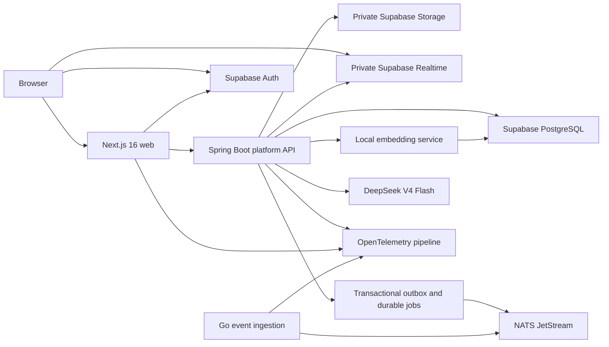

# Nexora Technology Decisions

## Status and Version Policy

- State: `PROPOSED FOR USER APPROVAL`.
- Scope: architecture direction for the complete program, with implementation priority on v0.1 M0-M4.
- Sources live-checked: 2026-08-09 from primary project documentation.
- Major/minor lines below are planning baselines. Prompt Phase 0 records source-backed compatibility candidates and the owner/gate that will materialize each pin; it does not invent product lockfiles or artifacts. The owning M1+ task pins exact patches, lockfiles/BOMs, container digests and model revisions before dependent implementation or acceptance.
- A dependency is not accepted merely because it is current; it must pass compatibility, license, security, resource and reproducibility checks.

## Chosen v0.1 Stack

| Decision | Chosen direction | Why this fits Nexora | Rejected or deferred |
|---|---|---|---|
| TD-001 Repository | Polyglot monorepo: pnpm workspace for web/packages, Maven Wrapper for Java, Go modules per service, Makefile as canonical entrypoint | Keeps each ecosystem native while giving fresh-clone commands and one CI vocabulary | Bazel/Nx/Turborepo until build-graph evidence requires them |
| TD-002 Node | Node.js 24 LTS planning line; M0 records the exact source-backed candidate and compatibility rationale, then M1-T01 materializes the exact runtime/tool-version/CI pin before M1-DW01 or any Node consumer dispatches | Current production LTS and compatible with current Supabase JS support; Node 20 is EOL | Node Current and EOL versions |
| TD-003 Frontend | Next.js 16 App Router, Next-supported React 19 line, strict TypeScript 5+, Tailwind CSS 4 for branded public/layout work, Ant Design 6.x for admin/builder and owned Nexora wrappers | SSR/SEO for public pages plus a mature data-dense studio; strict surface boundaries avoid a generic enterprise skin | Vite SPA, Pages Router, MUI, parallel full shadcn design system |
| TD-004 Frontend data | React Server Components for initial reads; Spring API is the domain data boundary; TanStack Query only for genuinely live client state; React Hook Form + Zod for forms | Avoids client waterfalls/global-state sprawl while supporting builder/jobs/chat refresh | Direct database access from Next.js, Redux by default, all-client rendering |
| TD-005 Builder state | Local command model with immutable operations and undo; Zustand only inside the builder if plain React state becomes insufficient; dnd-kit plus keyboard-equivalent commands | Isolates complex interactive state and makes autosave/replay/test behavior explicit | Global app store, pointer-only drag/drop, CRDT in v0.1 |
| TD-006 Design | Stitch produces three bounded Nexora directions, anchor-screen screenshots, HTML reference and `.stitch/DESIGN.md`; user selects one; production UI is hand-built in Next.js and mapped to AntD/custom tokens | Preserves distinctive visual quality without pretending generated HTML is production code | Copying Stitch export directly into production or leaving AntD defaults unchanged |
| TD-007 Java | Java 25 LTS-compatible runtime, Spring Boot 4.1 line, Maven Wrapper, package-by-feature modular monolith | Strong transactional domain boundary for tenancy, CMS, publishing and RAG; current Spring line supports Java 25 | Microservices-first, custom auth server |
| TD-008 Module enforcement | ArchUnit boundary tests; consider Spring Modulith only after live compatibility check | Enforces modular-monolith boundaries without making an optional framework a bootstrap blocker | Informal package conventions only |
| TD-009 API | REST under `/api/v1`, OpenAPI authority, RFC 9457-style problem details, SSE proxied as a same-origin stream through the Next.js BFF | Stable external contract, generated client drift checks and simple streaming without exposing a second browser API trust boundary | GraphQL/gRPC/WebSocket chat or direct cross-origin browser API until a concrete need exists |
| TD-010 Page contract | Versioned JSON Schema is wire/storage authority; Java and TypeScript validators share canonical fixtures | Cross-language schema evolution is explicit and blocks arbitrary page code | Zod-only contract or arbitrary JSONB |
| TD-011 Database | Supabase-managed PostgreSQL; PostgreSQL 17 compatibility baseline; Flyway is the single application migration authority; domain tables live in application-owned schemas absent from the Data API; pgvector for dense retrieval with observed-version compatibility tests | One durable truth for tenant data, publishing, jobs, audit and vectors while preventing implicit Data API exposure and false managed-extension pins | MongoDB, separate vector database, dual Flyway/Supabase migration histories, automatic public grants |
| TD-012 Tenant isolation | Shared database/schema; mandatory tenant keys and composite constraints; Spring authorization plus forced RLS using a non-owner, non-`BYPASSRLS` runtime role | Operationally practical and independently enforceable at API and database layers | Browser-supplied tenant authority, schema-per-tenant in v0.1 |
| TD-013 Identity | Supabase Auth issues identity; Next.js uses current SSR cookie flow; Spring validates issuer/JWKS and derives tenant membership fresh | Avoids implementing auth protocol while keeping domain authorization in Spring | UI-only authz, trusting session payload alone, service secret in browser |
| TD-014 Browser data path | Default domain path is Browser -> same-origin Next.js BFF/Server Component -> Spring. Direct browser calls are limited to Supabase Auth, server-approved signed private Storage operations and authorized private Realtime | Centralizes cookie/CSRF/token forwarding, CORS and tracing while keeping one business trust boundary | Direct browser-to-Spring and general direct PostgREST access in v0.1 |
| TD-015 Storage | Private Supabase Storage buckets, tenant-derived object keys, MIME sniffing, server-issued bounded signed operations | Supports secure documents without exposing privileged credentials | Public source bucket or local filesystem as production truth |
| TD-016 Realtime | Supabase Broadcast/Presence on private channels with documented RLS policies on `realtime.messages`; public access disabled; every event triggers durable refetch/poll fallback | Uses the provider-supported authorization surface without claiming ownership of the managed `realtime` schema or making WebSocket delivery authoritative | Public tenant topics, custom objects/indexes/functions in managed schemas, Realtime as business state |
| TD-017 Jobs | PostgreSQL durable job table and bounded `SKIP LOCKED`-style workers first | Restart-safe and avoids premature queue infrastructure | Redis/Valkey queue by default |
| TD-018 Events | Versioned event envelope; PostgreSQL transactional outbox; NATS JetStream at M3 with at-least-once semantics and idempotent consumers | Avoids dual-write loss and supports later consumers while keeping PostgreSQL authoritative | Exactly-once marketing claim, Kafka in v0.1, synchronous remote publish inside business transaction |
| TD-019 Go service | Go 1.26 supported stable planning line for the bounded event-ingestion service in Prompt Phase 13 | Small independent ingress with clear resource/time/rate limits; M0 records the exact source-backed candidate, M1-T01 materializes the repository toolchain pin, and M3-T04 consumes/verifies that exact service/runtime pin before acceptance | Moving Prompt Phase 13 silently outside accepted M0-M4 scope |
| TD-020 Documents | PDF, Markdown and plain text initially; Apache PDFBox plus bounded parsers; URL/DOCX disabled | Narrows parser and SSRF attack surface while covering useful sources | URL ingestion before independent SSRF gate |
| TD-021 Retrieval | PostgreSQL full-text search + pgvector + deterministic reciprocal-rank fusion; authorization predicates in both branches before candidates leave storage | One permission model, reproducible ranking and no extra search cluster | Elasticsearch/OpenSearch until corpus/latency/facet evidence exceeds PostgreSQL |
| TD-022 Chat model | DeepSeek adapter using `https://api.deepseek.com` and current model ID `deepseek-v4-flash`; model list verified at runtime; secret referenced only as `DEEPSEEK_API_KEY` | Matches the user's chosen live chat provider and current official V4 identifier | Deprecated `deepseek-chat`/`deepseek-reasoner` aliases; hard-coded key |
| TD-023 Embeddings | Proposed local default: version-pinned Hugging Face Text Embeddings Inference with `Qwen/Qwen3-Embedding-0.6B`, fixed at 1024 dimensions after corpus/hardware benchmark | Open-weight Apache-2.0 model, 100+ languages, explicit dimensions, CPU/GPU serving options, no document egress by default | Assuming DeepSeek chat provides embeddings; dimension chosen after migration |
| TD-024 Reranker | Interface exists but disabled by default; enable a version-pinned local/managed adapter only if fixed-corpus quality gain justifies latency/cost | Preserves Phase 20 without paying for unproven complexity | Always-on paid reranking |
| TD-025 AI testing | Separate chat/embedding/rerank interfaces; deterministic CI providers; live smoke evidence labeled with provider/model/date/dimension | CI remains reliable and no mock is presented as a live integration | One generic interface that hides incompatible capabilities |
| TD-026 Observability | OpenTelemetry instrumentation, structured JSON logs, trace IDs, Micrometer/Prometheus metrics from service introduction | Vendor-neutral evidence early; full backend/dashboard can arrive in M6 | Raw prompt/source text in telemetry, waiting until M6 to instrument |
| TD-027 Testing | JUnit 5, Testcontainers, ArchUnit; Vitest, React Testing Library, Playwright and axe; Go table/integration tests; pgTAP or equivalent RLS fixtures; k6 for bounded load evidence | Matches unit, integration, browser, security and distributed failure risks | Mock-only acceptance or screenshot-only UI acceptance |
| TD-028 Delivery | Docker/Compose production-shaped v0.1; Next.js standalone output; non-root containers; GitHub Actions mirrors local commands | Reproducible integrated release without choosing Kubernetes prematurely | Kubernetes/Helm/Terraform/Argo before M7 target approval |
| TD-029 Production hosting | Vercel is the primary Next.js target; paid Supabase is the production data plane; managed Kubernetes is the proposed Spring/Go/NATS/embedding runtime for M7 | Aligns each workload with its platform while preserving the prompt's container/Kubernetes/GitOps requirements | Free/sleeping tiers, ping-based keepalive, single-VPS production |
| TD-030 Distribution | GitHub Releases plus repository-linked GHCR images; SemVer/SHA tags, immutable digests, SPDX SBOM, provenance and verifiable attestations | Connects reviewed source to pullable artifacts and makes release claims auditable | Mutable `latest` deployment, manual opaque images, source-only release claim |
| TD-031 AI UI | Evaluate version-pinned Ant Design X 2.x components for conversations, sender, prompts, actions and sources behind Nexora-owned adapters; citations/security/rendering remain domain-owned | Accelerates polished AI interaction while preserving secure-RAG contracts and visual identity | Browser-side provider keys, library-owned authorization, unreviewed dynamic HTML/A2UI |
| TD-032 CSP/cache boundary | Resolve a per-surface ADR in M1: dynamic Studio/auth may use strict request nonces; public schema pages must preserve a tested cacheable rendering path through external/static CSS, hashes or another documented compatible strategy | Next.js nonce CSP forces dynamic rendering, so one global policy would silently trade away public ISR/PPR/CDN behavior; explicit route evidence keeps security and performance honest | Blanket nonce middleware, default `unsafe-inline`, or claiming cacheability from headers/config without browser/CDN evidence |

## Runtime Architecture

## Trust and Data Boundaries

### Browser to Next.js

- Supabase SSR helpers manage cookies; authorization decisions use validated claims, not an unverified session object.
- `NEXT_PUBLIC_*` values are treated as public. No Supabase secret/service role or DeepSeek key enters them.
- Server Components fetch initial domain data from Spring. Client Components are reserved for interaction.
- State-changing browser requests use same-origin BFF endpoints with SameSite/secure cookies, Origin checks and an explicit CSRF token strategy; auth callbacks are separately allowlisted and tested.
- The only direct browser egress exceptions are Supabase Auth, bounded signed private Storage and private Realtime. Domain table/PostgREST and direct Spring calls are denied by design.

### Next.js to Spring

- Spring is the business API authority.
- The BFF/Server Component obtains the validated user access token server-side, forwards it as bearer identity with correlation metadata, and never forwards browser-supplied organization authority blindly.
- Spring validates JWT issuer/audience/expiry and fresh membership. Its ingress/CORS/network policy accepts only approved server and operator paths; a future direct-browser exception requires a new ADR and browser security tests.
- Client chat connects to a same-origin Next.js route that preserves cancellation/backpressure while proxying Spring SSE and propagating the trace ID.
- Spring resolves membership and effective permission for the requested resource.

### Spring to PostgreSQL

- Migration owner and runtime owner are different roles.
- Runtime role does not own tables and has no `BYPASSRLS`.
- Each transaction sets verified actor/tenant context locally; policies and explicit tenant predicates enforce the same boundary.
- Tenant tables use tenant-bearing primary/unique/foreign-key designs where required, not only a loose `tenant_id` column.
- Domain schemas are absent from Supabase Data API exposure and the Data API is disabled when the approved product paths do not need it. No domain table relies on implicit `public` grants; Data API grants and RLS are tested as separate controls.
- Privileged views use `security_invoker` where supported; custom objects are never placed in managed `auth`, `storage` or `realtime` schemas. Only provider-documented policies/triggers on supported managed tables are permitted.
- Managed extension DDL omits explicit version clauses. The exact installed PostgreSQL/extension versions are observed from each target and accepted only through an application compatibility/query-plan receipt.
- Connection-pool tests prove transaction-local tenant context is reset and cannot leak between requests.

### Storage and Realtime

- Storage is private; object path alone never grants access.
- Realtime uses private channels and provider-documented RLS authorization on `realtime.messages`; helper functions remain in application-owned schemas with hardened search paths and minimum grants. Channel payloads contain minimal IDs/version metadata.
- Disconnect, duplicate, reorder or missed event always converges through durable API refetch.

### RAG and providers

- Document extraction runs with file/page/text/time/memory/network limits.
- Lexical and vector queries apply equivalent tenant and permission filters.
- Authorized candidates are rechecked before context assembly.
- DeepSeek receives only bounded authorized context. Prompts, chunks and raw document bodies are absent from default logs/traces.
- Every citation resolves to an authorized document/chunk/page at click time.
- The credential previously supplied in chat is treated as exposed and must be rotated before production use; the plan and source refer only to `DEEPSEEK_API_KEY`.

## Frontend Composition Rules

| Surface | Rendering/data strategy | Interaction state |
|---|---|---|
| Public page | Server Components and cache keyed by tenant/site/version | Small client islands only where required |
| Auth | Supabase SSR with server validation | Forms with RHF/Zod and explicit errors |
| Admin lists/detail | Server initial data, client refresh/mutations as needed | TanStack Query only where polling/live invalidation provides value |
| Page builder | Nexora Studio shell built from branded AntD wrappers around frozen schema/API contracts; custom canvas/blocks remain domain-owned | Command model; optional local Zustand store; autosave state machine |
| RAG chat | Nexora-themed Ant Design X candidates behind owned adapters; same-origin BFF proxies the server-authorized Spring SSE/citation contract | Sources-first rendering, cancellation, backpressure, partial failure, no-answer and reconnect states |

For multi-instance Next.js, cache invalidation must use a shared cache strategy or avoid ISR assumptions. Filesystem cache evidence from one instance is not enough.

Stitch HTML and its referenced assets are treated as untrusted input: scan for scripts/imports/event handlers/URLs/fonts/images/dependency instructions, inspect only in an offline sandbox, and hand-build from the approved visual evidence. Generated code, remote resources and dependencies have no production authority.

## Alternatives and Change Triggers

| Current choice | Change only when evidence shows |
|---|---|
| Modular monolith | Independent ownership, scaling or failure isolation outweighs distributed cost |
| PostgreSQL jobs | Queue lag/throughput/lock contention violates an accepted target |
| PostgreSQL FTS/pgvector | Corpus, recall, facets or latency cannot meet the accepted benchmark |
| Shared-schema tenancy | Compliance or contractual isolation requires stronger physical separation |
| Local embeddings | Hardware, latency, operations or quality fail the accepted corpus benchmark and provider egress is approved |
| REST/OpenAPI | Concrete clients or query patterns justify GraphQL/gRPC |
| Supabase Realtime | Scale, cost or authorization limitations justify a custom gateway |
| Docker Compose v0.1 | M7 target and operational requirements justify Kubernetes or another managed runtime |
| Vercel/Supabase/managed Kubernetes split | Cost, region, compliance or measured reliability shows a different target meets the accepted SLO more safely |

Every change creates an ADR with problem, evidence, alternatives, security/cost impact, migration/rollback and user approval when it changes the Outcome Contract.

## Current Primary Sources

- [OpenAI current model guidance](https://developers.openai.com/api/docs/guides/latest-model)
- [Codex subagents](https://learn.chatgpt.com/docs/agent-configuration/subagents)
- [Codex worktrees](https://learn.chatgpt.com/docs/environments/git-worktrees)
- [Codex long-running work](https://learn.chatgpt.com/docs/long-running-work)
- [Next.js App Router](https://nextjs.org/docs/app)
- [Next.js 16 upgrade and runtime requirements](https://nextjs.org/docs/app/guides/upgrading/version-16)
- [Next.js Content Security Policy guide](https://nextjs.org/docs/app/guides/content-security-policy)
- [Node.js release status](https://nodejs.org/en/about/previous-releases)
- [Spring Boot system requirements](https://docs.spring.io/spring-boot/system-requirements.html)
- [OpenJDK 25](https://openjdk.org/projects/jdk/25/)
- [Go release history](https://go.dev/doc/devel/release)
- [PostgreSQL versioning policy](https://www.postgresql.org/support/versioning/)
- [Supabase Next.js SSR Auth](https://supabase.com/docs/guides/auth/server-side/nextjs)
- [Supabase RLS](https://supabase.com/docs/guides/database/postgres/row-level-security)
- [Supabase Realtime authorization](https://supabase.com/docs/guides/realtime/authorization)
- [Supabase Data API security and explicit grants](https://supabase.com/docs/guides/api/securing-your-api)
- [Supabase managed-schema operation restrictions](https://supabase.com/changelog/34270-restricting-access-on-auth-storage-and-realtime-schemas-on-april-21-2025)
- [Supabase Data API automatic-grant breaking change](https://supabase.com/changelog/45329-breaking-change-tables-not-exposed-to-data-and-graphql-api-automatically)
- [Supabase extension version pinning deprecation](https://supabase.com/changelog/extension-version-pinning-ignored)
- [NATS JetStream consumers](https://docs.nats.io/nats-concepts/jetstream/consumers)
- [OpenTelemetry overview](https://opentelemetry.io/docs/what-is-opentelemetry/)
- [DeepSeek V4 model/pricing page](https://api-docs.deepseek.com/quick_start/pricing)
- [DeepSeek model list](https://api-docs.deepseek.com/api/list-models)
- [Qwen3 Embedding model card](https://huggingface.co/Qwen/Qwen3-Embedding-0.6B)
- [Hugging Face Text Embeddings Inference support](https://huggingface.co/docs/text-embeddings-inference/en/supported_models)
- [Ant Design 6 changelog](https://ant.design/changelog/)
- [Ant Design with Next.js App Router](https://ant.design/docs/react/use-with-next/)
- [Ant Design theme tokens](https://ant.design/docs/react/customize-theme/)
- [Ant Design X AI interface](https://x.ant.design/docs/react/introduce/)
- [Vercel production checklist](https://vercel.com/docs/production-checklist)
- [Vercel rollback](https://vercel.com/docs/deployments/rollback-production-deployment)
- [Vercel Observability](https://vercel.com/docs/observability)
- [Supabase production checklist](https://supabase.com/docs/guides/deployment/going-into-prod)
- [Supabase backups and PITR](https://supabase.com/docs/guides/platform/backups)
- [GitHub repository customization](https://docs.github.com/en/repositories/managing-your-repositorys-settings-and-features/customizing-your-repository)
- [GitHub Releases](https://docs.github.com/en/repositories/releasing-projects-on-github/managing-releases-in-a-repository)
- [GitHub Container Registry](https://docs.github.com/en/packages/working-with-a-github-packages-registry/working-with-the-container-registry)
- [GitHub artifact attestations](https://docs.github.com/en/actions/how-tos/secure-your-work/use-artifact-attestations/use-artifact-attestations)
- [Docker build best practices](https://docs.docker.com/build/building/best-practices/)
- [Docker SBOM attestations](https://docs.docker.com/build/metadata/attestations/sbom/)

## Decisions Still Requiring Explicit Approval

1. Accept this stack direction, including AntD for studio surfaces and custom/Tailwind public surfaces, or name required substitutions.
2. Confirm local/private Qwen3 embeddings versus an approved managed embedding provider.
3. Apply accepted Apache-2.0 repository licensing and independently verify third-party dependency/model/font/media provenance before first public push.
4. Accept or amend DEC-011: DeepSeek USD/call ceiling, Stitch direction/screen/edit-operation quota, and the default USD 0 new managed-cloud spend boundary for M0-M4.
5. Select v0.1 public site routing: subdomain/host or path-based.
6. Approve Vercel/Supabase production tiers, managed Kubernetes provider/region and monthly continuity budget before hosted production.
7. Choose one of the three same-candidate Advisor/Kongming-reviewed Stitch directions before the frontend design-system implementation branch starts.
8. Approve the M1 per-surface CSP/cache ADR before frontend-foundation dispatch; do not assume a nonce strategy for cacheable public pages.
9. Approve `DEC-028`: non-exposed application schemas, no implicit Data API grants, provider-supported managed-schema policy DDL only and observed managed-extension compatibility.
