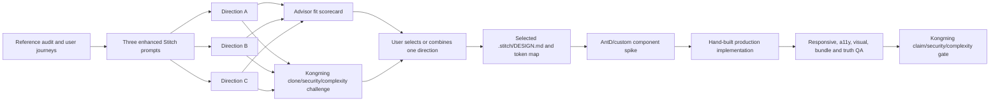

# Nexora UI/UX, Stitch and Ant Design Strategy

## Status and Authority

- State: `PROPOSED DIRECTION — ANT DESIGN/STITCH REQUIREMENT ACCEPTED; VISUAL DIRECTION AWAITING USER SELECTION`.
- This is a design and implementation contract, not proof that Stitch was called or that any UI exists.
- `DEC-012` requires a three-direction Stitch exploration and user selection. `DEC-025` assigns Ant Design to data-dense Studio surfaces and custom/Tailwind primitives to the public brand surface.
- The planning architecture targets the Ant Design 6.x and Ant Design X 2.x major lines; patch-level observations are intentionally non-authoritative. M0 records a source-backed candidate/version rationale from then-current official changelogs and package metadata without modifying a product lockfile. After M1-T01 establishes repository/toolchain constraints and M1-D02 freezes the selected design contract, M1-DW01 alone owns the exact Node package manifests and `pnpm-lock.yaml`; M1-T03 consumes that integrated dependency head and proves Next.js/React/SSR/bundle/accessibility compatibility with zero dependency-control diff. A failed compatibility gate blocks the requester and routes one bounded amendment through M1-DW01R1; after integration the requester is re-dispatched from the new exact head and all earlier implementation/review receipts are invalid.

## Desired Product Character

Nexora must feel like a deliberate digital-experience studio, not an admin template with an AI chat box attached. The design language is called **Nexora Signal Atelier** until the user selects or renames a direction.

Core traits:

- Editorial intelligence: content remains the hero; AI appears as a grounded assistant, not decoration.
- Calm precision: dense professional controls use strong hierarchy and progressive disclosure, not visual noise.
- Adaptive signal: a restrained spectral accent/motif communicates version, state, personalization and knowledge provenance.
- Trust before magic: permissions, source state, save/publish status, citations and degraded behavior are visible.
- Crafted motion: motion explains hierarchy/continuity and respects reduced motion; no ambient animation that slows work.
- Vietnamese-ready typography and copy: full glyph coverage, natural line-height, compact labels and no awkward machine-translated microcopy.

## Reference Research — Patterns, Not Clones

| Product | What Nexora studies | What Nexora must not copy |
|---|---|---|
| Linear | Fast keyboard-first navigation, command palette, compact information density, restrained feedback | Its exact dark/purple identity, navigation labels or decorative treatment |
| Webflow Designer | Canvas/navigator/inspector relationship, selection hierarchy, responsive preview and component reuse | Control overload, exact panel layout, icons or branded interaction language |
| Sanity Studio | Schema-as-code thinking, role/workflow-oriented content views, live preview and custom editorial tools | Sanity visual identity, content model, wording or plugin surface |
| Notion | Calm document-first editing, progressive disclosure, lightweight empty states and content focus | Monochrome clone, slash-command imitation without Nexora value |
| Vercel | Typography discipline, developer trust, clear deployment/status feedback and performance restraint | Black/white clone, grid motif or brand copy |
| Stripe | Editorial storytelling, layered technical diagrams, purposeful gradients and polished documentation | Stripe gradient/color language, illustrations or page composition |
| Ant Design | Mature forms, tables, trees, overlays, tokens, enterprise states and consistent keyboard behavior | Default blue theme, default spacing/radius or direct raw-component sprawl |

Research receipts record URL, access date, screenshot provenance for internal analysis, observed pattern, Nexora adaptation, accessibility caveat and “do not copy” note. No third-party screenshot is published as a Nexora asset without rights and attribution review.

## Three Stitch Directions

All three use the same approved information architecture and tasks; only visual language and emphasis differ. Stitch outputs concept screenshots/HTML reference and design-system evidence, never production code authority.

### Direction A — Signal Atelier (recommended)

- Mood: editorial, precise, quietly futuristic.
- Light surface: porcelain/soft mineral background, ink text, deep-indigo actions, cyan-lime “signal” used only for focus/provenance/adaptive state.
- Dark Studio: near-ink panels, neutral canvas, luminous selection edge and subtle topology texture.
- Typography: humanist grotesk for UI plus a restrained editorial display face only where Vietnamese coverage and performance pass.
- Shape: 8/12px functional radii, clipped/offset signal corner on selected/high-value cards, no excessive pills.
- Signature motif: a thin adaptive “signal rail” showing draft -> review -> published -> personalized/grounded state.
- Best fit: balances distinctive public pages with a professional content studio.

### Direction B — Luminous Grid

- Mood: technical, modular, high-contrast.
- Visual system: structured grid, crisp separators, cobalt/violet spectral highlights and denser compact mode.
- Signature motif: component/node lattice that connects content blocks, events and citations.
- Strength: strongest for technical confidence, complex builder and observability.
- Risk: can look like a Vercel/Linear derivative or overwhelm editorial content; Advisor must challenge similarity.

### Direction C — Warm Intelligence

- Mood: approachable, premium, content-led.
- Visual system: warm paper neutrals, deep forest/indigo actions, coral/gold highlights, softer editorial cards.
- Signature motif: layered “knowledge folio” revealing source and version depth.
- Strength: inviting for marketers/knowledge teams and public storytelling.
- Risk: can lose technical precision in dense admin views; compact Studio variant must prove clarity.

## Stitch Comparison Anchors and Selected-Direction Coverage

The bounded comparison wave sends exactly the same four anchors to each direction so the user compares design systems rather than unrelated mockups:

1. Public landing/home with real-content-shaped blocks, one adaptive-state explanation and its 375px composition.
2. Organization dashboard with recent content, review queue, knowledge jobs and honest empty/degraded variants.
3. Builder workspace with navigator/library, canvas, inspector, responsive viewport control and autosave/conflict/offline state.
4. Secure RAG chat with sources panel, citation hover/open, no-answer, denied-source and provider-degraded state.

For budget accounting, one initial generation plus at most two bounded edit passes equals at most three operations per anchor: `4 anchors × 3 operations × 3 directions = 36 operations total`. Unused operations are not transferable into unreviewed scope. The comparison stops immediately at the accepted result, budget ceiling or kill switch, whichever comes first.

After the user selects a direction, the design-system/frontend team must also cover the remaining product inventory without silently consuming more Stitch quota:

5. Page list with filters, status/version chips, bulk affordance and permission-denied state.
6. Review/publish side-by-side diff with reason, stale-version conflict, confirmation and rollback history.
7. Knowledge workspace with upload constraints, progress, retry, object/source metadata and deletion confirmation.
8. Mobile 375px companion for dashboard/public/chat; the full desktop builder gets an explicit supported/degraded mobile policy rather than a fake compressed canvas.

Those four remaining items are hand-designed and hand-built from the selected direction, tokens and verified interaction contracts by default. Any additional Stitch generation/edit operation for selected-direction expansion requires a separately accepted amendment to `DEC-011` with its own numeric ceiling and receipt; it cannot borrow from or exceed the 36-operation comparison budget.

## Library Boundary

### Ant Design owns

- Studio forms, validation layout, tables, tree/navigator, menus, tabs, dropdowns, drawers, dialogs, tooltips, pagination, date/time, upload shell, notification plumbing and data-display primitives.
- Builder chrome and inspector controls through Nexora wrapper components.
- Accessible state mechanics where verified, with manual keyboard/screen-reader testing for critical flows.

### Ant Design X candidates own behind Nexora adapters

- Conversation list, sender shell, prompt suggestions, message actions and source presentation only when exact-version API/a11y/performance checks pass.
- The Nexora adapter owns domain message IDs, SSE state, citations, permissions, redaction, provider errors and safe Markdown/component mapping.
- Dynamic A2UI/HTML/code execution is disabled in v0.1 unless separately threat-modeled and allowlisted; the library never receives provider credentials in the browser.

### Nexora custom/Tailwind owns

- Public editorial pages, brand hero, schema block rendering, marketing storytelling and the distinctive adaptive-signal motif.
- Builder canvas/block frames, drag targets, selection geometry, version/publish rail and complex domain visualizations.
- Layout utilities and brand primitives outside AntD internals. Tailwind does not spray overrides across private AntD selectors.

### Explicit exclusion

Do not ship shadcn as a second full component system. A headless primitive may be proposed only when AntD/custom implementation cannot meet a concrete interaction or accessibility need, with bundle/style/focus evidence and an ADR. This avoids duplicate Button/Dialog/Form semantics, token drift and conflicting CSS/reset behavior.

## Next.js and AntD Technical Contract

- Use App Router with `@ant-design/nextjs-registry` or the current official equivalent to extract/inject first-screen styles and prevent flicker.
- Wrap Studio in an owned `NexoraStudioProvider` combining `AntdRegistry`, `ConfigProvider`, `App`, locale, theme, the accepted surface-specific CSP adapter and error boundary.
- Import App Router-incompatible dot subcomponents through owned client wrappers; never scatter workaround code through feature pages.
- Use context-aware hooks/components instead of static `message`, `notification` or `Modal.confirm` calls that escape theme/context.
- Evaluate AntD 6 `zeroRuntime`/static extraction against CSP, theme switching, bundle size and visual regression. Do not enable it because it is new; pin the proven mode.
- Define a CSS cascade/layer order for reset, public tokens, AntD generated/static styles, Nexora component layer and bounded feature styles.
- Use `prefixCls="nx"`/CSS variable prefix only if SSR, third-party integration and test evidence support it; record the choice once.
- Server Components own data reads where possible. Interactive AntD components live in narrow Client Component islands; no full-app client conversion.
- Enforce import/bundle analysis so a single component does not pull unnecessary icons/locales/charts.

### CSP and cache contract by surface

`DEC-027` must be resolved in M1 before any production frontend-foundation dispatch. A single blanket nonce policy is forbidden because current Next.js nonce-based CSP makes routes dynamically rendered and removes normal static optimization/ISR/PPR/CDN caching assumptions.

- Authenticated Studio/auth routes are dynamic and may use a strict request nonce when the AntD registry, hydration, streaming and browser evidence pass.
- Public schema-rendered pages are intended to remain cacheable. Their ADR must select and test an external/static CSS, hash-compatible or other documented strategy that preserves the approved cache contract without defaulting to `unsafe-inline`.
- The ADR records route groups, render/cache mode, style source, exact CSP directives, browser matrix, rollback and the performance/security tradeoff. It cannot be accepted from configuration text alone.
- Required receipts include a production build, header inspection, CSP-violation capture, hydration-console check, first-screen FOUC screenshot/trace and cache-control/CDN hit/miss or equivalent behavior for both public and Studio surfaces.

### Stitch artifact quarantine

Stitch screenshots/HTML are untrusted design input. They are inspected offline before opening or converting: inventory and block remote scripts, module/import maps, event handlers, inline executable URLs, external fonts/images, network-prefetch tags and package/dependency instructions. Remote assets are downloaded only through a separately approved provenance/license process; otherwise they are replaced with owned local placeholders. Reference HTML is sanitized or rendered in an isolated no-network sandbox and is never executed in an authenticated/product origin. No script, dependency, copied component code, font or image from a Stitch export enters production merely because the generated concept used it.

## Package and Ownership Layout

```text
packages/design-tokens/       # source semantic tokens and generated targets
packages/ui-core/             # Nexora public/custom primitives
packages/ui-studio/           # owned AntD wrappers and Studio patterns
packages/ui-ai/               # owned Ant Design X adapters and citation UI
packages/ui-builder/          # canvas, block frames, navigator/inspector composition
apps/web/app/(public)/        # public branded experience
apps/web/app/(studio)/        # authenticated Studio/BFF-facing experience
.stitch/                      # prompts, selected project metadata and DESIGN.md
assets/designs/               # concept screenshots/reference provenance only
```

One design-system owner writes tokens/providers/wrappers. Feature workers consume frozen exports and may not edit global tokens, AntD theme configuration or root styles without a separately leased task.

## Nexora Token Contract

Final values come from the selected Stitch direction; the schema is frozen first:

- Color: `canvas`, `surface-1..3`, `text-strong/muted`, `border`, `brand`, `signal`, `focus`, semantic success/warning/error/info, chart/citation palettes and dark equivalents.
- Typography: display, body, UI, code, numeric; Vietnamese glyph coverage, font fallback, weights, line-height and loading strategy.
- Space: 4px base with documented compact/comfortable Studio density; no arbitrary feature spacing.
- Shape: radius levels, border widths, control heights, focus ring, shadows/elevation and selection outline.
- Motion: duration/easing by enter/exit/reorder/confirm, interruption behavior and reduced-motion replacement.
- Layer: base, sticky chrome, dropdown, drawer, modal, toast, drag overlay and command palette z-index contract.
- Component aliases: map Nexora semantic tokens into AntD Seed/Map/Alias/Component tokens; snapshots prevent silent upstream-default drift.

No color is accepted solely for aesthetics. Contrast is measured for text, controls, focus and charts in light/dark/high-contrast contexts.

## Navigation, Breadcrumb and Contextual Help Contract

- Public and Studio information architecture defines route name, parent hierarchy, current-page label, permission requirement, mobile collapse and help owner before visual styling.
- Breadcrumbs represent resource hierarchy, use real links only for authorized ancestors, expose `aria-current`, truncate without hiding the current location and never render untrusted labels as HTML.
- A skip link reaches the primary task. Rail/sidebar, breadcrumb and command palette announce the same selected context without stealing focus.
- Contextual help is concise, task-local and versioned with the feature contract. Tooltip-only critical instructions are forbidden; keyboard/touch/screen-reader users receive an equivalent popover, inline help or docs link.
- Help content cannot reveal forbidden actions, private resource names, internal policy or a capability that the exact build does not provide. Empty/denied/error states point to safe recovery guidance.
- Each anchor screen supplied to Stitch includes its navigation hierarchy and help moments so generated decoration cannot invent product structure.

## Page Builder UX Contract

Desktop layout uses four deliberate regions: global rail, structure/library panel, responsive canvas and contextual inspector. Panels are resizable/collapsible with persisted safe bounds. Selection is reflected in navigator/canvas/inspector without focus theft.

Required interaction paths:

- Pointer drag/drop with visible target, auto-scroll and undo.
- Keyboard add/move/duplicate/delete/reorder alternative with announcements.
- Command palette for insert, navigate, preview, submit and publish actions.
- Autosave state machine: clean, dirty, saving, saved, offline, retrying, failed, conflict and restored draft.
- Preview widths and real-content overflow; public output remains separate from Studio chrome.
- Destructive actions require impact statement and recoverable undo/version behavior.
- On 375px, support content/status/review/quick edits where honest; do not pretend the full complex canvas is equally usable if evidence says otherwise.

## Secure RAG UX Contract

- Sources are first-class: answer segments/citations expose document title, page/chunk, permission state and open-time reauthorization.
- Distinguish retrieving, reranking, generating, canceled, provider unavailable, no authorized evidence and answer complete.
- Never expose hidden chain-of-thought. “Thought/processing” UI shows safe stage/status metadata only.
- Markdown renderer allowlists elements/protocols and sanitizes content; code/diagram rendering is sandboxed or disabled until reviewed.
- Feedback records bounded reason/categories without leaking document text.
- Mobile keeps sender, answer and sources usable; conversation rail collapses and focus returns correctly.

## Stitch-to-Production Workflow



Stitch prompt inputs include persona, job, exact screen/state, information hierarchy, selected reference patterns, forbidden imitation, density, color/typography atmosphere, responsive behavior, accessibility and required output. Prompts never contain credentials, private documents or user data.

## Design Thread and Branch Ledger

| Order | Thread/agent | Branch | Exclusive output | Gate |
|---:|---|---|---|---|
| 1 | UI research scout, R0 | none | Reference matrix and screenshot/provenance report | Advisor accepts patterns/anti-copy rules |
| 2 | M1-D00 — UX architect, sol high | `design/m1-ux-architecture` | `docs/ux/architecture/**`: journeys, IA, route/state inventory, wireflows | M1-T01 integrated; exact-head product/outcome, navigation and accessibility dual review |
| 3A | Stitch designer A | `design/m1-signal-atelier` | `.stitch/directions/signal-atelier/**`, `assets/designs/signal-atelier/**` | No product code; provenance complete |
| 3B | Stitch designer B | `design/m1-luminous-grid` | `.stitch/directions/luminous-grid/**`, `assets/designs/luminous-grid/**` | Runs beside A only; disjoint paths |
| 4 | Stitch designer C | `design/m1-warm-intelligence` | `.stitch/directions/warm-intelligence/**`, `assets/designs/warm-intelligence/**` | Starts after a design slot frees |
| 5 | Advisor + Kongming + user, R0 | none | Fit scorecard, adversarial review and selected direction | Both receipts plus explicit user selection/combination |
| 6 | Design-system owner, sol high | `design/m1-nexora-design-system` | Canonical `.stitch/DESIGN.md`, selected artifacts, tokens, AntD mapping and component contracts | Exact-head Advisor and Kongming dual review |
| 6B | M1-DW01 dependency owner | `chore/m1-node-dependency-window` | Enumerated Node package manifests, workspace control and lockfile only | Exact pins, provenance/license/security, frozen install/import/SSR probe; no product source |
| 7 | Frontend foundation worker | `feature/web-design-foundation` | Providers, registries, wrapper packages, Storybook/test fixtures; no dependency-control file | Frozen M1-DW01 head plus SSR/flicker/CSP/bundle/a11y and zero dependency diff |
| 8A | Builder UI worker | `feature/page-builder` | Builder-only paths | Frozen design/API/schema contracts |
| 8B | Knowledge/RAG UI worker | `feature/rag-chat-ui` | Knowledge/chat-only paths | Frozen design/RAG contracts |
| 9 | UI tester/reviewer, R0 | none | Exact-head visual/a11y/responsive receipts | PASS/HOLD/STOP |

Maximum two writers applies. Global tokens/provider/root style have one writer. Stitch designers write design artifacts only; frontend workers never overwrite the selected design authority silently.

M1-D01A through M1-D01C cannot dispatch from a prose reference to an “approved journey inventory.” Git Manager first integrates the exact `MERGE_READY` M1-D00 head onto `integration/v0.1-m1`; each direction packet pins that `INTEGRATED` head. A moved M1-D00 head blocks all three directions until their packets and reviews are re-pinned.

## Advisor and Kongming Supervision

Advisor scores each direction on brand distinctiveness, task clarity, information hierarchy, editor speed, cognitive load, responsive honesty, accessibility and consistency across public/Studio/AI surfaces. Advisor can HOLD a beautiful direction that weakens core jobs.

Kongming challenges clone risk, dark-pattern copy, fake live data, permission ambiguity, destructive-action safety, inaccessible canvas, style-system collision, CSS-in-JS/CSP/SSR risk, bundle cost, AI-source spoofing and concept-versus-product claims. Both Advisor and Kongming review the same direction candidate, selected DESIGN.md/token boundary, frontend-foundation exact head and release-media candidate. Routine cosmetic commits remain under the dual-approved system unless they alter a material boundary.

## Quality Gates

- No unthemed default AntD showcase appearance on an accepted anchor screen.
- One canonical token source; AntD/custom/public dark/light outputs are generated and drift-tested.
- Critical routes pass 375px and desktop without unintended overflow; complex builder mobile policy is explicit.
- Keyboard, focus, screen-reader smoke, reduced motion and zero serious/critical automated a11y findings.
- Visual regression covers anchor screens/states in both themes where supported.
- App Router SSR shows no first-screen style flash/hydration error; the per-surface CSP/cache ADR is verified with headers, violations and cache behavior.
- Bundle/performance report attributes AntD, icons and Ant Design X cost; unused systems are removed.
- Fixture/live data and AI/provider mode are visibly labeled in design and release media.
- Selected design remains recognizable as Nexora without logo/color alone.

## Stop Conditions

Copying a famous site’s identity/assets, executing unsanitized/network-capable Stitch output, shipping Stitch HTML/code/dependencies as production, running two full component systems, default AntD theme presented as finished brand, blanket nonce policy that silently destroys public caching, default `unsafe-inline`, browser provider key, unsafe dynamic AI rendering, inaccessible drag-only builder, concept screenshots presented as product, global token edits by feature workers, or user direction/CSP ADR not selected before production foundation work.

## Current Primary References

- [Ant Design changelog](https://ant.design/changelog/)
- [Ant Design with Next.js](https://ant.design/docs/react/use-with-next/)
- [Ant Design theme customization](https://ant.design/docs/react/customize-theme/)
- [Ant Design X introduction](https://x.ant.design/docs/react/introduce/)
- [Next.js Content Security Policy guide](https://nextjs.org/docs/app/guides/content-security-policy)
- [Linear features](https://linear.app/features)
- [Webflow Designer](https://webflow.com/designer)
- [Webflow canvas](https://help.webflow.com/hc/en-us/articles/33961319255059-Webflow-canvas-overview)
- [Sanity Studio](https://www.sanity.io/studio)
- [Notion product](https://www.notion.com/product)
- [Vercel home](https://vercel.com/home)
- [Stripe home](https://stripe.com/)
